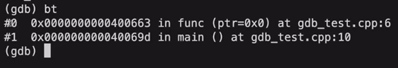
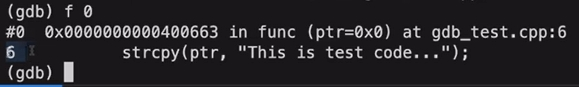
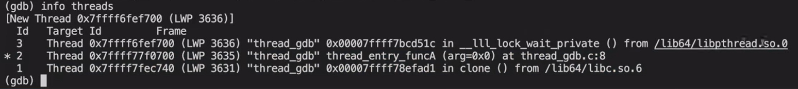
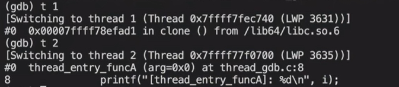
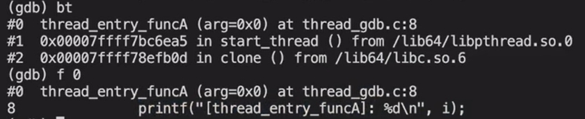
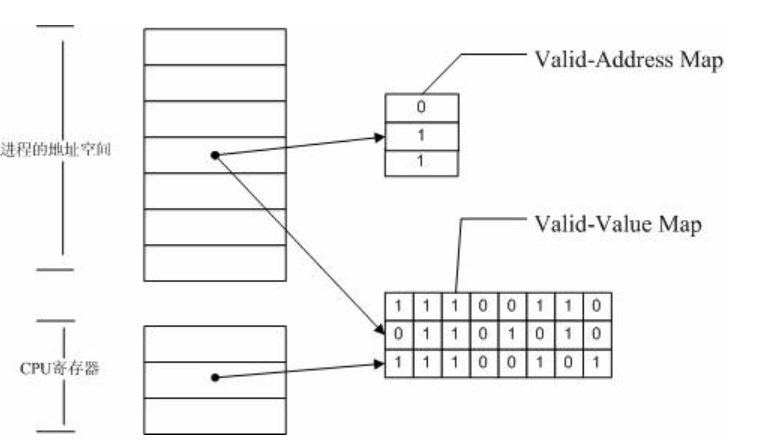
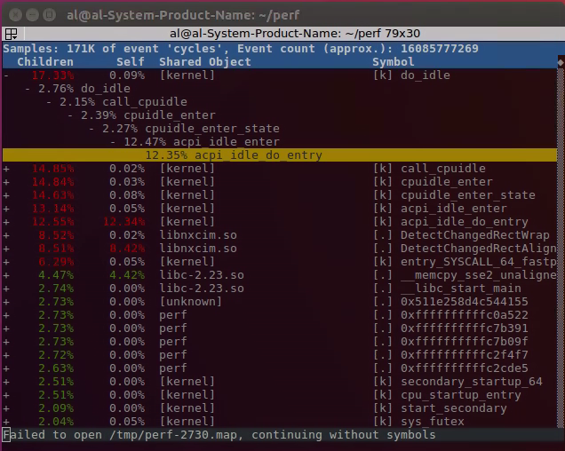
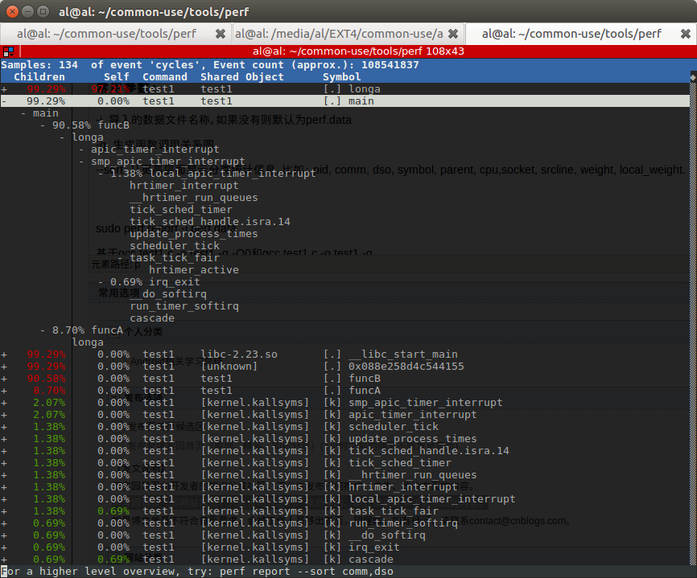
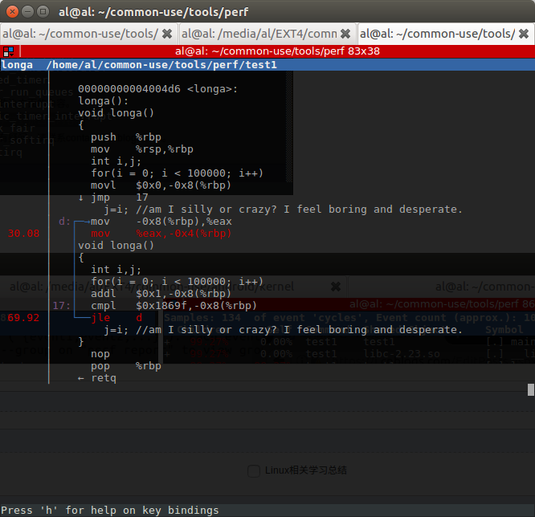
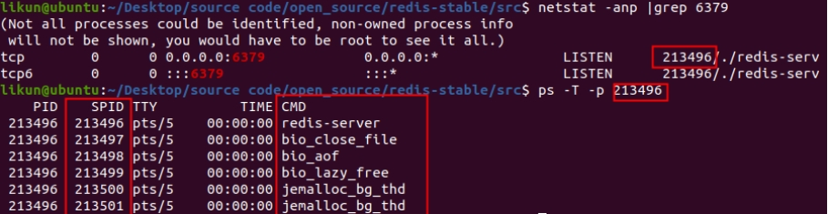

## GCC

GCC:GNU编译套件

1.在Ubuntu中安装GCC,G++

2.使用GCC

```shell
gcc test.c -o app #-o指定生成文件名称为app,如果不加,则默认生成a.out(Linux中可执行文件)
gcc -o app test.c #与上同理
./app #运行该程序
```

GCC工作流程:
源代码(.c,.cpp,.h)->预处理器(Pre-Processing)(头文件展开,宏替换等)->预处理后源代码(.i)
->汇编器(Assembling)->汇编代码(.s)
->编译器(Compiling)->目标代码(机器代码).o
->链接器(链接库代码等)(Linking)->可执行程序(.out/exe)

GCC编译选项:
-E:只预处理源文件,不编译
-S:只激活Pre-Processing和Assembling,生成.s
-c:只激活Pre-Processing,Assembling和compiling,生成obj(.o)文件
-o:指定输出文件名称
-g:生成调试信息
-Dxxx:指定一个名为xxx的宏,如`-DDEBGU`,使`#ifdef DEBUG`后的代码生效
-w:不生成警告
-wall:生成所有警告
-On,n取0-3,0:没有优化,1:默认缺省值,-O3优化程度最大
-std:指定C版本,如`-std=c99`
`-I`:指定头文件所在位置路径
`-l,-L`:分别指定使用的静态库和其所处的位置路径

GCC与G++

> gcc和g++都是GNU(组织)的一个编译器
> 后缀为.c的,gcc把它当作是C程序,而g++当作是c++程序
> 后缀为.cpp的,两者都会认为是C++程序
> 编译阶段,g++会调用gcc,对于C++代码,两者是等价的
> 但是因为gcc命令不能自动和C++ 程序使用的库联接.所以通常用g++ 来完成链接,为了统一起见,干脆编译/链接统统用g++了,这就有一种错觉,好像cpp程序只能用g++,但实际二者都可以

## 库文件使用

静态库在链接阶段就复制到程序中
动态库在程序运行时才由系统动态加载到内存中供程序使用

**静态库**

Linux:`libxxx.a`(xxx为库的名称,libxxx是库文件名称)
Windows:`libxxx.lib`

静态库制作:
①gcc获得.o文件
**②将.o文件打包(用ar命令)**
`ar rcs libxxx.a xxx.o xxx.o`,r:将文件插入;c:创建文件;s:索引

静态库使用:
需要库文件(.a)和头文件(.h),gcc命令添加如下选项,会把静态库进行链接,打包到可执行文件中
`-l calc -L ./lib`
-l后面加**库的名称**(注意不是库文件名字libcalc),以及在-L后面指定库所处的路径

**动态库**

Linux:`libxxx.so`
Windows:`libxxx.dll`

动态库制作:
①得到.o文件(-fpic,和位置无关的代码,产生的代码没有绝对地址,全部用相对地址)
`gcc -c -fpic/-fPIC a.c b.c`
②gcc得到动态库
`gcc -shared a.o b.o -o libcalc.so`

动态库使用,需要库文件(.so)和头文件(.h)
gcc命令添加`-l`和`-L`选项
但是按此方法,在程序执行时动态库会加载失败,找不到库文件

静态库在GCC链接阶段时会打包到可执行程序中
而动态库在GCC链接时,代码不会打包到可执行程序中,只会把动态库的一些信息打包
(可通过ldd(list dynamic dependences)命令检查动态库依赖关系)
程序启动后,在用到动态库api时通过动态载入器ld-linux.so定位,加载程序所需所有动态库文件
动态载入器先后查找以下目录:
`elf文件DT_RPATH段->环境变量LD LIBRARY_PATH->/etc/1d.so.cache文件列表->/lib/或/usr/lib`

解决找不到库文件,加载失败的方法:

**(1)修改环境变量**

`env`命令可以输出Linux系统所有环境变量
`export LD_LIBRARY_PATH=$LD_LIBRARY_PATH:动态库绝对路径`:把动态库加入环境变量
(临时增加,关闭终端就没有了)

永久修改环境变量:
①用户级别
在home目录下,打开文件`.bashrc` ,加入一行内容,保存退出
`export LD_LIBRARY_PATH=$LD_LIBRARY_PATH:动态库绝对路径`
再用一下命令更新:`. ./bashrc`或`source .bashrc`
②系统权限(需root权限)
在home目录下,打开文件`sudo vim /ect/profile`加入一行内容,保存退出
`export LD_LIBRARY_PATH=$LD_LIBRARY_PATH:动态库绝对路径`
再用一下命令更新:`sudo source .bashrc`

**(2)cahce文件列表**

打开文件:`sudo vim /etc/ld.so.config`
把路径插入该文件即可

**(3)lib目录**

把动态库文件放在/lib或/user/lib目录下
(不推荐使用,为了避免把系统自带的库文件替换掉)

## Makefile

一个工程有很多源文件且放在不同的目录下,Makefile文件定义了一系列的规则来指定哪些文件要先编译,哪些文件要后编译,哪些文件要重新编译,甚至进行更复杂的操作,Makefile文件就像Shell脚本一样,可以执行操作系统命令

Makefile 带来的好处就是“自动化编译”(make命令)

文件命名:makefile或者Makefile
Makefile规则:


头文件(.h)写在依赖中,但不用写在g++/gcc命令中

**Makefile工作原理**
(1)检查依赖:命令在执行之前需要先检查规则中的依赖是否存在:
①存在,执行命令
②不存在,向下检查其它规则,检查有无规则是用来生成这个依赖的,如找到则执行该规则中的命令
(2)检测更新:在执行规则中的命令时,会比较目标和依赖文件的时间
如果依赖的时间比目标的时间晚,需要重新生成目标。
如果依赖的时间比目标的时间早,目标不需要更新,对应规则中的命令不需要被执行

例如,如果sub.o不存在,则向下查找,执行用sub.c编译得到sub.o的命令
如果app存在,但sub.c比sub.o的时间晚(sub.c已被修改过),则会重新生成sub.o和app

```makefile
app :sub.o add.o mult.o div.o main.o
    gcc sub.o add.o div.o mult.o main.o app
sub.o:sub.c
    gcc -c sub.c -o sub.o
add.o:add.c
    gcc -c add.c -o add.o
div.o:div.c
    gcc -c div.c -o div.o
mult.o:mult.c
    gcc -c mult.c -o mult.o
main.o:main.c
    gcc -c main.c -o main.o
```

**Makefile中的变量**

变量名=变量值`var=hello`
预定义变量:
AR:归档维护程序的名称,默认值为 ar
CC:C 编译器的名称,默认值为 cc
CXX:C++ 编译器的名称,默认值为 g++
\$@:目标的完整名称
\$<:第一个依赖文件的名称
\$^:所有的依赖文件
获取变量的值:
\$(变量名)`$(var)`

使用变量+模式匹配:

```makefile
#定义变量
src=sub.o add.o mult.o div.o main.o
target=app
 
$(target):$(src)
    $(CC) $(src) -o $(target)
%.o:%.c
    $(CC) -c $< -o $@
```

%表示通配符,匹配一个字符串,在生成app前需要用.c文件生成.o文件
每一次生成.o文件都要调用含有`%.o:%.c`的指令生成.o文件

**Makefile中的函数**

`$(wildcard PATTERN...)`
功能:获取指定目录下指定类型的文件列表
参数: PATTERN 指的是某个或多个目录下的对应的某种类型的文件,如果有多个目录,一般使用空格间隔
返回:得到的若干个文件的文件列表,文件名之间使用空格间隔
实例:`$(wildcard *.c ./sub/*.c)`获取当前目录下和./sub/目录下所有的点c文件
返回值格式:`a.c b.c c.c d.c e.c f.c`

`$(patsubst <pattern>,<replacement>,<text>)`
功能:查找 `<text>` 中的单词 (单词以空格,Tab或回车,换行分隔) 是否符合模式`<pattern>` 
如匹配,用`<replacement>` 替换。
`<pattern>`可以包括通配符 `%`,表示任意长度的字串
(如果 `<replacement>`中也包含%,可以用 `\` 来转义,以 `\%` 来表示真实含义的%字符)
返回:函数返回被替换过后的字符串
示例:`$(patsubst %.c, %.o, x.c bar.c)`
返回值格式:`x.o bar.o`

```makefile
src = $(wildcard ./*.c)
objs = $(patsubst %.c, %.o, $(src))
target = app
 
$(target):$(objs)
    $(CC) $(objs) -o $(target)
%.o:%.c
    $(CC) -c $< -o $@

.PHONY:clean#表示伪目标,
clean:#删除多余的.o文件,需要make clean执行该条命令
	rm $(objs)-f
```

## Cmake

自动生成makefile文件

CmkeListst.txt中配置

**最简单的CmkeListst.txt**

```cmake
# 最低要求版本
cmake_minimum_required(VERSION 3.10)

# 声明工程名称
project(project1)

# 生明生成的目标文件和目标文件所依赖的代码文件
add_executable(main main.cpp)
```

之后使用命令`cmake .`(点代表当前目录)
就可以生成makefile

之后用make命令即可编译

**有多个cpp和h文件的情况**

```cmake
# main.cpp test1.cpp test1.h test2.cpp test2.h

cmake_minimum_required(VERSION 3.10)

project(project2)

# 头文件在同一目录下,不用写.h头文件
add_executable(main main.cpp test1.cpp test2.cpp)
```

**如果文件很多**

```cmake
cmake_minimum_required(VERSION 3.10)

project(project2)

# 将当前目录(.)的所有源码文件保存至SRC_LIST这个变量中
aux_source_directory(. SRC_LIST)

# 使用变量$符号+大括号
add_executable(main ${SRC_LIST})
```

**多个文件夹,头文件include,源码src,cmake相关build,可执行文件bin**

```cmake
# 这个CmkeListst.txt放在build子目录中
cmake_minimum_required(VERSION 3.10)
    
project(project3)

# 设置 C++ 标准
set(CMAKE_CXX_STANDARD 17)

# 设置可执行文件保存的位置
# PROJECT_SOURCE_DIR是默认变量
set (EXECUTABLE_OUTPUT_PATH ${PROJECT_SOURCE_DIR}/bin)

# .cpp保存在src目录中
aux_source_directory(src SRC_LIST)

# 指定头文件路径(include文件夹下)
include_directories(include)

add_executable(main ${SRC_LIST})
```

实际执行cmake时

因为cmake相关文件都放在build文件夹下

所以在build目录中执行cmake命令时
需要`cmake ..`(回到上一级目录进行cmake)

**添加子目录**

使用 `add_subdirectory()` 拆分模块

每个模块有自己的 `CMakeLists.txt`

```objective-c
project/
├── CMakeLists.txt
├── src/
│   ├── CMakeLists.txt
│   ├── main.cpp
│   └── ...
├── math/
│   ├── CMakeLists.txt
│   ├── add.cpp
│   └── add.h
```

顶层 `CMakeLists.txt`

```cmake
cmake_minimum_required(VERSION 3.10)
project(MyProject)

add_subdirectory(math)
add_subdirectory(src)
```

子目录

```cmake
# math/CMakeLists.txt
add_library(math STATIC add.cpp)
target_include_directories(math PUBLIC ${CMAKE_CURRENT_SOURCE_DIR})
```

```cmake
# src/CMakeLists.txt
add_executable(myapp main.cpp)
target_link_libraries(myapp math)
```

**同时有子模块和库**

```cmake
cmake_minimum_required(VERSION 3.10)

# 项目名称
project(MyApp)

# 设置 C++ 标准
set(CMAKE_CXX_STANDARD 17)

# 添加子模块
add_subdirectory(math)
add_subdirectory(utils)

# 构建主程序
add_executable(MyApp main.cpp)

# 链接 math 和 utils 库
target_link_libraries(MyApp math utils)
```

**寻找外部包**

```cmake
find_package(OpenCV REQUIRED)

add_library(vision
    image_creator.cpp
)

target_include_directories(vision PUBLIC
    ${CMAKE_CURRENT_SOURCE_DIR}
    ${OpenCV_INCLUDE_DIRS}
)

target_link_libraries(vision ${OpenCV_LIBS})
```

**支持GDB调试**

```cmake
SET(CMAKE_BUILD_TYPE "Debug")
SET(CMAKE_CXX_FLAGS_DEBUG "$ENV{CXXFLAGS} -O0 -Wall -g2 -ggdb")
SET(CMAKE_CXX_FLAGS_RELEASE "$ENV{CXXFLAGS} -O3 -Wall")
```

## GDB调试

GDB是GNU社区提供的调试工具,和GCC配套组成了一套完整的开发环境

1.启动程序,可以按照自定义的要求随心所欲的运行程序
2.可让被调试的程序在所指定的调置的断点处停住(断点可以是条件表达式)
3.当程序被停住时,可以检查此时程序中所发生的事
4.可以改变程序,将一个BUG产生的影响修正从而测试其他BUG

为了调试而编译时,关闭编译器的优化选项`-O`,**打开调试选项`-g`**

`gcc -g -Wall program.c -o program`

> `-g` 选项的作用是**在可执行文件中加入源代码的信息**,比如可执行文件中第几条机器指令对应源代码的第几行,但并不是把整个源文件嵌入到可执行文件中,所以在调试时必须保证 gdb 能找到源文件

**GDB常用操作命令**(以下`/`表示空格)


要使用until跳出循环,循环内部必须没有断点(或使其disable)

finish跳出函数,函数内部也不能有断点

## Linux命令

### 1.文件与目录操作

> 用于在服务器上定位项目,切换目录,查看配置文件等
>
> | 命令 | 功能 | 常用示例 |
> |------|------|---------|
> | `ls` | 列出目录内容 | `ls -lh`(带人类可读的文件大小) |
> | `cd` | 切换目录 | `cd /var/log` |
> | `pwd` | 显示当前路径 | `pwd` |
> | `mkdir` | 创建目录 | `mkdir logs` |
> | `rm` | 删除文件/目录 | `rm file.txt`、`rm -rf dir/` |
> | `cp` | 复制文件/目录 | `cp a.txt b.txt` |
> | `mv` | 移动/重命名文件 | `mv old new` |

------

### 2.文件查看与编辑

> 日志排查时非常常用
> | 命令 | 功能 | 常用示例 |
> |------|------|---------|
> | `cat` | 一次性显示文件内容(小文件用) | `cat config.json` |
> | `more` / `less` | 分页查看 | `less app.log`(支持上下翻页,搜索 `/keyword`) |
> | `head` | 查看文件开头 N 行 | `head -n 50 app.log` |
> | `tail` | 查看文件末尾 N 行 | `tail -n 50 app.log` |
> | `tail -f` | 实时追踪日志 | `tail -f app.log` |
> | `nano` / `vim` | 编辑文件 | `vim config.yaml` |
>
> **less中常用命令**
>
> | 操作      | 功能                                  |
> | --------- | ------------------------------------- |
> | `/关键字` | **向下**查找关键字                    |
> | `?关键字` | **向上**查找关键字                    |
> | `n`       | 重复上一次搜索,继续向下（或向上）查找 |
> | `N`       | 反方向重复搜索                        |
> | `g`       | 跳到文件开头                          |
> | `G`       | 跳到文件末尾                          |
> | `q`       | 退出                                  |

------

### 3.搜索与过滤

> 定位错误日志和关键字时的核心技能
>
>  | 命令 | 功能 | 常用示例 |
>  |------|------|---------|
>  | `grep` | 文本搜索 | `grep "ERROR" app.log` |
>  | `grep -r` | 递归搜索目录 | `grep -rn "TODO" src/` |
>  | `grep -E` | 正则匹配 | `grep -E "ERR[0-9]{3}" app.log` |
>  | `find` | 查找文件 | `find /var/log -name "*.log"` |
>  | `awk` | 文本切割,处理 | `awk '{print $1, $3}' access.log` |
>  | `sed` | 文本替换 | `sed -i 's/foo/bar/g' file.txt` |

------

### 4.进程与资源管理

> 排查程序运行状态,内存泄漏,性能瓶颈必备
>
> | 命令 | 功能 | 常用示例 |
> |------|------|---------|
> | `ps` | 查看进程 | `ps aux | grep myapp` |
> | `top` / `htop` | 实时系统监控 | `top`(`htop`更友好) |
> | `kill` | 杀死进程 | `kill -9 <pid>` |
> | `free` | 查看内存使用情况 | `free -h` |
> | `df` | 查看磁盘使用 | `df -h` |
> | `du` | 查看文件/目录大小 | `du -sh /var/log` |

------

### 5.网络相关

> 检查网络连接调试服务
>
>  | 命令 | 功能 | 常用示例 |
>  |------|------|---------|
>  | `ping` | 测试网络连通性 | `ping 8.8.8.8` |
>  | `curl` | 发 HTTP 请求 | `curl http://127.0.0.1:8080/health` |
>  | `wget` | 下载文件 | `wget http://example.com/file.zip` |
>  | `netstat` / `ss` | 查看端口占用 | `ss -tulnp | grep 8080` |
>  | `telnet` | 测试端口连通性 | `telnet 127.0.0.1 3306` |

------

### 6.权限与用户管理

> 有时需要改权限才能读取或执行程序
>  | 命令 | 功能 | 常用示例 |
>  |------|------|---------|
>  | `chmod` | 改文件权限 | `chmod +x run.sh` |
>  | `chown` | 改文件所有者 | `chown user:group file` |
>  | `whoami` | 查看当前用户 | `whoami` |

------

### 7.压缩与解压

> | 命令            | 功能             | 常用示例                                             |
> | --------------- | ---------------- | ---------------------------------------------------- |
> | `tar`           | 压缩/解压 tar 包 | `tar -czvf file.tar.gz dir/`,`tar -xzvf file.tar.gz` |
> | `zip` / `unzip` | 压缩/解压 zip 包 | `zip -r file.zip dir/`,`unzip file.zip`              |

### 8.日志分析常用组合

> 实际排查中你会频繁用**管道(`|`)**把命令组合起来：

```bash
# 查看最新错误日志并实时跟踪
tail -f app.log | grep "ERROR"

# 统计今天出现的错误次数
grep "$(date +%F)" app.log | grep "ERROR" | wc -l

# 按 IP 统计访问次数
awk '{print $1}' access.log | sort | uniq -c | sort -nr | head
```

### 9.Apt 常用命令

列出所有可更新的软件清单命令 sudo apt update

升级软件包 sudo apt upgrade

安装指定的软件命令
`sudo apt install <package_name>`

安装多个软件包
`sudo apt install <package_1> <package_2> <package_3>`

更新指定的软件命令 sudo apt update <package_name>

删除软件包命令 sudo apt remove <package_name>

## Linux文件系统

文件分配是以块为基础完成的
按需动态分配,而非预定义分配
所有类型的UNIX文件都是由操作系统通过**索引节点Inode**来管理的
索引节点都包含一些直接指针和三个间接指针(一级、二级、三级)
直接块之间指向数据,一级,二级,三级间接块为间接指针

Inode引用次数:
实现文件共享,来表示链接到本文件的用户目录项的数目
硬链接会改变引用计数,创建+1,删除-1,=0时删除
软链接不会增加引用计数值

目录文件中只有name和InodeNumber

UNIX文件系统驻留在单个逻辑磁盘或磁盘分区:

在一个逻辑分区中包括:
①引导块(BOOTblock),包含操作系统的代码
②超级块(包含有关文件系统的属性和信息,如分区大小,索引节点表的大小)
③索引节点表(Inode table)所有文件的索引节点集
④数据块(数据文件和子目录文件所需的存储空间)


在Linux文件系统中寻找一个文件的过程:
Inode表第一个表项(此处的inode指向根目录文件内容的存储位置)
->访问根目录文件内容,得到下一级目录文件的inode在inode表中位置
->找到下一级目录的目录文件的inode,得到下一级目录文件的存储位置
->......
->在要寻找文件的直接所属目录的目录文件中找到该文件的inode在inode表中位置
->找到要寻找文件的inode,得到该文件内容的存储文件
->依次访问文件所存储的块,读取文件内容


硬链接和软链接:(直接链接到inode or 通过路径名链接)
硬链接:inode表里的某个inode被多个在目录文件中的项所指向
软链接:软链接文件的文件内容只有它所指向的另一个文件的绝对路径和一个标志(表明它是索引文件)
但不直接指向另一个文件的inode,不改变引用计数

> 硬链接直接链接到文件inode,文件属性和源文件基本一致,可以进行同步更新
> 软链接利用文件的路径名建立链接,通常建立软链接使用绝对路径而非相对路径,以最大限度保证可移植性
>
> 源文件删除后,软链接无法定位到源文件,所以会显示没有文件
> 硬链接删除源文件,硬链接依仍可访问(只要还存在目录项指向文件inode,即引用计数>0,则不会删除)
>
> 假如删除源文件后,重新创建一个同名文件,软链接将恢复
> 硬链接则不再有效,因为文件的i节点已经改变
>
> 修改硬链接的目标文件名,硬链接依然有效,软链接将断开

**Linux文件类型**

①普通文件 REG

②目录文件 DIR

> 这种文件包含其他类型文件的名字以及指向与这些文件有关的信息的指针。对一个目录文件具有读许可权的任一进程都可以读该目录文件的内容，但只有内核才有写目录文件的权限。

③字符设备文件 CHR

④块设备文件 BLK

⑤管道文件 FIFO

用于进程间通信 

⑥套接字文件 SOCK

> 用于进程间的网络通信。也可用于在一台宿主机上的进程之间的本地通信。

⑦符号连接 LNK

指向另一个文件

## Linux文件IO

标准C库IO函数:`fopen,fclose,fread,fwrite,fflush,fseek...`


与Linxu文件IO的区别:可以跨平台,不局限于Linux
实现跨平台:调用了不同操作系统的API,如Linux下fopen使用了open这一系统调用
标准C库的IO函数效率更高,因为有缓冲区
(`printf`输出也有缓冲区,输出换行符`\n`可以起到刷新缓冲区的作用)

文件指针指向的File类型结构体内容如图,有int文件描述符,char\*读写指针和缓冲区

与Linux系统IO(read,write)关系如图(缓冲区写入磁盘时调用)


程序自己以为的的地址空间:虚拟地址空间,大小4G,连续
(不是实际的物理地址空间,实际上在物理内存中可能不连续,也一般比4G小,要进行地址转换)

(程序看到的)虚拟地址空间结构:


文件描述符保存在内核区里的PCB中 
PCB中有文件描述符表,保存该进程打开的文件
(大小1024,最多同时打开1024个文件)

描述符表中:0,1,2分别是标准输入,标准输出,标准错误,默认都打开
每打开一个新文件,就从小到大占用一个空闲文件描述符,当close时释放
(一个文件打开多次,文件描述符不一样)

**Linux系统IO函数**

```c++
#include<sys/stat.h>
#include<sys/types.h> //宏flags放在这两个头文件中
#include<fcntl.h> //open函数声明在此头文件
#include<unistd.h> //close,read,write在此头文件下

/*
2个参数的open:打开现有文件
falgs设置这次打开文件时的操作权限,O_RDONLY.O_WRONLY,O_RDWR(三者互斥)
open返回文件描述符,失败返回-1并设置errno值(Linux系统函数库中的全局变量,表示最近错误)
perror(const char*s)函数:打印errno对应的错误描述及其函数参数s
*/
int open(const char *pathname, int flags);

/*
3个参数的open:创建新文件
flags:必选项:进程这次打开文件时的操作权限:O_RDONLY.O_WRONLY,O_RDWR(三者之一)
(本次以什么样的方式打开文件)
可选项:O_CREAT(文件不存在,创建新文件)
mode:八进制的数,表示创建出的新的文件的操作权限属性
权限=(mode&umask),不同等级用户的umask不同,umask作用是抹去某些权限
0777权限:使1.当前用户2.当前用户组3.其他所有用户均可读可写可执行
但如果umask=0002,mode传入0777,得到最终权限=0775,导致其他组用户无写权限
默认umask普通用户0002,root用户0022.用umask命令,umask函数可自己设置umask值
*/
int open(const char *pathname, int flags, mode_t mode);
//flags是int,32位,被当作32个01标志位,每位代表一个宏,所以不同的宏之间用按位或|
int fd = open("new.txt",O_RDWR|O_CREAT,0777);

int close(int fd);

//buf:读文件存储目的和写文件来源;count:指定读取/写入的buf数组大小
//read返回值:>0:返回实际读取到的字节数;=0:文件已经读取完了;=-1:失败,设置error
//成功时返回值不一定等于count,因为文件尾可能剩余不足count个数字
//write返回值:成功:实际写入的字节数;;=-1:失败,设置error
ssize_t read(int fd, void *buf, size_t count);
ssize_t write(int fd, const void *buf, size_t count);

/*
lseek()对应标准C库中的fseek函数
需要#include<sys/types.h>和#include<unistd.h>
对指定文件进行读写指针的偏移,offset参数为偏移量.off_t为有符号整型
返回值返回最终指针所在位置
whernce可选择的宏:
1.SEEK_SET(设置文件指针偏移量=offset)
2.SEEK_CUR(设置偏移量:当前位置+offset)
3.SEEK_END(设置偏移量:文件大小+offset)
该函数的作用:
1.移动指针到文件头,重新开始读文件
2.通过返回值获取当前文件指针的位置
3.通过返回值获取文件长度
4.拓展文件的长度(移动指针到文件大小之后写入一个空字符串)
*/
off_t lseek(int fd, off_t offset, int whence);

//获取文件详细信息
//对于软链接文件,stat获取其链接到的文件的信息,而lstat获取软链接文件本身
int stat(const char *pathname, struct stat *statbuf);
int lstat(const char *pathname, struct stat *statbuf);
//stat结构体内容:
struct stat {
    dev_t st_dev; // 文件的设备编号
    ino_t st_ino; // 节点
    mode_t st_mode; // 文件的类型和存取的权限
    nlink_t st_nlink; // 连到该文件的硬连接数目
    uid_t st_uid; // 用户ID
    gid_t st_gid; // 组ID
    dev_t st_rdev; // 设备文件的设备编号 
    off_t st_size; // 文件字节数(文件大小)
    blksize_t st_blksize; // 块大小
    blkcnt_t st_blocks; // 块数
    time_t st_atime; // 最后一次访问时间
    time_t st_mtime; // 最后一次修改时间
    time_t st_ctime; // 最后一次改变时间(指属性)
};
```

mode_t类型st_mode变量:16位整数


**文件描述符操作函数:**

```c++
//拷贝文件描述符(新描述符使用未被使用的最小数字),两个描述符指向同一个文件
int dup(int oldfd);
//重定向文件描述符,让后面的newfd描述符指向前面oldfd指向的文件
int dup2(int oldfd, int newfd);
//cmd参数决定对文件描述符进行什么操作,后面是可变参数
//常用:1.复制文件描述符2.设置/获取文件状态标志
int fcntl(int fd, int cmd, ... /*arg*/);
/*
cmd:
F_DUPFD:复制文件描述符(dup),返回新描述符
F_GETFL:获取指定描述符对应文件的状态标志,得到的flag和通过open函数传递的flag参数相同
F_SETFL:通过第三个可变参数设置指定文件状态,失败返回-1
O_RDONLY.O_WRONLY,O_RDWR三者等不可修改,在可变参数中会被忽略
常见能修改的标志:
O_APPEND:追加数据(每次写之前,都将标志位移动到文件的末端)
O_NONBLOCK:IO设置为非阻塞模式(读取不到数据或写入缓冲区已满会马上return,而非阻塞等待)
*/
//给文件添加O_APPEND标志示例:
int flag = fcntl(fd,F_GETFL);
flag |= O_APPEND; //按位或
fcntl(fd,F_SETFL,flag);
```

## Linux文件属性函数

```c++
//判断当前进程是否有文件的某个权限,或判断文件是否存在(#include<unistd.h>)
//mode:可传入宏F_OK(判断文件是否存在),R_OK,W_OK.X_OK,返回:成功0,失败-1
int access(const char *pathname, int mode);
//修改文件访问方式*(#include<sys/stat.h>)
//mode:需要修改的权限值,八进制的数(如0775)或使用宏值
int chmod(const char *filename, mode_t mode);
//修改所有者(#include<unistd.h>),需要sudo
int chown(const char *path, uid_t owner, gid_t group);
//缩减或扩展文件尺寸至指定的大小,length为修改后的大小
int truncate(const char *path, off_t length);
```

## Linux目录函数 

```c++
//创建新文件夹
int mkdir(const char *pathname, mode_t mode);
//删除空目录
//remove()删除指定文件
int rmdir(const char *pathname);
//重命名文件,重命名目录(#include<stdio.h>)
int rename(const char *oldpath, const char *newpath);
//切换进程当前的工作目录到path
int chdir(const char *path);
//获取当前工作目录的绝对路径,szie:数组的大小
char *getcwd(char *buf, size_t size);

//目录遍历函数:
//打开目录
//返回一个指向目录流的指针,流刚开始在目录中第一个entry处(目录开始)
DIR *opendir(const char *name);
//读取目录
//返回dirp指针处的下一个实体(entry)对应的dirent结构体
//如果读取到末尾或读取失败,返回NULL
struct dirent *readdir(DIR *dirp);
//关闭目录
int closedir(DIR *dirp);

//DIR结构体定义:类似FILE,内部成员不重要
struct __dirstream
{
    void *__fd;
    char *__data;
    int __entry_data;
    char *__ptr;
    int __entry_ptr;
    size_t __allocation;
    size_t __size;
    __libc_lock_define (, __lock)
};
typedef struct __dirstream DIR;
//dirent结构体定义:
struct dirent
{    
    ino_t d_ino;//此目录进入点的inode    
    off_t d_off;//目录文件开头至此目录进入点的位移     
    unsigned short int d_reclen;//d_name 的长度, 不包含NULL字符     
    unsigned char d_type;//d_name 所指的文件类型 
    char d_name[256];//文件名
};
```

dtype有以下几种:

>  DT_BLK - 块设备
> DT_CHR - 字符设备
> DT_DIR - 目录
> DT_LNK - 软连接
> DT_FIFO - 管道
> DT_REG - 普通文件
> DT_SOCK - 套接字
> DT_UNKNOWN - 未知

dirent结构体存储的关于文件的信息很少,所以dirent起着一个索引的作用
如果想获得类似ls -l那种效果的文件信息,必须要靠stat函数
用当前目录+`entry->name`得到文件的路径,用来调用stat函数

> 想要获取某目录下(比如a目下b)所有文件的详细信息:
> 首先,我们使用opendir函数打开目录a,返回指向目录a的DIR结构体c
> 接着,我们调用readdir(c)函数读取目录a下所有文件(包括目录),遍历目录a下所有文件对应的dirent结构体
> 对于每个dirent结构体,通过其获取文件名,进而得到文件路径
> 进而调用stat来获取文件的详细信息,存储在一个stat结构体中

## 调试与性能测试

### 什么是CPU密集型和IO密集型?

判断:看进程是占用CPU高还是磁盘I/O和网络I/O占用高

CPU密集型应用程序是指需要大量CPU运算能力的程序
涉及大量计算和数据处理,例如科学计算,图像处理,加密解密,Json转换等
优化:除算法本身优化外,并行多线程处理

IO密集型程序指需要大量输入输出的程序,如网络服务器,数据库系统和文件传输等
优化:异步IO操作,缓存计数,使用多线程,零拷贝,优化磁盘和网咯性能等

### coredump文件是什么?如何调试coredump文件

- **coredump文件的生成**

coredump文件又称为核心转储文件,是奔溃时进程在内存中的一个快照

当生成coredump文件时操作系统中断程序的执行
并将程序的内存状态,寄存器值,堆栈信息等保存到一个特定的文件中
core dump文件通常以"core"或程序的名称加上进程ID的形式命名

1.程序崩溃:当程序执行过程中发生了未处理的异常,段错误,内存访问越界等错误
程序无法继续执行时,操作系统会生成core dump文件

2.手动触发:开发人员可以通过向程序发送特殊信号(如SIGABRT,SIGSEGV等)
用以触发core dump的生成,这在调试程序或捕捉特定错误时很有用

- **奔溃产生不了coredump文件怎么办**

ulimit-a 查看 core-file-size
设置为无限制 ulimit -c ulimited

- **如何使用gdb调试coredump**

1.打开终端并进入core dump文件所在的目录

2.使用gdb <可执行文件路径> <core dump文件路径>命令加载coredump文件

3.打开coredump文件后,可以用常用的gdb命令调试程序

(1) 使用backtrace或bt命令**查看程序崩溃时的调用栈**

(2) 使用f <frame_number>命令**选择特定的栈帧**

(3) 查看程序在哪一行代码崩溃
使用print <variable_name>命令查看变量的值

> **调试例子**
>
> ```c++
> #include <iostream>
> #include <cstring>
> 
> void func(char *ptr) {
>  // 程序在此处就会奔溃
>  strcpy(ptr, "test code");
> }
> int main() {
>  char* ptr = nullptr;
>  func(ptr);
>  return 0;
> }
> ```
>
> 1.编译及执行测试代码,产生core文件
>
> `g++ gdb_test.cpp -o mygdbtest -g`
> `./mygdbtest`
>
> 2.加载coredump文件,进入gdb调试界面
>
> `gdb mygdbtest core.22450`
>
> 3.查看调用堆栈,寻找奔溃原因
>
> 使用`bt`命令,查看调用堆栈如下
> 
>
> 4.使用`f 0`命令,切换到0号堆栈中
> 
>
> 可以看出在执行strcpy这行代码时程序奔溃了

### gdb调试已经运行起来的进程

`gdb -p 12345`
会启动GDB并将其附加到进程12345

如果是已经运行的gdb,使用gdb attach pid

### 如何使用gdb调试多线程

- **`pstack <pid>` 观察进程下所有线程当前的函数调用栈**
- **多线程`gdb`调试具体流程**

> 示例代码:(每个线程都打印1-100)
>
> ```c++
> #include <stdio.h>
> #include <unistd.h>
> #include <pthread.h>
> void* thread_entry_funcA(void* arg) {
>  int i = 0;
>  for(; i<100; i++) {
>      printf("[thread_entry_funcA]: %d\n",i);
>      sleep(1);
>  }
>  return NULL;
> }
> void* thread_entry_funcB(void* arg) {
>  int i = 0;
>  for(; i<100; i++) {
>      printf("[thread_entry_funcB]: %d\n",i);
>      sleep(1);
>  }
>  return NULL;
> }
> int main() {
>  pthread_t tidA,tidB;
>  int ret = pthread_create(&tidA,NULL,thread_entry_funcA,NULL);
>  if (ret < 0) {
>      perror("pthread_create");
>      return 0;
>  }
> 
>  int ret = pthread_create(&tidB,NULL,thread_entry_funcB,NULL);
>  if (ret < 0) {
>      perror("pthread_create");
>      return 0;
>  }
> 
>  pthread_join(tidA,NULL);
>  pthread_join(tidB,NULL);
>  return 0;
> }
> ```
>
> 1.编译并通过`gdb`开始调试
>
> `gcc thread_gdb.c -o thread_gdb -lpthread -g`
> `gdb thread_gdb`(程序还没有运行,只是让gdb附加到程序中)
>
> 2.打一些断点辅助判断(`gdb b <line/func>`)
>
> 3.`r/run`让程序运行
>
> 4.使用`info threads`命令查看当前进程所有线程情况
>
> 可以看到当前正在执行的线程(星号),每个线程当前执行到的地方
> 
>
> 5.使用thread/t tid命令切换到具体的线程上
> 
>
> 6.使用bt命令查看该线程函数调用栈信息
> 并可使用f命令切换到编号为 n 的栈帧
> 
>
> 7.使用print <variable_name>命令查看变量的值
>
> 如果某线程停在断点处,输入n不仅断点处线程会往下走,其他线程也会继续

- **多线程`gdb`调试调度器锁模式**

`set scheduler-locking off` 不锁定任何线程,所有线程都可以继续执行

`set scheduler-locking on` 只有当前线程可以执行,其他线程暂停执行

`set scheduler-locking step`:
1.当单步执行某一线程,保证调试对象不发生改变(但其他线程也会执行)
2.但如该模式下执行continue,其他线程又遇到断点,gdb也会把调试对象切换为遇到断点的线程

### CPU100%排查?可能原因?

- 排查步骤

1.执行top命令查看所有进程占用资源的情况

2.`top -Hp`进程号 查看进程下所有线程占CPU的情况
(H 打印线程信息,p指定pid)

3.用pstack命令查看进程下所有线程的执行栈情况

4.或用`gdb attach pid`命令开始用gdb跟踪正在运行的线程,进行调试
后续调试流程如之前gdb多线程调试

- 可能的原因

代码中有大量消耗CPU的操作,导致CPU过高,系统运行缓慢
例如错误的死循环,递归为终止,复杂度过高等

### 怎么排查死锁?

1.top 看CPU占用率为0,不动了

2.pstack看线程执行栈,看它具体在哪里卡住了
如果多次用pstack命令,看到某线程是否总是卡在同样的位置

### 检测内存泄漏的工具?

Valgrind 是一个流行的内存调试工具
其memcheck工具能够检测内存泄漏,未初始化内存的使用和非法的内存访问

安装`apt install -y valgrind`

使用方法:
1.编译程序时使用调试信息选项 -g
2.使用 valgrind 运行程序 `valgrind --leak-check=full ./your_program`

> **使用示例**
>
> ```c++
> #include <iostream>
> 
> void func(){
>  int* p = new int(10);
> }
> 
> int main(){
> 
>  func();
>  return 0;
> }
> ```
>
> valgrind输出结果:
>
> ```cmd
> [root:~/stutest]# valgrind --leak-check=full ./a.out 
> ==1536437== Memcheck, a memory error detector
> ==1536437== Using Valgrind-3.18.1 and LibVEX; rerun with -h for copyright info
> ==1536437== Command: ./a.out
> ==1536437== 
> ==1536437== 
> ==1536437== HEAP SUMMARY:
> ==1536437==     in use at exit: 4 bytes in 1 blocks
> ==1536437==   total heap usage: 2 allocs, 1 frees, 72,708 bytes allocated
> ==1536437== 
> ==1536437== 4 bytes in 1 blocks are definitely lost in loss record 1 of 1
> ==1536437==    at 0x48657B8: operator new(unsigned long) (in /usr/libexec/valgrind/vgpreload_memcheck-arm64-linux.so)
> ==1536437==    by 0x1088E3: func() (test.cpp:4)
> ==1536437==    by 0x108907: main (test.cpp:9)
> ==1536437== 
> ==1536437== LEAK SUMMARY:
> ==1536437==    definitely lost: 4 bytes in 1 blocks
> ==1536437==    indirectly lost: 0 bytes in 0 blocks
> ==1536437==      possibly lost: 0 bytes in 0 blocks
> ==1536437==    still reachable: 0 bytes in 0 blocks
> ==1536437==         suppressed: 0 bytes in 0 blocks
> ==1536437== 
> ==1536437== For lists of detected and suppressed errors, rerun with: -s
> ==1536437== ERROR SUMMARY: 1 errors from 1 contexts (suppressed: 0 from 0)
> ```
>
> **HEAP SUMMARY**: 堆摘要
>
> in use at exit: 4 bytes in 1 blocks
> 在程序结束时,有 4 字节的内存仍然在使用,即有一块 4 字节的内存没有被释放
>
> total heap usage: 2 allocs, 1 frees, 72,708 bytes allocated
> 程序共进行 2 次内存分配操作,但只进行了 1 次内存释放操作,共分配72,708 字节内存
>
> **LEAK SUMMARY**: 泄漏摘要
>
> 4 bytes in 1 blocks are definitely lost in loss record 1 of 1
> Valgrind 确认有 4 字节内存泄漏
>
> at 0x486578B: operator new(unsigned long) (in /usr/libexec/valgrind/vgpreload_memcheck-arm64-linux.so) 内存是在调用 operator new 时分配的
>
> by 0x1088E3: func() (in /root/stutest/a.out)
> func() 函数中进行了内存分配,这是导致内存泄漏的地方
>
> by 0x108907: main (in /root/stutest/a.out)
> main 函数调用了 func()导致了内存泄漏
>
> **ERROR SUMMARY**: 错误摘要
>
> 1 errors from 1 contexts (suppressed: 0 from 0)
> 总共检测到 1 个内存泄漏错误,且没有任何错误被抑制

### Valgrind工具的原理?

Valgrind中Memcheck检测内存问题的原理如下图所示


Valgrind会在程序运行期间侦听所有的内存分配,释放以及访问操作

Memcheck 建立了两个表示内存状态的全局表

- Valid-Value 表

  对于进程的整个地址空间中的每一个字节(byte)都有与之对应的 8 个 bits
  对于 CPU 的每个寄存器也有一个与之对应的 bit 向量

  这些 bits 负责记录该字节或者寄存器值是否具有有效且已初始化的值

- Valid-Address 表

  对于进程整个地址空间中的每一个字节(byte)还有与之对应的 1 个 bit
  负责记录该地址是否能够被读写

检测原理:

当要读写内存中某个字节时,首先检查这个字节对应的 A bit
如果该A bit显示该位置是无效位置,memcheck 则报告读写错误

一旦寄存器中的值,被用来产生内存地址,或者该值能够影响程序输出,则 memcheck 会检查对应的V bits
如果该值尚未初始化,则会报告使用未初始化内存错误

检测内存泄漏:

当程序运行结束以后,检查全局表中所有没释放的内存
包括:一定泄漏(definitely lost):即没有释放也没有引用的内存
可能泄漏(possibly lost):即没有释放但仍有引用的内存

### 使用过perf吗?

Perf 是Linux kernel自带的系统性能优化工具
可实现基于内核进行性能统计

**1.perf stat 命令提供被调试程序运行的整体情况和汇总数据**

> task-clock: 任务真正占用的处理器时间,单位为毫秒
> context-switches: 程序运行中上下文的切换次数
> CPU-migrations: 程序在运行过程中发生的处理器迁移次数
> page-faults: 缺页异常的次数
> cycles: 消耗的处理器周期数
> instructions: 执行了多少条指令(IPC为每个CPU时钟周期平均执行多少条指令)
> branches: 遇到的分支指令数
> branch-misses: 预测错误的分支指令数

**2.使用perf top实时显示系统中最耗费CPU资源的函数**

可以用于系统瓶颈定位,便于缩小排查范围

使用-g得到函数的调用关系图
前面的占比指占用的cpu周期比例


**3.使用perf reocrd进行采样**

```cmd
# 采样60s生成一个perf.data文件
# 对一个正在运行的进程进行采样
perf record -p PID -g -- sleep 60
# 全新运行一个二进制文件main进行采样
sudo perf record -F 99 -g ./main -- sleep 60
```

可以用perf评估:

- 对硬件资源的使用情况,如各级cache的访问次数,各级cache的丢失次数,流水线停顿周期,前端总线访问次数等
- 对操作系统资源的使用情况,如系统调用次数,上下文切换次数,任务迁移次数

软件性能调优常用选项

- -g : 函数调用关系图功能
- -p/-t: 指定进程/线程
- -F 采样频率

`$ perf record -g ./my_program $ perf report`

**4.用perf report解析perf record产生的数据并给出分析结果**

`-i`:使用的数据文件

分析示例


可以看到funcA和funcB的占比

–source:以汇编和source的形式进行显示,分析一下热点
可以看出for循环占用了69.92%,j=i赋值占用了30.08%


**5.perf生成火焰图**

从底部往顶部,列出所有可能的调用栈

y轴表示调用栈,每一层都是一个函数
调用栈越深,火焰就越高,顶部就是正在执行的函数,下方都是它的父函数

x轴表示抽样数,一个函数在x轴占据宽度宽,表示它被抽到的次数多,即执行时间长.

生成火焰图步骤:

1.下载工具FlameGraph

2.perf record -F,生成perf.data文件

3.perf script工具对perf.data进行解析

4../FlameGraph-master/stackcollapse-perf.pl out.perf > out.folded
折叠调用栈执行后生成out.folded文件

5../FlameGraph-master/flamegraph.pl out.folded > perf.svg
执行后生成perf.svr文件得到火焰图

### 如何查看进程的线程数?

- ps 命令

  `ps -T -p <PID>`
  

- 使用top命令(实时显示指定进程内各个线程情况)

  `top -Hp`进程号 查看进程下所有线程占CPU的情况
  (H 打印线程信息,p指定pid)
  
