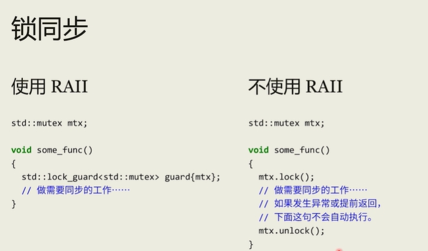

[TOC]


## C++基础

#### 变量的声明和定义有什么区别?

声明不分配内存
定义为变量分配内存和存储空间
变量可以声明多次,但定义只能一次
extern 声明表示变量会在外部其他地方定义(显式只声明不定义)

#### 指针与引用的区别?

1.指针本身就是变量,存放某个对象的地址,其本身需要分配内存 而引用是变量的别名,本身不占内存

2.指针可以被改变, 可以指向其他对象; 而引用从一而终, 不可变

3.存在空指针; 但引用必须被初始化

4.存在多级指针,但没有多级引用

#### 引用的底层是怎么实现的?为什么不能改

在符号表层面:指针变量在符号表上对应的地址值为指针变量的地址值
而引用在符号表上对应的地址值为引用对象的地址值
符号表生成之后就不会再改
因此指针可以改变其指向的对象,而引用对象则不能修改

在汇编层面,引用和指针一样,都会申请一段内存用来存放被引/被指向的变量的地址
所以从汇编层次来看,的确引用是通过指针来实现的,只是这一细节被屏蔽了

在操作引用时,编译器会总是在引用前面加上*,所以可以直接通过引用操作被引对象

#### 引用作为函数参数的作用?

1.不需要进行值的拷贝,节省时间,,且无需创建临时对象存储实参的拷贝,节省内存
函数内部直接操作的就是实参

2.常引用参数:即避免拷贝,又防止函数内部对实参进行修改

#### 指针参数传递和引用参数传递?

指针参数传递本质仍是值传递
将被指对象的地址拷贝后供函数内部使用,可通过该地址解引用访问和修改被指对象
指针本身修改不了

而对引用传递而言
被调函数的形式参数也作为局部变量在栈中开辟了内存空间,存放被引对象的地址
使用引用会直接通过该地址访问到被引对象

可以通过常引用在避免拷贝的同时限制函数内对实参进行修改

#### 引用作为返回值的用处?

1.在内存中不会产生被返回值的临时副本

2.避免拷贝,对于返回值为类对象的函数,避免调用类的拷贝构造函数

返回值有赋值需求的,比如修改a[1],就可以修改a内存第二个位置的数值,而非另一个临时空间的数值

链式操作中的需求,(a = b) = c,++,--,保证了运算结果再参与运算

#### C++类型长度?

short 至少16
int 至少和short一样长,通常32
long 至少32,且至少和int一样长,通常32
long long 至少64,且至少和long一样长,通常64

float为32,double为64

头⽂件climits定义了符号常量INT_MAX等

#### 为什么比较两个double不能用==?

double在内存中是以二进制近似表示的,会导致一些小的舍入误差

> **IEEE 754** 标准
>
> 对于64位的bouble
>
> 符号位 (1 位) 表示数字的符号,0表示正数,1表示负数。
> 指数部分 (11 位 存储浮点数的指数值,用于表示数值的范围
> 实际存储的指数值是经过偏移bias处理的,偏移量为 1023
> 尾数 (52 位):存储浮点数的有效数字
> 这个部分实际上是一个二进制小数.表示数值的精确部分
>
> 一个 `double` 浮点数的值可以通过以下公式计算
>
> $value=(−1)sign×(1+fraction)×2^{exponent−bias}$
>
> - **sign** 是符号位
> - **fraction** 是尾数部分,二进制小数表示的有效数字
> - **exponent** 是指数部分,加上偏移量后得到的实际指数值
>
> 某些十进制数在二进制中无法精确表示(如0.1和 0.2)
> 导致存储时会产生舍入误差
> 尤其是当进行多次运算时,误差可能会积累

double a = 0.1 + 0.2; double b = 0.3; a==b可能返回false

为安全地比较两个浮点数,通常引入一个小的误差范围,称为“容差epsilon
只要两个数的差值在这个容差范围内.就认为它们是相等的

const double epsilon = 1e-9; // 定义一个非常小的数作为容差 
if (fabs(a - b) < epsilon) {   // a 和 b 在容差范围内,认为它们相等 }

#### struct和union的区别?

struct 把不同的数据组合成一个整体
所有成员同时存在struct所占的内存中

union 使几个不同类型的变量共占一段内存
在同一时间union中只存放一个被选中的成员
union的内存大小等于最长的成员的长度

对union的不同成员赋值,将会对其它成员重写,(原来成员的值就不存在了)
而对struct中各个成员赋值时成员之间互不影响

#### const关键字的作用?

1.声明变量为只读,使其不能被修改

2.使用指向常量的引用/指针,表示不能通过这个引用或指针修改被指向的对象

3.常量成员函数,表示这个函数不会修改对象成员

> 如果需要修改个别的 mutable关键字

4.常量对象,使对象的成员不会被修改
(常对象中的数据成员为常变量且必须要有初始值)

5.函数常引用参数:表示不会修改传入的参数

6.函数常量指针参数:声明参数为指向常量的指针,表示函数不会通过这个指针修改指向的变量

#### const是怎么实现的

- 函数内部的const,会由编译器检查有没有修改const变量
  但可以另外定义一个指向这个变量的指针,通过这个指针修改const变量
  函数中局部const变量存储在函数的帧里的,程序拥有对这个存储区写的权限
- 类中const成员变量同理
  存在类对象的内存中,程序有写权限
  只通过编译器检查保证不能直接修改,可间接修改
- 全局变量中定义的const,无法通过指针间接修改值
  全局const变量存放在内存的只读数据段,程序没有写权限

#### 解释底层const和顶层const?

底层const:表示指针或引用的所指对象为常量,不能通过这个引用或指针修改所指对象
可以指向常量,非常量,字面量
(非常量可以给底层const赋值,但常量不能给普通指针赋值)

顶层const:指针常量,表示指针本身是const,不可变,不能指向其他对象
(不变的是指针本身的值而不是指针指向的值)

底层const:const是指针或引用所指对象类型的一部分
顶层const:const是指针本身类型的一部分

```c++
int i = 42;

// 底层const:
// 常量引用:允许为一个常量引用绑定非常量的对象,字面值或一般表达式
// 仅限制通过这个引用修改其绑定的对象,但不限制通过其他方式修改这个非常量
// 普通引用不允许上述特性
const int &r1 = i;
const int &r2 = 42;
// 指向常量的指针
// 指向常量的指针可以指向一个非常量的对象(仅限定不能通过该常量指针修改)
const int *cptr = &i;

// 顶层const
// 常量指针:指针本身是常量,指针本身不能修改(不能指向其他对象)

int *const p = &i;
```

#### static关键字的作用?

作用是控制变量和函数的生命周期,作用域和访问权限
实现多个对象间的数据共享(持久)+隐藏

隐藏:相比于同样在静态存储区的全局变量:可以限定访问范围

持久:存储在静态数据区的变量只会初始化一次,在程序结束时释放

1.静态成员函数

可以通过类名直接访问,无需创建变量
无法访问类内非静态的成员变量和成员函数

2.静态成员变量

所有类对象共享同一份副本
静态成员变量必须在类外单独定义,以分配存储空间

3.静态局部变量

在函数内部加static的变量
生命周期延长到整个程序的执行过程,但只在那个声明它的函数内可见

#### static分配内存空间和初始化时机?

static必须在类声明的外部初始化

如果static变量是基本类型且未显示初始化编译器会默认初始化它们为0
如果是指针类型,则默认初始化为nullptr

全局static变量的内存分配在程序启动时就完成了
全局`static`变量在程序启动时初始化

局部static变量,内存也在程序开始时分配了,但初始化会延迟到函数第一次调用时进行
只有在第一次函数执行到变量声明时才初始化

生命周期都是持续到函数结束
只是访问权限不一样

例外:类型static const int可以类内初始化

#### define,typedef,inline,const的区别?

define: 定义预处理的宏
在预处理阶段起作用
只进行简单的字符串替换,不进行类型检查
不分配内存,给出的是立即数(操作数),使用多少次就进行多少次替换

typedef:
在编译阶段起作用
编译器在编译阶段会将 typedef 定义的别名记录在其内部的符号表中,用于类型检查和代码解析
而在生成可执行文件后,这个别名的信息就不再存在

inline:
在编译时完成
会进行类型检查
将函数体插入到函数被调用的地方,避免了普通函数调用的开销,减少了压栈,跳转和返回的操作
是对编译器的一种请求,有可能拒绝
inline函数不能有循环,过多判断语句,声明必须在调用之前

const:
const用于定义常量;define可用于定义宏或常量
编译阶段进行
需要类型检查
占用内存

#### const和constexpr的区别?constexpr有什么作用

1.const表达的是"只读"的语义,constexpr表达的是"常量表达式"的语义

> 常量表达式:值不会发生改变且编译时就能得到计算结果的表达式
> 只读:无法通过自身去修改

2.constexpr是**声明的一部分**,要求编译器检查后面是不是常量表达式
即constexpr用于声明变量时,要求在编译期间就初始化并确定下来这个变量
constexpr定义的是编译期常量

const是**变量类型名的一部分**,其定义的常量值可以在运行时才确定下来
所以const既能定义编译器常量,也可以定义运行期常量

3.在使用constexpr声明一个类型为T的变量时,constexpr会自动把这个变量定义为const T类型
即在完成检查工作的同时,还把原来的T类型改为了const T类型
但反过来不会

constexpr函数:
可以在常量表达式中使用的函数
形参和返回值都是字面量
被隐式定义成inline

constexpr的作用:
为某些不能修改的数据提供保障,写成变量就有被修改的风险
编译器可对constexpr进行优化,提高效率

#### volatile关键字?应用场景?

1.类型修饰符,表示该变量的数据随时可能发生变化
2.与该变量相关的运算不进行编译优化,避免编译优化导致的指令重排
3.每次都从内存中读值而非从寄存器中拷贝,保证对特殊内存地址的绝对访问

**使用场景:**

1.值可能由硬件随时改变,编译器需要每次都直接访问内存中的值,而不是使用缓存的值

2.有些多核并发场景下使用 `volatile` 来确保每次读取的值是最新的

#### volatile是线程安全的吗?

不是

无法保证对volatile的操作都是原子的

每条操作都可能对应好几条汇编指令

#### extern关键字?

用于声明在函数或文件外部定义的变量/函数

如果文件 a.c 需要引用 b.c 中变量 int v,
就可以在 a.c 中声明 extern int v,然后 就可以引用变量 v

extern 修饰符可用于指示 C 或者 C＋＋函数的调用规范

#### mutable关键字?

在 const 成员方法中修改一个成员变量的值,那么需要将这个成员变量修饰为 mutable

#### 什么是函数指针,有什么作用?

函数指针是指向函数的指针变量,用于存储函数的地址

使用场景
①回调函数:像函数内传入函数指针参数,实现回调机制
②动态加载库
③虚函数+函数指针实现动态多态
④实现函数映射表,实现基于不同的输入调用不同的函数

#### 函数指针和指针函数的区别?

指针函数是返回指针类型的函数

#### struct和class的区别?

1.struct默认public,class默认private
2.struct默认共有继承,class默认私有继承

#### C++隐式转换?

隐式转换,是指不需要用户干预,编译器私下进行的类型转换行为

通过隐式转换,你可以直接将一个子类的对象使用父类的类型进行返回

在构造函数声明的时候加上 explicit 关键字可禁止隐式转换

如果构造函数只接受一个参数,则它实际上定义了转换为此类类型的隐式转换机制。
可以通过将构造函数声明为 explicit 加以制止隐式类型转换
即必须显示调用构造函数

#### 继承关系之间的类型转换?

- 向上类型转换

  自动进行,类型安全

- 向下类型转换

  向下类型转换不会自动进行,因为一个基类对应几个派生类
  所以向下类型转换时不知道对应哪个派生类

  dynamic_cast 主要用在继承体系中的安全向下转型

#### C++四种强制类型转换?

**1.static_cast**

有编译时类型检查
无运行时类型检查

使用场景:

1.基本数据类型之间的转换

2.具体指针和void*指针之间转换
(不能用于两个不相关的具体类型指针之间的转换)

3.上行转换安全,下行转换无类型转换,不安全
把基类指针转为派生类指针时不会检查是否确实是派生类

> 和前面加括号的强转的区别:会进行编译时类型检查
>
> 是一种“万能”的类型转换工具
> 但它缺乏类型检查和明确的转换意图
> 容易导致类型安全问题或缺乏可读性

**2.dynamic_cast**

适用于存在继承关系的类型之间的强制类型转换
要求基类有虚函数,且转换后是指针或引用
可进行安全的下行转换,会有动态类型检查
指针转换失败返回nullptr,引用转换失败报错

当使用 dynamic_cast 时,该类型必须含有虚函数
这是因为 dynamic_cast 使用了存储在 VTABLE 中的信息来判断实际的类型

**3.reinterpret_cast**

自由转换,不进行任何检查,平台移植性差

使用场景:

1.将指针类型转换为整数

在操作内存地址时,可能需要将指针转换为 `uintptr_t` 或 `intptr_t`
进而执行一些地址运算

2.转换不同的指针类型

例如将将某种结构体指针转换为字节指针

3,在访问磁盘时,直接将磁盘中某块内存转为特定类型

**4.const_cast**

去掉或加上指针或引用的const属性
可将指针或引用在仍指向原对象的前提下加上或去掉const属性

使用场景:

1.某些情况下函数接口无法修改,但确实需要对传入的 const 参数进行修改

2.与C库API交互(很多C库函数的接口并不使用 `const` 参数)

#### void指针类型?

void*为通用指针或叫泛指针,它是C语言关于纯粹地址的一种约定
当某个指针是void型指针时,所指向的对象不属于任何类
因为void指针不属于任何类型,则不可以对其进行算术运算,比如自增,因为编译器不知道其自增需要增加多少,也不能解引用

任何类型的指针都可以赋值给void指针

业务数据与底层存储实现了抽象解耦
例如可以让函数接收任意类型的指针

#### 友元是什么?

有些私有属性,也想让类外特殊的一些函数或者类进行访问

- 全局函数做友元
- 类做友元
- 成员函数做友元

破坏了封装性,不可继承

#### 什么是string?

**string**

不是容器,在内存中连续存在

但有和其他序列容器类似的成员函数
begin,end,size,swap,==,<等比较
可用迭代器遍历

- begin,end是迭代器(end指向最后一个字符后一个,即'\0')
- front,back是引用,指向第一个和最后一个有效字符

支持字符串拼接,查找,支持到整数的互转

支持给期待const char*的接口传递字符串内容(使用c_str)

如果不需要修改字符串内容,推荐接口使用`string_view`或`const char*`
避免额外的拷贝和堆上的内存分配

如果需要修改传入参数的字符串,使用`string&`

## C++内存管理

#### 如何使用C语言测试大端和小端字节序?

union测试

```c++
#include<stdio.h>

union myunion
{
    int a;
    char b;
}; 

int main(void)
{
    union myunion s1;  
    s1.a=0x10000000;
    if(s1.b==0x10)
        puts("大端模式");
    if(s1.b==0x00)
        puts("小端模式"); 
    return 0;
}
```

指针测试

```c++
#include<stdio.h>

union myunion
{
    int a;
    char b;
}; 

int main(void)
{
    int a;
    a=0x10000001;     //指针测试
    char b=*((char*)(&a));
    if(b==0x10)
        puts("大端模式");
    else if(b==0x01)
        puts("小端模式"); 
    return 0;
}
```

#### new和malloc的区别?free和delete的区别?

new和malloc:

①new是运算符,malloc是C标准库函数
②new无需显式指定内存大小,自动计算,new可用于动态分配数组;
malloc需显式指定需分配的内存大小
③new类型安全;malloc类型不安全
④new会调用构造函数完成对象的构造,malloc不会
⑤new可被重载;malloc无法重载
⑥new返回的是具体类型的指针;malloc返回的是`void*`,需手动类型转换
⑦分配失败时,new抛出bad_alloc错误;malloc返回空指针

free和delete:

①delete是运算符,free是标准库函数
②delete会调用析构函数,free不会
③delete可用于释放动态分配的数组,free不行

注意:delete和free空指针是安全的,什么都不发生;

#### 能否malloc(1.2G)?

1.只申请1.2G

能,因为申请内存时申请的是虚拟内存,不会分配物理内存

当使用了这块内存,才会产生缺页中断,分配空闲的物流内存
当空闲物理内存不够时触发 OOM(Out of Memory)机制

如果是32GB系统,用户空间3GB
若申请大于3GB的内存,则在申请虚拟内存节点就会失败
而64 位操作系统,最多申请128 TB 大小的虚拟内存空间

2.申请并使用1.2G,且空闲物理内存不足1.2G

- 未使用swap机制,程序就会直接 OOM
- 使用swap机制,程序可以正常运行

Swap机制是Linux一种利用磁盘空间来扩展内存的方法
把当前暂时不使用的内存移到磁盘,后续使用时再移入内存

缺陷:频繁读写磁盘会显著降低操作系统的运行效率

内存回收至磁盘的时机:

- 后台内存回收(kswapd):使用后台内核线程异步回收
- 直接内存回收如果后台异步回收跟不上进程内存申请的速度,就会开始直接回收
  这个回收内存的过程是同步的,会阻塞进程的执行

#### delete和delete[]的区别

- 当数组元素是基本数据类型

  delete[] 和 delete 等同
  因为分配简单类型内存时,内存大小已经确定,系统可以记忆并且进行管理
  在析构时,系统也并不会调用析构函数

- 当数组元素是自定义类型

  数组占据内存空间都会被释放
  但若使用delete,只有第一个元素的析构函数会被调用
  导致后面元素的相关资源可能无法正常释放(例如端口号(没有close),文件描述符没关闭等)

#### C++内存分区?

#### 进程地址空间分布?

对于32位系统而言,进程的地址空间为4GB
从高到低依次为1GB的内核空间和3GB的用户空间

用户空间从高地址到低地址依次为:

①命令行参数&环境变量

②栈区,从高地址到低地址增长
存放局部变量,函数形参,返回值,离开作用域生命周期结束
分配效率较高

③共享区(文件映射区),在栈区和堆区之间
包括动态库,共享内存等
从低地址开始往上增长

④堆区,从低地址到高地址增长
由程序员控制生命周期

⑤静态(全局)存储区
分为未初始化静态存储区(bbs)和已初始化静态存储区(data)
程序编译时就已分配好,生命周期是程序的整个运行期间,存放全局变量,静态变量
(在编译阶段就确定了大小,不释放)

⑥常量区(.rodata)
又称只读数据段.存放常量数据
如const全局变量,\#define定义的常量,字符串常量等

⑦代码区(.text)

#### Linux下内存分配的方式?malloc的实现?

malloc是C库函数,其会用两种方式向OS申请内存:
(new底层也是调用malloc)

1.当申请的内存在128kb以下时

- 内存池和已有堆空间的分配

当调用 malloc 申请小块内存时,内存分配器(如 glibc 中的 `ptmalloc`)首先会在已经分配的堆空间中查找是否有合适的空闲内存块,如果找到合适的内存块(通常通过内存池或空闲链表管理),则直接分配给应用程序,无需进行系统调用

- 堆空间不足时扩展

如果现有堆空间(内存池)不能满足 malloc 的请求(即没有足够大的连续空闲块),则分配器会调用 brk 或 sbrk 系统调用来扩展堆的边界,为进程分配更多的虚拟地址空间

当 brk/sbrk 扩展堆时,进程获得了更多的虚拟地址空间,但这时还没有立即分配物理内存
只有当进程首次访问这些新的虚拟地址时会触发页面错误
内核通过伙伴系统为该虚拟页面分配实际的物理页面,并更小页表

> 实际分配的内存空间为要求分配的空间+16KB
> 16KB存储了该内存块的大小等描述信息,以供free释放时使用

2.当申请的内存大于等于128KB时,会使用mmap()系统调用在文件映射区分配
free 释放内存的时候,会把内存归还给操作系统,内存得到真正的释放

(1)为什么不全都采用mmap()?

①每次向操作系统申请内存和释放内存都需要执行系统调用
系统调用需要先进入内核态,再切换会用户态,模式切换耗费时间
②由于mmap申请的内存每次都归还给操作系统
所以每次申请,分配的虚拟内存都是缺页状态,第一次访问都会缺页中断

而若使用brk(),释放后的内存缓存在malloc的内存池中
下次申请时,直接从内存池中取出对应的内存块即可
如果这个内存块的虚拟地址到物理地址的映射还在,就避免了系统调用和缺页中断

(2)为什么只有128KB以下的分配才采用brk()?

使用brk()分配容易产生碎片
所以只有分配小块内存才使用brk()

#### 说一下C++的内存分配方式?

①静态存储区
②栈区
③堆区+文件映射区

#### 为什么栈空间分配效率高?

1.有专门的寄存器直接对栈进行访问,而对堆访问,只能是间接寻址
也就是说,可以直接从地址取数据放至目标地址
使用堆时,第一步将分配的地址放到寄存器,然后取出这个地址的值,然后放到目标地址
2.栈中数据cpu命中率更高,满足局部性原理
3.栈是编译时系统自动分配空间,而堆是动态分配,运行时分配空间,所以栈的速度快
4.栈是先进后出的队列结构,比堆结构相对简单,分配速度大于堆

#### 什么是内存泄漏?怎么解决?

指程序未能正确释放掉不再使用的内存的情况
即程序失去了对已分配过的内存的控制

场景内存泄漏的场景

- 手动分配的堆内存忘记释放导致泄漏

- 动态分配的内存覆盖了原先分配的内存导致原内存泄漏

  ```c++
  char* leakyString = new char[25];
  // 重新分配,原内存未释放
  leakyString = new char[50];
  delete[] leakyString; // 释放第二次分配的内存
  ```

- 使用未初始化的指针

- 系统资源泄漏(如bitmap,socket,文件描述符等)

- 未将基类的析构函数设为虚函数,导致未正确调用子类的析构函数

1.记得释放(delete和new配对,记得关闭连接,文件描述符等系统资源)

2.RAII思想(如使用智能指针)

> RALL即使用栈上的对象帮助管理堆上的资源
> 

3.泄露以后使用内存泄漏检测工具检测

#### 什么是野指针?怎么解决?

野指针即指向已被释放或无效内存的指针

①释放后未置空
②传出局部变量的指针
③函数释放参数传入的指针

解决方法:
①释放后置空
②不要传出指向局部变量的指针
③注意指针的生命周期,不要错误地释放参数传入的指针
④使用RAII思想,使用析构函数释放资源,或使用智能指针

#### 什么是内存对齐?有什么作用?

内存对齐指的是变量的起始地址必须是某个值的整数倍
如果变量的起始地址为自身长度的整数倍,则称为自然对齐

作用①提高存取效率,一次取出,避免内存不对齐造成的性能损失

> 为了访问未对齐的内存,处理器需要作两次内存访问
>
> 例如一个32位的数据没有放在4字节整除的地址
> 需要两个周期进行访问

②缓存行可以存更多数据,提高缓存命中率

**结构体内存对齐?**

第一个数据成员存放的地址为结构体变量偏移量为0的地址处

其他结构体成员自身对齐时,存放的地址为:
min{有效对齐值为自身对齐值, 指定对齐值} 的最小整数倍的地址处

> 注:自身对齐值:结构体变量里每个成员的自身大小
> 注:指定对齐值:有宏 #pragma pack(N) 指定的值,这里面的 N一定是2的幂次方.如1,2,4,8,16等.如果没有通过宏那么在32位Linux主机上默认指定对齐值为4,64位的默认对齐值为8,AMR CPU默认对齐值为8;

总体对齐时,结构体字节大小是min{所有成员中自身对齐值最大的, 指定对齐值} 的整数倍

#### strlen/sizeof?

strlen不包括字符串末尾的'\0'
sizeof字符数组则包括末尾的结束符

#### 实现strcpy/memcpy?

```c++
char* strcpy(char *dst,const char *src) {
    assert(dst != NULL && src != NULL); //体现健壮性
    char *ret = dst;
    while ((*dst++=*src++)!='\0');
    return ret;
}
```

返回char*:使支持链式表达式

如果有内存重叠的情况:src还未处理的部分已经被dst覆盖了
即`src<=dst<=src+strlen(src)`

C标准库的函数memcpy可处理内存重叠的情况,实现如下
(内存重叠时从高地址开始复制)

```c++
char* my_memcpy(char *dst, char *src, int cnt) {
    assert(dst != NULL && src != NULL);
    char *ret = dst;
    if (src <= dst && dst <= src+cnt-1) {
        // 内存重叠,从高位开始复制
        src = src + cnt - 1;
        dst = dst + cnt - 1;
        while (cnt--) {
            *dst-- = *src--;
		}
    } else {
        while (cnt--) {
            *dst++ = *src++;
        }
    }
    return ret;
}
```

#### 实现string类的构造函数和赋值运算符?

已知string的原型如下,请编写这4个函数
(考察含有指针的类的构造函数和赋值运算符的写法)

```c++
class String{
public:
    String(const char *str = NULL);
    String(const String &other);
    ~ String(void);
    String & operate =(const String &other);
private:
	char *m_data;
};
```

函数实现:(赋值运算符要检查自赋值)

```c++
String::String(const char *str) {
    if (str == NULL) {
        m_data = new char[1];
        m_data[0] = '\0';
	} else {
        int length = strlen(str);
        m_data = new char[length + 1];
        memcpy(m_data, str);
    }
}

String::~String() {
    delete []m_data;
}
String::String(const String &other) {
    int length = strlen(other.m_data);
    m_data = new char[length + 1];
    memcpy(m_data, other.m_data);
}
String &String::operate =(const String &other) {
    if (this == &other) {
        return *this;
    }
    delete []m_data;
    int length = strlen(other.m_data);
    m_data = new char[length + 1];
    memcpy(m_data, other.m_data);
    return *this;
}
```

#### linux怎么检测内存越界的?

首先区分数组越界和内存越界

对于数组越界,在编译时可以进行检测

运行时,可能检测到,可能检测不到
如果越界的内存在当前进程的地址空间中,则不会检测到

内存越界,指程序操作的内存范围超过了其地址空间范围

在CPU中设置一对上下限寄存器,存放进程的上下限物理地址
进程的指令要访问某个地址时,CPU检查是否越界

## C++新特性

#### 介绍一下智能指针?

作用:避免资源内存泄漏和方便资源管理

**1.unique_ptr**

独占所有权,确保仅有一个`unique_ptr`可以拥有指定的内存资源
可以通过右值引用和移动语义实现高效的所有权转移

**无法拷贝和赋值,但可以拷贝或赋值一个将要销毁的`unique_ptr`**
可通过reset将资源所有权从一个`unique_ptr`转移到另一个`unique_ptr`

当被销毁时会立即释放资源

使用场景:你需要智能管理资源,如文件句柄和互斥锁时
且不需要共享,其相比于shared_ptr更轻量化,和裸指针开销相同

**2.shared_ptr**

允许多个智能指针共享同一个资源和引用计数
内部维护引用计数,为0时释放资源

线程安全问题:
①多个线程使用同一个`shared_ptr`:线程不安全
②多个线程使用共享同一个引用计数的`shared_ptr`:线程安全

可能存在的问题:循环引用
创建2个shared_ptr分别指向类A和类B的对象
A类对象有一个shared_ptr成员,指向B
B类对象有一个shared_ptr成员,指向A
当释放A类对象时,会将指向A和B的shared_ptr的引用计数都从2变成1,但无法释放

**3.weak_ptr**

目的:解决`shared_ptr`循环引用的问题
不占用引用计数,不影响资源释放
由shared_ptr创建,使用时需用lock函数获取一个shared_ptr

#### 智能指针常用成员方法

- shared_ptr

  p.unique() 当p.use_count()==1时返回true
  p.use_count() 返回与p共享对象的智能指针数量

  定义shared_ptr的方法:
  shared_ptr p(q); q是内置指针
  shared_ptr p(u); u是unique_ptr
  shared_ptr p(q,d); d是可调用对象,代替delete shared_ptr p(p2,d);
  p2是另一个shared_ptr,d同上

  p.reset() 若p引用计数为1,则释放并置空p
  p.reset(q) 会令p指向内置指针q
  p.reset(q,d) 会令p指向内置指针q并用d代替delete
  (使用reset前,常用.unique()检查是否是这个对象的唯一用户,如果不是,则需要创建拷贝)

- unique_ptr

  可以通过release或reset将指针的所有权从一个非const的unique_ptr转移给另一个unique release只会放弃控制并返回指针,并不会释放该指针,如果需要,应手动释放
  reset会释放原来unique_ptr所指向的内存

- weak_ptr

  w.use_count(); //所指对象相同的shared_ptr数量
  w.expired(); //若w.use_count()==0,则返回true
  w.lock(); //若w.expired()为true则返回空shared_ptr,否则返回一个指向w对象的shared_ptr
  因为对象可能不存在,不能通过weak_ptr直接访问对象,必须通过调用lock()

#### make_unique和make_shared

它们是创建智能指针的工厂函数

**std::make_unique**

- 返回一个 `std::unique_ptr<T>`,对象由独占指针管理
- 异常安全:在构造过程中若抛出异常,不会造成内存泄漏

```c++
int main() {
    auto p = std::make_unique<Person>("Alice", 30);

    // 转移所有权
    std::unique_ptr<Person> p2 = std::move(p);
    if (!p) {
        std::cout << "原指针已置空，所有权转移至 p2" << std::endl;
    }
    return 0;
}
```

**std::make_shared**

- 返回一个 `std::shared_ptr<T>`
- 单次分配:对象与控制块(引用计数)通常只做一次内存分配,提高性能,减少内存碎片
- 异常安全:同 `make_unique`

#### 使用智能指针一定可以避免内存泄漏吗

不正规的使用

- shared_ptr循环引用导致资源无法释放
- 自定义的析构函数错误
- 使用智能指针接管了裸指针后,释放原来的裸指针
  导致重复释放程序崩溃,间接引发内存泄漏

#### weak_ptr真的不计数吗?什么是控制块

计数分为强引用计数use_count和弱引用计数weak_count

前者用来管理对象的生命周期,为0时释放内存

弱引用计数weak_ptr也会增加
只用来管理控制块本身的存在,当两个引用都为0时控制块才会销毁

控制块是一个独立的结构体
包括了强引用计数,弱引用计数,被管理的对象的指针,自定义的析构函数等

- 使用make_shared 初始化

  控制块和实际对象通常分配在同一块内存中
  这种方式优化了内存分配,减少了分配的次数

- 使用new 和 shared_ptr构造函数 初始化

  对象和控制块两次分配

#### unique_ptr?所有权被转移后再使用会怎样?

对动态分配对象的独占所有权
销毁时,它所指向的对象也会被自动删除

std::make_unique在内存分配和对象构造期间提供了异常安全保证
如果在构造对象时发生异常,已分配的内存会被自动回收,这样就不会发生内存泄漏

它会把指向对象的指针和对象的所有权移交给目标std::unique_ptr,然后将自身置为空

#### make_shared构造与先new再用裸指针构造shared_ptr相比?

①std::make_shared 一次性为int对象和用于引用计数的数据都分配了内存
而new操作符只是为int分配了内存,即new方式最终要分配两次内存

②因为有对应的优化,make_shared会比new快

③如果用先new再用其创建shared_ptr的方案,在并发时
若为以下顺序:
new Lhs();
new Rhs();
std::shared_ptr;
std::shared_ptr;
在第二步异常,第一步申请的内存将没处释放了
产生内存泄露的本质是当申请数据指针后,没有马上传给std::shared_ptr

std::make_shared在内存分配和对象构造期间提供了异常安全保证
如果在构造对象时发生异常,已分配的内存会被自动回收,这样就不会发生内存泄漏

④使用后者方式,如不慎在创建智能指针后继续使用原来的普通指针,可能导致指针空悬

#### 手写智能指针?

##### 技巧:用拷贝+交换实现赋值

```cpp
template <typename T>
class smart_ptr {
    T* release() {
        T* ptr = ptr_;
        ptr_ = nullptr;
        return ptr;
    }
    
    void swap(smart_ptr& rhs) {
        using std::swap;
        swap(ptr_, rhs.ptr);
    }
    
    smart_ptr(smart_ptr& other) {
        ptr_ = other.release();
    }
        
    smart_ptr& operator=(smart_Ptr& rhs) {
        smart_ptr(rhs).swap(*this);
        return *this;
    }
}
```

1.构造一个临时对象,它会从 rhs “偷走”内部指针
结果:临时对象拥有了 rhs 原来的资源,rhs 变为空

2.把临时对象和 *this (=左侧对象) 的内部指针对换

3.`*this`拿到了临时对象原来(也就是 rhs 原来)的指针
临时对象拿到了 `*this`旧有的指针

然后临时对象马上离开作用域析构,析构函数会 delete 它手上的那支旧指针
这样就清理掉了 *this 赋值前的旧资源

这样写的原因:

> **强异常安全**
>
> 强异常安全的承诺是:
> 要么操作成功并完成,要么在抛出异常后对象保持调用前的原子状态,不被破坏
>
> 1.先构造临时副本,可能抛异常,但此时 *this 还没动
> 2.再交换资源+让临时对象析构释放旧资源,这两步是noexcept
>
> 如果不这样,而是:
>
> ```cpp
> smart_ptr& operator=(const smart_ptr& rhs) {
>     if (this != &rhs) {
>         // 释放旧资源
>         delete ptr_;
>         // 从 rhs 拷贝新资源（可能分配并抛异常）
>         ptr_ = rhs.clone();
>     }
>     return *this;
> }
> ```
>
> 如果 `rhs.clone()` 在步骤②抛出了异常
> 那么我们已经做了 `delete ptr_`,破坏了原有状态,不能强异常安全
>
> 即因为拷贝这一步可能抛异常
> 所以先拷贝到一个临时对象中,再交换
> 而不是先清空原资源,再拷贝

##### 技巧:统一拷贝赋值和移动赋值(值传递代替上面的临时对象)

```cpp
template <typename T>
class smart_ptr {
    smart_ptr(smart_ptr&& other) {
        ptr_ = other.release();
    }
    smart_ptr& operator=(smart_ptr rhs) {
        rhs.swap(*this);
        return *this;
    }
}
```

**核心就在于参数 `rhs` 是按值传入的**

当调用

```c++
a = b;             // b 是左值
a = std::move(b);  // b 是右值
```

在传参时都会先“造”出一个局部对象 `rhs`

- 如果源是左值,调用它的拷贝构造
- 如果源是右值,调用它的移动构造(上面那个 `smart_ptr(smart_ptr&&)`)

在这一步,如果抛异常,this根本没动,强异常安全就保证了

之后再进行交换

最后传参进来的rhs是一个局部变量,出作用域后析构

##### unique_ptr

不允许拷贝构造和拷贝赋值
允许移动构造和移动赋值

可以只实现移动构造和移动赋值

##### shared_ptr

多个shared_ptr共享同一对象和一个引用计数

#### C++11的新特性有什么?

1.统一的初始化方法(用大括号{ }来进行初始化)

2.成员变量默认初始化

3.auto关键字 自动推断类型

4.decltype 获取表达式类型

5.nullptr 空指针

6.智能指针

7.右值引用与移动语义

8.范围for

9.无序容器

10.lambda表达式

#### 类成员初始化方式有什么?为什么用初始化列表更快?

赋值初始化:通过在构造函数函数体内进行赋值初始化
列表初始化:构造函数函数名后面加冒号再加初始化列表

前者是在所有数据成员被分配内存空间后才进行
后者是在给数据成员分配内存空间时就进行初始化(构造函数函数体还未执行)

因为前者的赋值操作会产生临时对象,所以后者更快

初始化顺序由类中的成员声明顺序决定的,与初始化列表的顺序无关

#### 介绍一下auto关键字?

auto让编译器在编译期推导出变量的类型(因此不会影响程序运行的速度)

auto不声明为引用时会忽略右边的引用,而是推导出被引用对象的类型

不明确指出,会忽略顶层const(底层const会保留)

不能用作函数参数类型,不能用作类的非静态成员类型

auto不能定义数组,但可以定义指针

同一行定义多个变量,类型不能有二义性
(`*,&`不属于数据类型的一部分,const属于类型的一部分)

#### 介绍一下decltype?

推导表达式类型,不进行计算

会保留表达式的引用和顶层const

`decltype(auto) a = expr;` 自动推导类型

①输入标识符,推导出标识符类型
②输入函数调用.推导出函数返回值类型
③其他情况,输入左值(如表达式),推导出左值引用
输入右值,推导出被引对象的类型

#### 为什么要有nullptr?

为了区分0和NULL

#### lambda表达式?

[=]值捕获,**创建时拷贝**
[&]引用拷贝,保证lambda执行时变量存在

#### 解释一下左值,右值,右值引用,移动?

**三种值类型**

1.左值:表达式结束后依然存在的持久化对象,有名字,可取地址

2.右值:表达式结束后就不再存在的临时对象,也叫纯右值(prvalue)

> int a = b+c,a是左值,b+c是右值
> 以及除字符串字面量以外的字面量(true,42),lambda表达式都是右值

3.将亡值(xvalue),属于右值,但xvalue也是广义左值`glvalue`的一个子类别
其表示“有身份且可被移动的值”,例如std::move(x)的返回结果

**右值引用**

C++11的新特性,用于绑定右值(prvalue 与 xvalue)
**即C11后纯右值与将亡值将优先绑定到右值引用**
延长了右值的声明周期(和右值引用一样长)

注意具名的右值引用表达式本身是左值表达式,因为可取地址,有名字

作用:右值引用会告诉编译器

1. 这是一个“即将消亡”的对象
2. 它的内部资源可以安全地“转移”给新对象
   在确保其他变量不再被使用,或即将被销毁时可进行移动,避免内存的释放和分配

例如右值引用绑定std::move的返回值
可以用来转移所有权,获取其他对象内存的所有权的带的值

**移动语义**

移动:转移所有权
移动构造函数/移动赋值运算符:
①将自己的指针指向别人的资源(如是移动赋值运算符,还需释放自己的资源)
②将别人的指针设为nullptr(防止被移动的对象的析构函数把资源释放掉)

移动语义通过右值引用实现,即把被移动的对象当作是即将被销毁的临时变量右值
允许开发者通过右值引用捕获临时对象
从而可以对这些临时对象进行修改或“移动”其内部资源,而不是复制它们

#### 解释一下完美转发?

转发:一个函数将参数转发给另一个函数处理
完美转发:保留传入参数的左右值属性
实现:通用引用+std::forward

```c++
template<typename T>
void func(T &&t) {
    func1(std::forward<T>(t));
}
```

std::forward是一个函数模板
它接受一个通用引用,并将其转发给另一个函数

**1.通用引用:T&&+forward**

但函数传参进来时,不用通用引用,则会传入时丢失左右值属性
万能引用用来接受任意类型的值

> T&只能接受左值引用,传递右值会导致编译错误
> T是值属性,会丢失引用属性和右值属性

> 当**发生自动类型推断**时
> 如函数模板的类型自动推导,或auto关键字,`T&&`才是一个通用引用
>
> 通用引用用在传入函数参数的时候,如上面的函数模板表示的是右值引用的话,肯定是不能传递左值的,但是事实却是可以,这里的`&&`是一个未定义的引用类型,称为`universal references`,它必须被初始化,它是左值引用还是右值引用却决于它的初始化,如果它被一个左值初始化就是左值引用;如果被一个右值初始化就是右值引用

**2.forward**

使用万能引用后能够接受任意类型的值

但在函数内部直接传递参数给另一个函数无法保留原来的值类别

如果直接将 T&& 传递给另一个函数,参数会总是被当作左值来使用
因为**在表达式中,所有命名的变量都视为左值**

**forward转发会保留左右值**

#### ++i和i++返回的类型有什么去别?

++i返回的是自身的引用
i++返回的是临时的拷贝
所以前者效率更高

++i返回的是左值
i++返回的是右值(将亡值,无法取地址)

#### std::function的作用是什么?

是所有可调用类型的语法糖

```c++
std::function<int(int)> func;
std::queue<std::function<void()>> queue;

// 将F用bind转为符合void()的形式
auto task = std::make_shared< std::packaged_task<return_type()>>(  
        std::bind(std::forward<F>(f), std::forward<Args>(args)...));

// 将packaged_task用lambda表达式转为符合std::function要求的形式
tasks.emplace([task](){(*task)();});
```

#### string_view,span和view?

View的核心思想就是“非拥有+ 轻量级”地“观察”已有的数据,而不用拷贝它

**1.`std::string_view`**

内部有字符串开始处的指针+长度
没有字符串实际的内容,避免拷贝开销

**仅用来观察访问原字符串,只读,不能修改原字符串内容**

可以接受任意“可读 char 序列”
`std::string`,C-string,字面量,甚至某个 `vector<char>` 的 `&v[0]`

不拥有内存,需要确保被观察的string在内存中存在

> **VS 引用参数**
>
> 给函数传参时,如果用引用参数`void foo(const std::string& s);`
> 若传入的不是string,而是C风格字符串,字面量,string_view
> 都需要隐式构建一个string,发生一次分配或拷贝
> 而使用string_view作为形参则可直接绑定,没有整个开销

**2.`std::span<T>`**

对一段连续的 `T` 元素序列的非拥有引用

**可读写(只读需指定const)**

内部:开始指针+长度

- 泛化了 `string_view` 的概念,可以操作任何 POD 或对象类型的数组片段
- 既有读写版本,也可写 `std::span<const T>` 做只读视图
- 支持 `.subspan()`,`.first(n)`,`.last(n)` 等切片操作

```c++
void process(std::span<int> v) {
  for (int& x : v) x *= 2;
}

std::vector<int> a = {1,2,3,4};
process(a);               // 隐式转换vector→span<int>
int buf[5] = {5,6,7,8,9};
process(buf);             // C-array→span<int>
process({ &buf[1], 3 });  // 手动指定ptr+len,从buf[1]开始的3个元素
```

**3.`std::ranges::view`**

不拥有底层数据,只保存对原 Range 的引用或迭代器范围

**View Adaptors**

`<ranges>` 中提供了一系列 惰性适配器,用来在遍历时做筛选,变换,截断等操作
惰性执行:只有在遍历（或 `ranges::to<…>`）时才进行筛选/转换
多个 view 适配器用 `|` 链式拼接组合

**一般只读,除了transform可以改变值**

```c++
#include <ranges>
#include <vector>
#include <iostream>

int main() {
  std::vector<int> v = {1,2,3,4,5,6,7,8,9};
  // 惰性筛选 只遍历偶数,然后再乘以 10
  auto view = v 
            | std::views::filter([](int x){ return x % 2 == 0; })
            | std::views::transform([](int x){ return x * 10; });

  for (int x : view) {
    std::cout << x << " ";  // 输出 20 40 60 80
  }
}
```

#### 什么是返回值优化?

发生在函数通过返回值传递对象时

没有优化:会调用拷贝/移动构造函数,通过拷贝/移动构造一个新对象给调用方
函数内部的对象也需要析构释放,开销较大

而有返回值优化,编译器能直接在调用者分配的空间上构造返回值对象
完全跳过临时拷贝/移动,只用构造一次,也避免了析构

分为RVO和NRVO

- RVO 直接 `return Foo(/*…*/);`——返回的对象是一个“临时匿名对象”

- NRVO 返回的是一个有名字的局部变量 `name`,编译器也能对它做同样的“就地构造”优化
  但注意:需满足这个名字在函数内所有返回路径上都指向同一个对象

- C11和14中RVO和NRVO属于可选优化,编译器通常会做
  C17中,RVO场景会强制省略拷贝/移动构造,进行返回值优化

  ```c++
  // —— RVO 示例 ——  
  Widget make_rvo() {
      return Widget(42);    // 直接在调用者处原地构造,Widget(42) 不产生临时  
  }
  
  // —— NRVO 示例 ——  
  Widget make_nrvo(bool flag) {
      Widget result(42);
      if (flag)
          result.set_value(100);
      return result;        // 编译器把 result 当作就地构造对象  
  }
  
  // NRVO不成立的情况:
  A get_duang() {
      A a1;
      A a2;
      if (rand() > 42) {
          return a1;    // 返回命名的局部变量 a1
      } else {
          return a2;    // 返回命名的局部变量 a2
      }
  }
  // 两个分支返回了不同的名字(a1,a2)
  // 编译器就没法把它们统一 “就地构造” 到同一块调用者空间
  // 让它可以NRVO:
  A get_duang() {
    A result;
    if (rand()>42)
      result = /* … */;
    else
      result = /* … */;
    return result; // 唯一的 result，可做 NRVO
  }
  ```

**因为有返回值优化,所以尽量用返回值来传递对象,而不是通过输出参数**

但有例外情况:

- 返回子对象／局部资源不足以表达所有权
  比如返回值可能是子对象的情况,使用 `unique_ptr` 或 `shared_ptr` 来返回对象

  ```c++
  class ConfigSection {
  public:
      ConfigSection(const std::string& name);
      // 很多成员函数和数据
  };
  
  // Config 内部将各个 Section 存成 shared_ptr
  class Config {
      std::unordered_map<std::string,std::shared_ptr<ConfigSection>> sections_;
  public:
      // 从 Config 里“拿出”一个子对象 Section,并把它的 shared_ptr 返给调用者
      std::shared_ptr<ConfigSection> getSection(const std::string& name) const {
          auto it = sections_.find(name);
          if (it == sections_.end())
              return nullptr;      // 返回空指针表示没找到
          return it->second;       // 共享所有权
      }
  };
  ```

- 移动代价过高

  对于移动代价很高的对象,考虑将其分配在堆上,然后返回一个句柄,如unique_ptr
  或传递一个非 `const` 的目标对象的引用来填充(用作输出参数)

  ```c++
  std::unique_ptr<BigBuffer> make_buffer() {
    return std::make_unique<BigBuffer>(/*…*/);
  }
  
  void load_buffer(BigBuffer& out) {
    // 在 out 内部重用已有容量,只做必要的扩容
  }
  ```

- 重复调用里对象复用

  要在一个内层循环里在多次函数调用中重用一个自带容量的对象
  将其当作输入/输出参数并将其按引用传递

  因为返回值优化虽然省略了拷贝和临时对象的析构,但还是有一次构造

  ```c++
  std::vector<int> make_vec();
  for (…) {
    auto v = make_vec();  // 每次都要分配、构造、析构
    // … 用 v 做事 …
  }
  
  // 解决方法:
  void make_vec(std::vector<int>& out) {
    out.clear();
    // 如果 out.capacity() 足够,就不会再 realloc
    // 填充数据到 out
  }
  
  std::vector<int> buf;
  buf.reserve(1000);
  for (…) {
    make_vec(buf);
    // 用 buf 做事
  }
  ```

## C++面向对象

#### 一个类声明的时候有什么东西?

构造函数
析构函数
拷贝构造函数
赋值运算符重载函数
普通对象取地址运算符
const对象取地址运算符

#### 讲一下C++面向对象三大特性?

1.继承

让一个类可以获得另一个类的属性或方法
使用另一个类的所有功能和接口,并在无需编写被继承类的情况下对原来的类进行扩展

2.封装

基于将客观事物封装成抽象的类是思想,在类中提供相关的成员和方法
可由类自己控制将类内的成员和方法对可信的类或对象可见,对其他不可信的类和对象进行隐藏

3.多态

多态既让同一个事务表现出不同的功能
分为由重载实现的编译时多态,和由虚函数和重写实现的运行时多态
后者可以把子类对象的指针赋值给父类类型的指针,然后可通过父类的指针调用子类重写的方法

使用多态可以避免在父类中重载大量代码导致代码臃肿,难以维护

**注意多态只能通过指针和引用实现**

#### 什么是对象切片(Object Slicing)?

当子类对象被赋值（或返回）给一个父类的变量(值传递)时,只有父类的部分会被保留下来,子类中新增的成员和虚函数行为会被“切掉”

**与多态的区别: 多态必须通过指针或引用来实现**

对象切片会丢失子类特性,但不会报错
因为是自动的向上类型转换

```c++
shape create_shape()
{
    ...
    return circle();
}
// 其中 circle 是 shape 的子类
```

#### 函数重载是怎么实现的?

在汇编过程中编译器会收集全局符号并生成全局符号表
将符号和其相应地址一一对应的表格称为符号表

在汇编过程中每个文件都会生成本文件的符号表
对于暂时找不到地址的函数(如只有声明),它的地址是一个没有意义的填充值
之后在链接过程中需要对符号表进行合并

如同一个函数名在符号表中出现多次,且多个重名函数地址都有效
则会在链接的时候产生冲突,C语言会因为这种冲突导致不支持函数重载

C++支持函数重载,因为C++对写入符号表的函数具有一个修正的过程
Linux下用`g++`编译后,函数名在符号表中被修正,解决了同名函数的冲突

> 修正为 `_Z + 函数名长度 + 函数名 + 类型首字母的小写`
>
> 也叫name mangling(倾轧)技术

#### 什么是多重继承和虚继承?

一个派生类同时继承了多个基类

可能的问题:菱形继承
即派生类可能多次继承同一个基类,导致派生类中存在多个同一基类的子对象,导致二义性问题

解决方法:虚继承
使用`virtual`方法让某个类做出声明,愿意共享它的基类
被共享的基类称为虚基类

对于虚基类的派生类后续再次派生出的类来说,虚基类子对象在继承体系中只出现一次
避免之后派生出的这些类中可能会存在多个同一基类的子对象

虚基类总是由最底层的派生类初始化,而不是它们的直接基类
在构造时虚基类总是优先于非虚基类被构造,与其在继承体系中的位置无关
(如有多个虚基类,则它们之间的先后顺序由继承列表中前后顺序决定)
在析构时则相反,虚基类最后被销毁

#### C++构造函数和析构函数执行顺序?

先父类构造,再子类构造
父类的构造函数中,先执行虚基类构造,然后是非虚基类

先子类析构,再父类析构
父类的析构中,虚基类最后被销毁

#### C++为什么要有this指针

this指针是指针常量,不能修改

- 当形参和成员变量同名时,可以用this指针区分
- 在类的非静态成员函数中返回对象本身,可使用return *this

静态成员函数不能使用this指针
因此静态成员函数不属于某个特定的对象

每个非静态成员函数的第一个参数默认都有个指向对象的 this 指针

> 如果成员函数中没有用到类内其他成员,即使对象为空,该成员函数仍可正常执行
>
> ```c++
> class A{
>     int i;
>     public:
>     void Hello() 
>     { 
>         cout << "hello" << endl; 
>     }
> }; 
> int main(){
>     A * p = NULL;
>     p->Hello(); //结果仍可正常打印hello,因为没有用到i
> }
> ```

#### delete this的作用

delete this会去调用本对象的析构函数

可以实现当引用计数为0时释放自己
不用外部去调用析构函数或离开作用域调用析构函数

注意:若在析构函数中使用delete this,会形成无限递归,造成堆栈溢出,系统崩溃

#### 重载和重写的区别?

重载:在同一作用域下,使用相同的函数名,但是参数列表不同,让同名函数有多个版本

重写:派生类覆盖父类中的虚函数,以提供子类自己的实现,是多态性的体现,实现运行时多态

#### 解释C++多态的实现原理?

C++的多态通过虚函数和虚函数表来实现

虚函数是希望由子类进行覆盖的函数
当通过基类的指针调用派生类实现的虚函数时
该函数调用会在运行而非编译时动态绑定到子类重写的虚函数版本

如果不使用虚函数,而是使用普通函数,就会在编译而非运行时进行绑定
无法实现通过父类的指针调用子类实现的函数版本

每个含有虚函数的类都会有虚函数表
虚函数表中记录了指向其继承的最后一个类的虚函数的函数指针(类中所有虚函数的地址)
对于每个这样的对象,都包含一个指向自己类虚表的指针(虚指针)

当通过父类的指针调用子类对象的虚函数时
编译器会通过子类对象的虚指针找到子类的虚函数表
然后用其中保存的函数地址执行相应子类版本的虚函数

#### 虚函数表是属于对象还是类?在内存中什么位置?何时建立?

虚函数表是一个指针数组,每个元素对应一个虚函数的指针,在编译阶段就构建出了虚函数表
虚函数表保存一个类中所有虚函数的地址,在虚函数被覆盖时虚表保存覆盖版本的虚函数地址

虚函数表示属于类的,不是属于某个对象,一个类只有一个虚函数表
同一个类的所有对象都使用一个虚函数表,每个对象各自有一个指向其虚表的指针

虚函数表位于只读数据段,C++内存模型中的常量区
虚函数代码则位于代码段

虚指针:堆区中给对象分配的内存空间中

虚函数表在编译时建立

#### 父类有两个虚函数,虚函数同名但参数不同,也就是进行了重载,子类对其重载的虚函数进行重写之后,能否访问到未重载的虚函数?

不能直接被访问,所有同名函数都以其虚函数表中地址为准
父类中其他版本的虚函数被隐藏
可以使用父类作用域访问,或用`using` 声明来引入父类的其他重载版本

#### 虚函数和纯虚函数有什么区别?什么是抽象类

纯虚函数除了virtual关键字外,用`=0;`声明

和虚函数的区别:

①没有默认实现,即没有函数体,只有函数声明
②含有纯虚函数的类称为抽象类,无法示例化,只能用于派生其他类
③强制覆盖,抽象类的派生类必须覆盖纯虚函数,否则自己也会成为抽象类

作用:提供一种规范,类似接口

#### 虚析构函数的作用?

作用:通过基类指针删除派生类对象时,基类的虚析构函数可以让删除时能正确调用派生类的析构函数
如果不使用虚析构函数,则会调用基类的析构函数,可能导致派生类的某些资源不能成功释放,造成内存泄漏

#### 为什么不能虚构造?

1.从实现的角度来说,对象指向虚函数表的指针需要存储在内存空间中,但对象实例化前内存空间尚未分配;
且虚函数表在构造函数调用后才建立,所以构造函数不能是虚函数

2.从使用的角度来说,虚函数的目的是在信息不全的情况下,能使对应版本的重写函数得到调用
即可以通过父类指针调用子类的函数,但构造函数是对象本身被创建时调用的,不存在通过父类的指针调用的情况
构造函数只在生命周期中只调用一次,不存在动态绑定的行为,所以不需要虚函数

#### 哪些函数不能是虚函数?

1.构造函数

2.inline函数(虚函数运行时动态绑定,inline函数编译时就展开)

3.静态成员函数

4.友元函数(友元不继承)

#### 什么是深拷贝和浅拷贝?

二者的区别在于如何处理动态分配的资源
深拷贝会赋值动态分配的资源,涉及新内存的分配
浅拷贝只拷贝值,会和被拷贝的对象共享动态分配的资源

#### 运算符重载定义为成员还是非成员函数?

运算符重载如果是成员函数,其左侧的运算对象固定是this

①要访问该对象内部的资源,如=,[],->,++成员函数

②要求对称性,非成员(如string的+)

③输入和输出运算符(<<,>>)设为非成员,因为要让<<左边是流,右边是要打印的对象

#### 前置++和后置++的注意事项?

后置++运算符返回类型为对象而不是对象的引用
因为为了返回原值创建了临时对象,不能返回临时对象的引用

为什么后置++返回类型有const
因为防止出现类似"`i++++`的返回值为被加了一次了一次的结果"这样的违反直觉的情况
所以需要禁止连续两次调用后置++的情况

自定义类型最好使用前置++,因为不需要建立临时对象

#### 空类的sizeof有多大?

#### 添加构造函数和虚构函数后?析构函数定义为虚函数后?

声明类型实例的时候,必须给实例在内存中分配一定的空间,否则无法使用该实例
空类型不含任何信息,故而所占的内存大小由编译器决定
大多情况下是1B

在该类中添加构造函数和析构函数,再对该类型求sizeof,结果仍是1B
因为成员函数只与类型相关,而与具体实例无关

添加虚析构函数后:
C++编译器一旦发现类型中有虚函数,就会为该类型生成虚函数表,并在该类型的每个实例中添加一个指向虚函数表的指针,在32位的机器上,一个指针占4B;在64位的机器上,一个指针占8B

## C++STL

#### STL由哪几部分组成?

1.容器,存放数据的数据结构,类模板

2.算法,函数模板

3.迭代器,是算法和容器之间的桥梁,算法通过迭代器和容器交互,隐藏了容器的细节
迭代器是重载了解引用,箭头,++,--等运算符的类模板

4.仿函数:重载了()运算符的类模板

5.适配器,用来修饰容器或者迭代器或者仿函数的结构

6.空间配置器,负责空间的配置和管理
是一个实现了动态空间配置,空间管理和空间释放的类模板

给容器提供申请内存和释放内存的接口
封装了new和delete,可以在其中实现自己的内存分配释放策略(如内存池等)

#### 介绍一下迭代器,为什么要有这个东西?

迭代器是一种设计模式

是提供⼀种统⼀的方式来访问⼀个聚合对象中的各个元素,而不需要暴露该对象的内部表示
外部通过迭代器和容器交互,隐藏了容器的细节,不需要了解底层结构

STL中,迭代器是算法和容器之间的桥梁,算法通过迭代器和容器交互
让算法可以不用管容器细节,只需要聚焦于自身逻辑

#### 迭代器和指针有什么区别

指针是存储了被指向对象地址的对象
对于指向数组的指针来说,对其解引用,++,--等可以实现元素的访问和遍历

迭代器是容器给外界提供的与容器交互的手段,属于类模板
它模拟了指针的一些操作符,包括解引用,++,--,箭头等,以实现类似的功能
可以针对更多不同类型的容器提供对应的操作

#### 介绍一下Algorithms这个库?

包括std::sort,std::find,std::copy等
提供了对容器和C风格数组进行操作的一系列通用算法

#### 不同STL容器(数据结构)使用场景?

- vector

  数据需要频繁进行随机访问的时候

  不会经常发生在中间和开头的插入和删除操作
  删除插入只发生在末尾

- list

  不需要随机访问,只关心顺序遍历

  需要频繁在容器的任何位置进行插入或删除操作

- deque

  删除插入只发生在首部和尾部

  不会经常发生在中间和开头的插入和删除操作

- set

  基于红黑树实现
  需要存储不重复的元素集合,且需要保持有序性
  而且不需要频繁随机访问

- unordered_set

  基于哈希表实现
  需要存储不重复的元素集合,不需要保持有序性
  而且需要在O(1)的时间内插入,删除,查找

- map

  基于红黑树实现
  需要存储键值对,需要保持有序性
  而且不需要频繁随机访问

- unordered_map

  基于哈希表实现
  需要存储键值对,不用保持有序性
  而且需要在O(1)的时间内插入,删除,查找

- stack和queue

  一个是先进后出
  一个是先进先出
  都是适配器,基于deque实现

- priority_queue

  基于堆实现
  需要动态维护和经常获取数据中最大/最小值

  比如在按照优先级处理任务时,使用优先队列得到最高优先级的任务

#### 介绍vector容器的实现和扩容过程?

#### 不同扩容方式push_back时间复杂度?

#### vector的size和capacity?

#### vector的resize和reverse?

vector底层实现:

vector底层是一段连续的内存
有三个指针:first:起始字节位置
last:当前最后一个元素的末尾字节
end:整个vector容器所占用内存空间的末尾字节

size() 返回存储的元素个数
capacity() 返回在不重新分配新内存的前提下最多能存储的元素个数

resize() 改变size
如果设置的长度len大于capacity() ,则capacity()和size()都为len

reserve()改变容器的最大容量
设置的容量大于当前capacity(),则会重新分配一块内存,把当前的值拷贝进新位置
之后释放掉原来的值
设置的容量小于当前capacity(),则不做任何改变

扩容时机:当size()==capacity()的时候会扩容
linux下vector使用2倍扩容方案

两种扩容方式以及push_back()分别的时间复杂度:
①每次扩容增加常数,优点:空间利用率高;缺点:频繁扩容,消耗时间
添加n个元素,复杂度O(n^2)
②倍增扩容,优缺点相反,添加n个元素,复杂度O(n)

#### 为什么是2倍扩容?3倍呢?1.5倍呢?

2倍扩容是平衡了空间利用率和时间复杂度的选择,3倍浪费过多空间

win的vs下vector是1.5倍扩容,相比于2倍扩容:
1.5倍扩容下,扩容若干次以后,可以复用之前N-1次释放的空间
但如果是2倍扩容,每次需要扩容的大小都大于前面N-1次释放的空间总和(正好大1)
导致2倍扩容时无法复用之前N-1次释放掉的内存,需要另外申请新内存
(每次都是先申请新的2倍空间,完成数据拷贝,然后释放之前的老空间)

linux使用2倍的可能原因:
linux的伙伴系统导致整个内存区域构建成基本大小basicSize的1倍,2倍,4倍,8倍,6倍等
在分配和释放空间时,可以从空闲链表上快速找到大小为2的幂次方的内存块

#### push_back() 和 emplace_back() 的区别?

push_back()接收一个已经存在的元素,将其拷贝或移动到末尾的位置

emplace_back()直接使用传入的参数在容器尾部构造一个新元素
不需要创建临时对象,避免了创建和销毁临时对象的开销

#### push_back(std::move())和emplace_back(args)?

①不支持移动,就等于拷贝了
②对于已经存在的对象,前者效率更高
③对于不存在的对象,先创建再移动和emplace_back效率类似

#### 下标遍历是否会涉及到迭代器?

不涉及

#### 提高vector并发性能?

vector分成若干段,分别加锁

#### vector和list的区别?

vector使用动态数组实现,连续的内存块,支持随机访问
尾部插入较快,但中间或头部插入可能会涉及大量元素移动
vector一次性分配好一定长度的内存,不够时才进行倍增扩容

list使用双向链表,不连续的内存块,不支持随机访问
在任意位置插入/删除都是常数时间复杂度
list每次插入新节点都会进行内存申请

#### array的用法?

C数组更好的代替品

需要编译期缺点数字大小
提供了begin,end,size等成员函数

解决了C数组的:

- 不能按值拷贝
- 作为参数会退化为指针,被调函数不能再获得C数组的长度

```cpp
typedef array<char, 8> mykey_t;

mykey_t key4{"hello"};

mykey_t key5 = key4;

mykey_t key6;

key6 = key4;

key6[0] = 'H';

cout << boolalpha << (key4 == key5);

cout << (key4 == key6);
```

#### deque的实现和扩容?

双端开口的容器,由若干个长度相等的分段连续空间组成
有一个指针数组作为中控器,存储每一段连续空间的首地址

迭代器有四个字段:
first:该迭代器所处的连续空间分段的开始地址
cur:该迭代器当前指向的元素
last:该迭代器所处的连续空间分段的开始地址
node:指向中控map中该连续空间分段对应的项

deque容器提供2个迭代器成员first和finish,分别在调用start和end时返回
start指向第一个连续缓冲区的第一个元素
finish指向最后一个连续缓冲区最后一个元素的下一个元素

扩容:在插入时如需要在头部或尾端增加新的连续空间
便配置一段新的连续空间,串接在整个deque的头端或尾端

好处:1.在容器前端也可以提供常数时间的insert和erase操作
2.在扩容方面比vector更有效率,避免vector每次扩容都需要重新配置,拷贝和释放

缺点:1.迭代器实现更复杂
2.迭代器的遍历操作更加复杂,因为需要在不同的块之间跳转
因此遍历和随机访问比vector慢
(排序时可以先把deque中内容拷贝到vector中,用vector排序,之后复制回去)

#### heap 和 priority_queue的实现?

priority_queue也是配接器,缺省情况下使用max-heap完成
后者是以vector形式的完全二叉树表现的堆

其中要用到泛型算法:`make_heap(),push_heap(),pop_heap()`

把自定义类型

#### map 和 unordered_map的区别?

map底层红黑树,有序性
性能稳定,插入,删除,查找为O(logn)

unordered_map底层哈希表,无序性,用key的hash值判断元素是否相等
插入,删除,查找最快O(1),在发生碰撞的最坏极端情况下可能为O(n)

#### 自定义类型存入unordered容器和set/map容器?

哈希表需要定义哈希函数,并重载==

> 或者特化类模板 struct hash(std命名空间中)
>
> ```c++
> namespace std{
>     template<>
>     struct hash<in_addr>{
>         size_t operator()(const in_addr& addr) {
>             return addr.s_addr;
>         }
>     }
> }
> ```

ser/map需要重载<运算符

```c++
class MyClass {
public:
    int a;
    int b;

    MyClass(int x, int y) : a(x), b(y) {}

    bool operator==(const MyClass& other) const {
        return a == other.a && b == other.b;
    }
};

// 自定义哈希函数
struct MyClassHash {
    std::size_t operator()(const MyClass& obj) const {
        return std::hash<int>()(obj.a) ^ (std::hash<int>()(obj.b) << 1);
    }
};

int main() {
    // 提供自定义的哈希和相等函数
    std::unordered_set<MyClass, MyClassHash> my_set;

    my_set.insert(MyClass(1, 2));
    my_set.insert(MyClass(3, 4));

    if (my_set.find(MyClass(1, 2)) != my_set.end()) {
        std::cout << "Found MyClass(1, 2)" << std::endl;
    } else {
        std::cout << "Not found" << std::endl;
    }

    return 0;
}
```

#### 讲一下unordered_map的哈希,以及如何解决哈希冲突?

哈希冲突的处理,有:
①开放定址法(线性/平方/伪随机探测再散列)②再哈希法③链地址法
unordered_map的实现使用除留余数+链地址法处理冲突

unordered_map的哈希表数组中每一项称为一个bucket
对于新添加的元素计算哈希值后用bucket的数目取余数,得到应该分到的bucket的下标
使用链地址法,每个bucket存储一个指向链表的指针,存放取余数结果相同的元素

缺陷1:当哈希冲突严重,链表过长,查找和删除的时间复杂度退化成O(n)

解决方法:定义负载因子=总的元素个数/bucket的个数
当①手动调用rehash函数②负载因子达到设置的最大负载因子时,进行rehash
建立更大的哈希表,其中有更多的bucket
然后对原来哈希表中每一项重新取余数,分配到新哈希表中

缺陷2:如果没有预先估计好unordered_map的元素数目,rehash也会消耗时间

#### 除了链式哈希,还有什么别的办法?

链式哈希:在冲突严重时占用空间大,查询效率低

开放定址法:通过“多次探测”来处理哈希冲突,探测方式主要包括线性探测,平方探测和多次哈希等

优点:相比链表,用数组存储空间利用率高;数组查找和遍历也比链表更快

缺点:1.不能直接删除;2.聚集问题3.多重哈希额外有计算量

使用开放定址法的哈希表和删除元素不能直接删除
删除元素会在数组内产生一个空桶,而查询元素遇到空桶就会返回
使用标记+懒删除来完成
并在每次查询时记录第一个遇到的空桶标记位置,将更后面的实际元素移动到前面的空标记

1.线性探测

采用固定步长的线性搜索来进行探测(目标位置已有元素后继续往后线性查找)

线性探测容易产生“聚集现象”,具体来说,数组中连续被占用的位置越长,这些连续位置发生哈希冲突的可能性越大，从而进一步促使该位置的聚堆生长,形成恶性循环

2.平方探测

缓解线性探测的聚集效应
会跳过更大的距离来寻找空位置,有助于数据分布得更加均匀

但仍然可能存在聚集现象
由于平方的增长,平方探测可能不会探测整个哈希表,
这意味着即使哈希表中有空桶,平方探测也可能无法访问到它

3.多次哈希

更不容易聚集,但增加了计算量

#### 提高哈希表的效率?

减少rehash代价:1.尽量减少扩容,提前预估数据范围,预留好较大的空间
2.扩容任务可以用一个异步的线程来完成
扩容完成后切换到新哈希表(只需要切换过程阻塞,再哈希过程不需要阻塞)

冲突处理:使用链地址法时,若链表过长,可以使用红黑树存储,提高查找效率(java的办法)

#### 有哪些迭代器失效的情况?

1.序列容器vector插入或删除元素时,指向其后面所有元素的迭代器失效
(后面所有元素都要移动,erase()会返回下一个有效的迭代器)

2.vector扩容导致空间重新配置后,原来的所有迭代器都失效

3.deque:头尾插入可能指向其他元素的迭代器失效,但指针,引用仍有效

> push_back,push_front时
>
> 若当前map所管理的节点个数不足以扩充时.map需要重分配
>
> 原来的迭代器的node指向的map节点被释放
>
> 由于这个过程中内存并未发生改变,故其他元素的引用,指针仍然有效

头尾删除指向其他元素的迭代器,指针,引用仍然有效
其他位置插入,删除,指向其他元素的迭代器,指针,引用失效

4.map,set和list进行erase()不会导致其他元素的迭代器失效
使用erase()返回的下一个迭代器即可

#### 讲⼀讲你了解的排序算法 快排, 堆排, 插入排序?

插入排序:
将数组靠前部分看成是有序序列,逐步将后面的元素加入前面的有序序列中合适位置
刚开始有序序列只有第一个元素,逐步扩大有序序列到整个数组
O(n^2),稳定排序

选择排序:
找到最小的,放第一个,再找第一个后面部分最小的,放第二个...
O(n^2),不稳定排序

冒泡排序:
每趟交换中,如果发现前面的大于后面的,交换位置
进行n趟这样的交换
O(n^2),稳定排序
改进,记录上一趟交换中最后一次交换的位置,作为下一趟交换的结束位置

快速排序:
选择一个基准,把小于基准的放左边,大于基准的放右边
然后对左边和右边的区间分别递归调用快排
O(nlogn),最坏情况O(n^2),不稳定排序

二路归并排序:
初始有n个记录,可看作有n个长度为1的有序子序列
两两合并得到n/2个长度为2或1的有序子序列
再两两合并,如此重复,直到得到长度为n的有序子序列
每层合并过程O(n),共递归O(logn)层,时间复杂度O(nlogn),是稳定排序

堆排序:(以大顶堆为例)

所有操作都涉及到自上向下和自底向上调整以维护堆的性质

①建堆,从堆的二叉树下面第一个由孩子的节点(下标n/2-1)开始到堆第一个节点,向下维护堆的性质
②排序,依次把堆顶的元素和数组后面的元素交换,从新的堆顶开始对剩下元素组成的堆维护堆的性质
③插入,放在末尾,然后从末尾开始自下往上维护堆的性质
④删除:要删除的数和末尾交换,size--,然后从目标位置开始向上/向下维护堆性质
(目标位置是叶子:向上;目标位置非叶子:向下;避免排序:up和down都调用一下)

```c++
#include <iostream>
#include <algorithm>
using namespace std;

int n;
const int N = 100010;
int h[N], size_;

void down(int u) {
    int t = u;  // t记录最小值
    // 左儿子存在,且值比父亲小
    if (2 * u <= size_ && h[2 * u] < h[t]) t = 2 * u; 
    // 右儿子存在，且值比父亲小
    if (2 * u + 1 <= size_ && h[2 * u + 1] < h[t]) t = 2 * u + 1; 
    if (t != u) {
        swap(h[t], h[u]);
        down(t);
    }
    return;
}

void up(int u) {
    if (u / 2 > 0 && h[u / 2] > h[u]) {
        swap(h[u / 2], h[u]);
        up(u / 2);
    }
    return;
}

int main() {
    cin >> n;
    for (int i = 1; i <= n; i ++) cin >> h[i]; 
    size_ = n;

    // 初始化堆
    for (int i = n / 2; i > 0; i --) down(i); 

    while(n --) {
        cout << h[1] << " ";
        h[1] = h[size_];
        size_ --;
        down(1); 
    }
   
    
    // 插入一个数
    heap[++size_] = x; up(size_);
    
    // 删除集合中任意一个数
    heap[k] = heap[size_]; size_ --; down(k); up(k);
    
    // 修改集合中任意一个数
	heap[k] = x; down(k); up(k);
    
    /*
    在删除数组中一个数时
    因为我们删除末尾元素是很方便的,但删除中间的不是很方便
    所以我们先把末尾元素赋值给当前要删的位置,然后总长度减一
    最后再down(k)一下,up(k)一下
    这两个函数实际上只会执行一个,都写上可以省去分类讨论
    */
    
    return 0;
}
```

建堆复杂度O(n)
维护堆的性质O(logn)
堆排序O(nlogn)

使用场景:
1.需要稳定的时间复杂度
2.内存空间有限,数据量大,求topk
3.动态维护和获取最大最小值(优先级问题)

#### 快排平均时间复杂度,最坏时间复杂度,什么时候最坏,如何防止塌缩到最坏情况?

#### STL 的 sort 的实现是怎么避免的?

平均O(nlogn),最坏情况O(n^2)

最坏情况:
1.基准选择的不好,如以最大/最小值为基准
产生的两部分别有1和n-1个元素,不是大致平均划分的理想情况
导致退化成O(n^2)
2.输入数组可能有大量的重复的元素

可能的解决方法:
1.随机选择基准
2.使用三路快排
等于基准的元素不再向下递归,如果有大量元素相等的情况下,大大减少了递归区间

STL中sort()的解决方法:
结合了快速排序+堆排序+插入排序

①首先判断排序区间长度,如果小于16,则之间使用插入排序即可
②之后如果发现当分割行为有恶化为二次方的倾向时,即递归层数过深:
使用堆排序,使整体的时间复杂度维持在O(nlogn),不至于恶化为O(n^2)
③排除以上两种情况后使用快速排序往下递归

同样都是O(nlogn),为什么优先采用快速排序而不是统一用堆排序:
①堆排序时,对于数组中的数据时跳着访问的,对于CPU的缓存不友好
②对于同样的数据,在排序的过程中,堆排序的数据交换次数要多于快速排序

## C++模板编程

#### 模板的底层实现是什么?

模板使用分为两个步骤:模板的实例化和代码的生成,均在编译期进行

- 模板实例化

  在编译器遇到模板定义时,编译器会将模板定义保存在内存中,而不会生成对应的代码
  当后面使用这个模板时,编译器会根据模板参数的类型和数量得到具体的代码

- 代码生成

  当模板被实例化后,编译器会根据实例化的代码生成对应的目标代码
  和其他普通代码类似

#### 模板使用导致代码膨胀?

代码膨胀:因为每个不同的模板参数类型都会导致新的代码生成
过度使用模板可能会导致代码膨胀(即生成的目标代码体积增大)
(以相同的模板参数多次使用模板,只会实例化一次)

#### 类模板和函数模板的区别?

函数模板的实例化是由编译程序在处理函数调用时自动完成的,而类模板的实例化必须由程序员在程序中显式地指定,即函数模板允许隐式调用和显式调用,而类模板只能显式调用
在使用时类模板必须加`<T>`,而函数模板不必

```c++
#include <iostream>
using namespace std;

template <typename T>
void print(T value) {
    cout << value << endl;
}

template <typename T>
class Box {
public:
    Box(T value) : value(value) {}
    void show() {
        cout << value << endl;
    }
private:
    T value;
};

int main() {
    print(42);        // T 推导为 int
    print(3.14);     // T 推导为 double
    print("Hello");  // T 推导为 const char*
    
 	Box<int> intBox(42);      // 显式指定模板参数为 int
    intBox.show();            // 输出: 42

    Box<double> doubleBox(3.14); // 显式指定模板参数为 double
    doubleBox.show();         // 输出: 3.14
    
    return 0;
}
```

#### 为什么模板类的定义和实现都在.h头文件?

两种例外情况:

- 显式实例化(只是让编译器实例化,不是模板实现的一部分,不提供新东西)
- 显式特化的实现(可以只把显式特化的声明放在.h,定义放在.cpp)

**(而不是像其他类一样,类定义在.h头文件中,类具体实现在对应.cpp文件)**

编译器为模板生成实例的必要条件是
1.知道模板的完整定义和实现;2.知道模板参数对应的实际类型

编译器采用分离式编译,编译器编译某一个.cpp 文件时并不知道另一个.cpp 文件的存在,也不会去查找,对于未知符号会作为外部符号,在链接阶段再处理

对于模板类型,如果模板定义放在.h头文件中,模板实现放在.cpp文件中,编译时可以在,h中看到模板的声明,但找不到.cpp中的定义,因此会将其作为外部符号待链接阶段处理
但模板的实例化是在编译阶段就需要进行的
所以在链接时,必然无法找到模板的实现,导致链接失败

而如果模板定义和实现都在.h头文件中
则可以在编译时就找到模板的定义,进行模板实例化和代码生成

另外,模板类的定义放在头文件中,在使用模板的源文件中包含这个头文件
可以让所有使用同一模板参数类型的翻译单元都能共享相同的实例

将实现放在头文件中可能会导致编译时间增长,尤其是当头文件被多个源文件包含时
但在模板的情况下,这通常是权衡得来的,因为能更好地支持代码重用和实例化

> 示例:设模板类在MyTemplate.h中,另有MyTemplate.cpp和main.cpp
>
> - **模板类的定义和实现放在头文件**
>
>   MyTemplate.h
>
>   ```c++
>   // MyTemplate.h
>   #ifndef MYTEMPLATE_H
>   #define MYTEMPLATE_H
>
>   #include <iostream>
>
>   // 模板类定义
>   template <typename T>
>   class MyTemplate {
>   public:
>       void display();
>   };
>
>   // 全特化针对 int 类型
>   template <>
>   void MyTemplate<int>::display() {
>       std::cout << "This is a specialization for int type." << std::endl;
>   }
>
>   #endif // MYTEMPLATE_H
>   ```
>
>   main.cpp
>
>   ```c++
>   // main.cpp
>   #include "MyTemplate.h"
>
>   int main() {
>       MyTemplate<int> obj;
>       obj.display();
>       return 0;
>   }
>   ```
>
> - **模板定义在头文件,实现放在.cpp文件**
>
>   MyTemplate.h
>
>   ```c++
>   // MyTemplate.h
>   #ifndef MYTEMPLATE_H
>   #define MYTEMPLATE_H
>                 
>   template <typename T>
>   class MyTemplate {
>   public:
>       MyTemplate(T value);
>       void display();
>   private:
>       T data;
>   };
>                 
>   #endif // MYTEMPLATE_H
>   ```
>
>   MyTemplate.cpp
>
>   ```c++
>   // MyTemplate.cpp
>   #include <iostream>
>   #include "MyTemplate.h"
>                 
>   // 实现放在源文件中
>   template <typename T>
>   MyTemplate<T>::MyTemplate(T value) : data(value) {}
>                 
>   template <typename T>
>   void MyTemplate<T>::display() {
>       std::cout << data << std::endl;
>   }
>                 
>   // 显式实例化
>   template class MyTemplate<int>;  // 针对int类型的实例化
>   ```
>
>   main.cpp
>
>   ```c++
>   // main.cpp
>   #include <iostream>
>   #include "MyTemplate.h"
>                 
>   int main() {
>       MyTemplate<int> obj(42);
>       obj.display();  // 可能会导致链接错误,因为找不到实现
>       return 0;
>   }
>   ```

#### 模板显式实例化?

在模板实例化的过程中
会在用到模板实例的地方都分别生成一次代码

例如在 `a.cpp` 中生成 `Foo<int>`,在 `b.cpp` 中也生成 `Foo<int>`

多个 `.cpp` 文件中使用同样类型,就会重复生成相同的模板代码
即重复隐式实例化,导致的问题:代码膨胀 + 编译时间变长

编译器处理每个cpp文件时,都生成一份 `Foo<int>` 的代码
每个cpp文件生成的.o文件中都有一封
浪费了编译期间时间

后续链接阶段,链接器在链接时会看到多个相同符号,必须决定保留哪个
解决了重复定义问题,但有开销,且每个目标文件体积变大,链接时间也变长

对于大型项目这类冗余行为会显著拖慢 build 速度

**显式实例化可以解决这个问题**

可以只在一个 `.cpp` 中显式实例化
同时在.h中声明,大家都可以看到这个声明,避免重复生成

```cpp
// foo.cpp
template class Foo<int>;  
// 编译器只在这里生成 Foo<int> 的实现
// foo.h
extern template class Foo<int>;  
// 告诉编译器别再生成 Foo<int>,别人已经生成了

// 函数模板的例子
template <typename E>
E my_gcd(E a, E b) {
    while(b != E(0)) {
        // E(0)就是C98就有的显式类型转换
        // 表示用0来初始化一个类型为E的对象
        E r = a % b;
        a = b;
        b = r;
    }
    return a;
}
// 遇到时编译器的自动实例化
auto x = my_gcd(10,24);

// 显式实例化定义
template int my_gcd(int,int);

// 声明(表示有地方已经实例化,不再重复实例化)
extern template int my_gcd(int,int);
```

**和模板特化的区别**

- 模板特化为特定类型提供**自定义实现**,
  属于模板实现的一部分
- 模板显式实例化强制对**主模板**生成一次实例代码,复用主模板的通用实现
  属于根据主模板定义进行的实例化

所以模板的显示实例化不是模板实现的一部分,可以不放.h中

#### 模板特化?全特化与偏特化?

模板特化的作用:
有时我们希望针对某些特定类型或特定的模板参数进行不同的处理

模板特化是为特定的模板参数提前提供特定的实现
通过使用`template <>`语法来声明特化

全特化:
指为某个特定类型的模板提供专门的实现
在这种情况下,特化的模板只能用于这个特定的类型

```c++
#include <iostream>
#include <string>

// 通用模板
template <typename T>
class MyTemplate {
public:
    void display() {
        std::cout << "Generic template" << std::endl;
    }
};

// 全特化针对 int 类型
template <>
class MyTemplate<int> {
public:
    void display() {
        std::cout << "Specialized template for int" << std::endl;
    }
};

// 全特化针对 std::string 类型
template <>
class MyTemplate<std::string> {
public:
    void display() {
        std::cout << "Specialized template for std::string" << std::endl;
    }
};
```

偏特化:
偏特化允许针对某些特定参数的情况进行特化处理,而不是针对整个模板的所有参数
偏特化允许只对一部分参数特化,而保留其他参数的通用性和灵活性

当你希望对某些类型组合进行不同处理,但不想完全替代通用模板的实现时使用偏特化

```c++
#include <iostream>

// 通用模板
template <typename T, typename U>
class MyTemplate {
public:
    void display() {
        std::cout << "Generic template" << std::endl;
    }
};

// 偏特化针对 T 为 int 的情况
template <typename U>
class MyTemplate<int, U> {
public:
    void display() {
        std::cout << "Partial specialization where T is int" << std::endl;
    }
};

// 偏特化针对 U 为 double 的情况
template <typename T>
class MyTemplate<T, double> {
public:
    void display() {
        std::cout << "Partial specialization where U is double" << std::endl;
    }
};
```

偏特化也是以template来声明的
需要给出剩余的"模板形参"和必要的"模板实参"

函数模板不允许偏特化

#### 类模板特化的例子

**为标准库特化**

为了in_addr使用unordered_map容器

- 需要给类模板hash(std命名空间中)提供in_addr类型的特化
- 需要重载==运算符

```c++
#include <unordered_map>
#include <netinet/in.h>

namespace std{
    template<>
    struct hash<in_addr>{
        size_t operator()(const in_addr& addr) {
            return addr.s_addr;
        }
    }
}

bool operator==(const in_addr& lhs, const in_addr& rhs) {
    return lhs.s_addr== rhs.s_addr;
}

std::unordered_map<in_addr,int> ip_count;
```

#### 只用显式特化,完全没有通用版本的情况

头文件只留声明,没有通用版本的实现,也不需要有特化的实现

```cpp
// bar.h
template<typename T>
void bar(T);   // 声明，没有定义

template<>     // 特化声明（无定义）
void f<int>(int); 

template<>     // 特化声明（无定义）
void f<double>(double); 
```

在 .cpp 里写你想支持的那些特化

```c++
// bar.cpp
#include "bar.h"

template<>
void bar<int>(int x) { /* int 的专用实现 */ }

template<>
void bar<double>(double x) { /* double 的专用实现 */ }
```

可以精确控制支持的类型

另外,编译器看到.h的有个显式特化声明
就不再隐式实例化通用版本,而把对它的调用留到链接阶段,从 cpp的.o文件拿实现

#### 同样是多态,什么时候用模板,什么时候函数重载?

- 模板: 编写类型无关的代码,要处理很多类型的数据
  且对于不同类型处理的逻辑类似(不考虑模板特化)
- 模板特化: 在使用模板编写类型无关的代码基础上,为其中部分类型提供特殊实现
  包括在指定了所有参数为特定类型时提供专门版本的全特化
  以及只指定部分参数类型时提供专门实现的偏特化
- 函数重载:类似全特化,为特定类型的参数提供专门实现
  只需要处理有限的部分类型,对于指定的类型以外的类型无法提供类型无关的代码
  也无法实现类似偏特化中给只指定部分参数时的情况提供特殊版本

#### 让原有的方法支持需要特别处理的新类型

- 全局重载,直接添加支持所需操作的代码

  缺点:对类内部成员函数无效,只能重载全局或命名空间范围的函数/运算符

- 增加间接层,针对所需操作和对象进行重载

  - 为之前的其他已有类型提供模板
  - 为特殊类型提供普通函数重载

- 增加间接层,针对所需操作和对象进行特化

  - 为之前的其他已有类型提供模板
  - 为特殊类型提供模板特化

例如需要让取模运算支持新类型

```c++
// 方法一:为 cln::cl_I 重载 % 运算符
// 全局重载 %，让 cln::cl_I 能用 %
namespace cln {
  cl_I operator%(const cl_I& lhs, const cl_I& rhs) {
    return mod(lhs, rhs);
  }
}
// 增加中间层
template <typename E>
E my_mod(const E& lhs, const E& rhs) {
  return lhs % rhs;
}
// 方法二:重载
cln::cl_I my_mod(const cln::cl_I& lhs,
                 const cln::cl_I& rhs) {
  return mod(lhs, rhs);
}

// 方法三:特化
// 模板显式特化
template <>
cln::cl_I my_mod<cln::cl_I>(const cln::cl_I& lhs,
                            const cln::cl_I& rhs) {
  return mod(lhs, rhs);
}
```

#### 类模板参数自动推导(C17)

C++17 在“模板参数自动推导”(Class Template Argument Deduction,CTAD)上做了一个非常大的改进:你可以在定义类模板对象的时候,完全省略尖括号里的模板参数,让编译器“看构造函数”帮你推出来

C14已有:

```c++
std::pair<int,int>  p1{1,42};           // OK
auto p2 = std::make_pair(1,42);   // 用了函数模板推导
```

C++17 的 CTAD类模板参数推导把“函数模板”那一套推导机制搬到了“类模板”上
对标准库里大部分模板std::pair`,`std::tuple`,`std::array`,`std::vector`,`std::map`…
都提供了“推导指南”Deduction Guides

没有预先定义好的推导指南不能自动推导

CTAD只在列表初始化(大括号)时生效

```c++
std::pair p{1,42};    // 直接得到 pair<int,int>
```

更多例子

```c++
// C 风格内建数组(只能靠数组退化,长度编译期确定)
int a1[] = {1,2,3};

// C++11/14 你得写完整的模板参数
std::array<int,3> a2{1,2,3};        // OK
// std::array<int> a3{1,2,3};       // 不行,缺少维度参数

// C++17 CTAD
std::array a{1,2,3};                // 推导成 array<int,3>

std::vector v = {0,1,2,3};      // vector<int>
std::map m = std::initializer_list
    <std::pair<const char*,int>>{{"a",1}, {"b",2}};  
```

## C++其他

#### 说一下理解 ifdef endif

但是有时希望对其中一部分内容只在满足一定条件才进行编译
也就是对一部分内容指定编译的条件,这就是“条件编译

避免多个文件同时包含一个头文件,导致重定义错误

``#ifndef __SOMEFILE_H`__
`#define __SOMEFILE_H`__
`/* 这里写真正的头文件 */`
`#endif`

#### C++怎么兼容C?

即保证.c代码和.cpp代码之间的可移植性

C中符号表的函数名是直接的函数名
CPP是经过修饰过的函数名
导致C++去调用C的静态/动态库中的函数时找不到对应函数

加extern "C",告诉编译器,将该函数按照C语言规则来编译链接

```c++
extern "C"{
    #include "../mylib/test.h"
}
```

#### 头文件重定义问题?

#### 头文件有一个变量,多个源文件includ发生什么,怎么解决?

①如果头文件中有某个局部变量或者非内联函数的定义:
相当于每个源文件都把该局部变量或非内联函数定义了一次,导致重定义

我们应当避免在头文件中定义局部变量或者非内联函数
头文件只声明,把实现放到cpp文件中去

②某个源文件多次包含同一个头文件时
如果头文件中有定义语句.那么不管是什么东西的定义.都会产生重定义错误

在头文件中增加:

```c++
#ifndef __SOMEFILE_H__
#define __SOMEFILE_H__
/* 这里写真正的头文件 */
#endif
```

或头文件头部使用`\#pragma once`

**输出源文件的标题和目前执行行的行数?**

```c++
#include <stdio.h>

int main()
{
    printf("当前代码行：%d\n", __LINE__);

    printf("当前源代码文件名：%s\n", __FILE__);

    printf("当前文件编译的日期%s\n", __DATE__);

    printf("当前文件编译的时间%s\n", __TIME__);

    return 0;
}
```

#### 函数对象?std::function模板?

函数对象是重载了调用运算符的类

不同类型的函数对象可以抹去所有差异,原型相同就可以放到 function 对象中
function 对象创建和销毁可能使用堆上内存;执行则相当于普通虚函数调用

```c++
map<string, function<int(int, int)>> op_dict{
    {"+", [](int x, int y) { return x + y; }},
    {"-", [](int x, int y) { return x - y; }},
    {"*", [](int x, int y) { return x * y; }},
    {"/", [](int x, int y) { return x / y; }}
};

cout << "std::function: " << op_dict.at("+")(1, 6) << endl;
```

#### 一个函数的调用方式?

函数调用栈:将函数的调用信息(栈帧),按照调用顺序压入栈
执行完后就弹出栈帧

栈帧的内容:
函数参数和返回地址
调用前后上下文(寄存器的值等)
局部变量

EBP寄存器指向了一个旧的EBP起始地址
末尾出栈后用于重置上一个EBP
ESP总是指向栈顶

调用过程:
①将参数入栈
②将当前指令的下一条指令地址压入栈,作为返回地址
③将当前的EBP压入栈中
④在栈区分配空间,保存old函数用到的寄存器数据
⑤之后可以在栈区分配局部变量
⑥执行完成后,恢复相关寄存器数据,回到返回地址继续执行

> 1.调用者函数把被调函数所需要的参数按照与被调函数的形参顺序相反的顺序压入栈
> 即从右向左依次把被调函数所需要的参数压入栈
>
> 2.压入返回地址
> 调用者函数使用 call 指令调用被调函数,并把 call 指令的下一条指令的地址当成返回 地址压入栈中(这个压栈操作隐含在 call 指令中);
>
> 3.在被调函数中,被调函数会先保存调用者函数的栈底地址(push ebp),然后再保存调
> 用者函数的栈顶地址,即:当前被调函数的栈底地址(mov ebp,esp)
>
> 4.在被调函数中,从 ebp 的位置处开始存放被调函数中的局部变量和临时变量
> 并且这 些变量的地址按照定义时的顺序依次减小

调用 main -> bar -> foo


- 简单(移动栈指针)
- 执行完立即释放
- 后进先出 无内存碎片

#### 程序编译链接过程?

①预处理

展开宏定义
处理所有条件预编译指令,如#if,#ifdef,#elif,#else,#endif等
删除所有的注释
添加行号和文件标识

得到.i文件

②编译

将预处理完的文本文件hello.i进行一系列的词法分析,语法分析,语义分析和优化,翻译成文本文件hello.s,它包含一个汇编语言程序

③汇编阶段

将hello.s翻译成机器语言指令
打包成可重定位目标文件
将结果保存在二进制文件hello.o中

④链接阶段

将该目标文件与其他目标文件,库文件,启动文件等链接起来生成可执行文件
附加的目标文件包括静态连接库和动态连接库

#### 静态库和动态库?

静态库:(.a或.lib)在编译的时候会直接整合到目标程序中
编译成功的可执行文件可以独立运行,而不再需要向外部要求读取函数库的内容

缺点:但如果函数库更新,需要重新编译
相同的库文件数据可能在内存中被加载多份,浪费内存

动态库:(.so或.dll)
动态函数库在编译的时候,在程序里只有一个“指向”的位置
当可执行文件需要使用到函数库的机制时,程序才会去读取函数库来使用
动态库升级简单,只需要替换库文件,无需重新编译应用程序
可实现不同进程间的资源共享
可以控制何时加载动态库,不调用库函数动态库不会被加载

缺点:①加载速度比静态库慢
②发布程序需要提供依赖的动态库

在UNIX中,使用ar命令创建或者操作静态库

ar archivefile objfile

archivefile:archivefile是静态库的名称
objfile:objfile是以.o为扩展名的中间目标文件名,可以多个并列

编译生成共享库:
gcc -fPIC -shared -o libhello.so hello.c
fPIC是position independent code 的缩写,表示生成位置无关的代码,这是动态库的特性
shared 是链接选项,告诉gcc生成动态库而不是可执行文件

#### a++,a=b两条语句并发安全?

a++对应三条汇编语句

①首先将变量a对应的内存值搬运到某个寄存器(如eax)中
②然后将该寄存器中的值自增1
③再将该寄存器中的值搬运回a代表的内存中

若两个线程,一个线程执行了①②
然后切换到另一个线程
会导致两个线程都执行了a++,最后只加了1次

a=b对应两条汇编语句

①将变量b的值搬运到某个寄存器(如eax)中
②再从该寄存器搬运到变量a的内存地址中

若两个线程一条执行了①然后切换到另一个线程,导致线程不安全

#### any,virant和optional

**1.any**

可以存放任何可拷贝（或可移动）类型的值的容器
能够记住所存放的值的类型(type成员函数)
取出(any_cast)时需知道实际类型,如果取出时指定的类型不对会异常

1.作为回调函数的参数

可传入不同类型,根据类型的不同进行处理

```c++
#include <any>
#include <iostream>
#include <string>
#include <functional>

void register_callback(std::function<void(std::any)> cb) {
    // ……将 cb 存储到某处，稍后触发时传参
    cb(42);                      // 传一个 int
    cb(std::string("Hello"));   // 再传一个 string
}

int main() {
    register_callback([](std::any a){
        if (a.type() == typeid(int)) {
            std::cout << "int: " << std::any_cast<int>(a) << "\n";
        }
        else if (a.type() == typeid(std::string)) {
            std::cout << "string: " << std::any_cast<std::string>(a) << "\n";
        }
    });
}
```

2.异质容器

如 `std::vector<std::any>` 和 `std::map<std::string, std::any>`
存放任意元素类型

```c++
#include <any>
#include <vector>
#include <iostream>

int main() {
    std::vector<std::any> v;
    v.push_back(10);
    v.push_back(std::string("foo"));
    v.push_back(3.14);

    for (auto& elem : v) {
        if (elem.type() == typeid(int)) {
            std::cout << std::any_cast<int>(elem) << "\n";
        }
        else if (elem.type() == typeid(std::string)) {
            std::cout << std::any_cast<std::string>(elem) << "\n";
        }
        else if (elem.type() == typeid(double)) {
            std::cout << std::any_cast<double>(elem) << "\n";
        }
    }
}
```

**2.optional**

一个可能包含值的对象
要么包含一个类型为 `T` 的值,要么为空()`std::nullopt`)

适用于“函数可能无返回值”或“查询可能失败”场景
不必抛异常,也不必用指针或魔法值(如 `-1`,`nullptr`,`""` 等)来表示失败

```cpp
#include <optional>
#include <string>

std::optional<std::string> find_username(int user_id) {
    if (auto it = db.find(user_id); it != db.end())
        return it->second;
    else
        return std::nullopt;  // 表示未找到
}

auto name = find_username(42);
if (name) {
    std::cout << "用户名" << *name << "\n";
} else {
    std::cout << "用户不存在\n";
}
```

optional中对象和optional存储在一起
标记位,还要考虑对齐
有额外开销,不适合作为参数

**3.variant**

一个类型安全的“可选类型合集”,可在多种类型间切换,只能持有其中之一

内部 inline 地用一个最大大小的联合体（union）＋标记来存储当前那个类型

当函数可能返回多种“成功”或“错误”类型时
用 `std::variant<ValueType, ErrorType>` 代替自定义结构体或异常

```c++
#include <variant>
#include <string>
#include <iostream>

struct Error { int code; std::string msg; };

std::variant<int, Error> parse_int(const std::string& s) {
    try {
        return std::stoi(s);
    } catch (...) {
        return Error{1, "非法数字格式"};
    }
}

auto result = parse_int("123a");
std::visit(overloaded {
    [](int v)   { std::cout << "解析结果：" << v << "\n"; },
    [](Error e) { std::cout << "错误(" << e.code << "): " << e.msg << "\n"; }
}, result);
```

## C++错误处理

#### trycacth的底层实现?

依赖编译器和操作系统的支持

当throw语句抛出异常时,程序的正常控制流会被中断
此时控制权转移给运行时的异常处理系统

**1.生成异常对象**

当程序执行到 `throw` 时,会生成一个异常对象(堆上分配内存,确保栈展开期间不销毁)
同时记录当前异常类型的信息便于匹配何时的catch块

**2.匹配catch块**

从当前位置开始沿着调用栈中的函数向上,在异常表中搜索合适的catch块

> 异常表是编译器生成的一张用于跟踪异常处理点和 catch 块的表
> 这张表使得异常处理可以在运行时找到对应的 catch 块
>
> 异常表中记录了函数内各个 `try` 块的起始地址,结束地址
> 以及对应的 `catch` 块的地址及其类型
>
> 借助异常类的虚表指针来确定实际类型,并将其与 catch 块中的类型进行匹配

**3.栈展开(回退)**

当异常被抛出时,程序需要在捕获的异常点和最近的 `catch` 块之间清理栈上的局部变量
确保它们的析构函数被调用

**4.执行catch块**

找到catch块后,将异常对象传递给catch语句
并跳转到该catch块执行异常处理代码

**5.恢复程序控制流**

当catch块结束以后,控制流恢复到catch块以后的代码并继续执行

#### trycatch的使用?

1.显示调用throw语句

2.标准库的错误

- bad_alloc
- vector::at() 越界访问 out_of_range
- std::bad_cast,dynamic_cast时类型转换异常(基类转派生类不匹配)

#### 异常码 or 抛异常?

**错误码**

定义一个枚举

在函数调用中
需要把里面出现的错误码一层层返回出来
在最外面处理这个错误码:写日志

**异常**

好处:

错误部分处理集中;其余部分做到异常安全即可
异常的传递不需要开发者手工写代码异常不会被忽略,易于调试
可以在构造函数和运算符重载中表达错误错误类型更丰富
有层次结构.无需全部预先完整定义
详细错误信息可以包含在错误对象中

错误:

只要启用异常,代码就会有膨胀(约5-15%)
异常路径上(抛异常时)的性能损失较大,比错误码大得多口
Bjarne 的建议:异常发生率应当小于1%

## C++11多线程

### 使用总结

**线程管理**

- std::thread 在`<thread>`头文件中
- 创建线程 std::thread my_th(f) f为函数,仿函数,lambda表达式
- 连接(阻塞等待)线程和分离线程 my_th.join() my_th.detach()
- 如果选择不等待线程(分离detach),需要保证线程运行期间可访问数据(如局部变量)的有效性
- sleep线程:std::this_thread::sleep_for(std::chrono::seconds(1));

**互斥量**

- std::mutex,在`<mutex>`头文件中
- mutex变量成员函数lock()进行上锁,unlock()进行解锁
- 给mutex提供的实现RAII的模板类std::lock_guard
  创建即加锁`std::lock_guard<std::mutex> guard(some_mutex);`
  离开作用域解锁,不能中途解锁
- 更为自由的模板类std::unique_lock
  允许创建后延迟锁定和随时加解锁
  延迟加锁`std::unique_lock<std::mutex> lock_a(lhs.m,std::defer_lock);`
  加锁`std::lock(lock_a);`

**条件变量**

- std::condition_variable,在`<condition_variable>`
  条件变量wait需要和unique_lock一起使用
- 在条件变量上等待:(每次唤醒后用传入的lambda表达式检查是否符合条件)
  `std::unique_lock<std::mutex> lk(mut); `
  `data_cond.wait(lk,[]{return !data_queue.empty();})`
  `lk.unlock()`
- 唤醒等待的线程
  `data_cond.notify_one(); `
  `data_cond.notify_all(); `

**原子操作**

- std::atomic 在`<atomic>`头文件中,是模板类
  `std::atomic<bool> b(true);`
- 存储到原子对象 store
- 获取原子对象值 load
- 访问获取值+修改 exchange
- 重载的=,+=,++运算符
- CAS操作:compare_exchange_weak,compare_exchange_strong
  前两个参数为用来对比的值expect和原子变量等于expect时给其写入的值val

### 1.线程管理

**std::thread**

在`<thread>`头文件中

每个程序至少有一个线程:执行main()函数的线程,其余线程有其各自的入口函数

线程启动:线程在`std::thread`对象创建(为线程指定任务)时启动

thread对象可以用可调用类型构造:
`std::thread my_thread(f);`(f为函数指针/仿函数类对象等)

**`std::thread`的构造函数参数:**

1. 默认构造函数,空对象

2. 初始化构造函数,第一个参数为可调用类型,后面其他参数为这个可调用类型(如函数)需要的参数
3. 拷贝构造函数:被禁用
4. move:允许移动

`std::thread`支持移动的好处是可以创建thread_guard类的实例(RAII)
让创建的thread_guard类对象拥有thread对象的所有权

**线程结束:**

线程启动后,要决定是要等待线程结束(`my_thread.join()`)
还是让其自主后台运行(`my_thread.detach()`)
即,可被joinable的 thread 对象必须在他们销毁之前被主线程join或者将其设置为detached

> 注意事项:
>
> 1.如果不等待线程(detach),就必须保证线程结束之前,**线程可访问数据的有效性**
>
> 如线程需要使用函数中的局部变量
> 线程还没结束,函数就已经退出
>
> ```c++
> struct func
> {
> int& i;
> func(int& i_) : i(i_) {}
> void operator() ()
> {
>  for (unsigned j=0 ; j<1000000 ; ++j)
>  {
>    do_something(i);           // 1. 潜在访问隐患: 悬空引用
>  }
> }
> };
> void oops()
> {
> int some_local_state=0;
> func my_func(some_local_state);
> std::thread my_thread(my_func);
> my_thread.detach();          // 2. 不等待线程结束
> }                            // 3. 新线程可能还在运行
> ```
>
> 2.必须保证线程函数运行期间**其线程对象**有效
>
> ```c++
> #include <iostream>
> #include <thread>
> void threadproc() {
>  while(true) {
>      std::cout << "I am New Thread!" << std::endl;
>  }
> }
> void func() {
> 	std::thread t(threadproc);
> }
> int main() {
> 	func();
> 	while(true) {} //让主线程不要退出
> 	return 0;
> }
> ```
>
> 错误原因:
> 线程对象创建在函数func()而不是主函数中,func函数调用结束后,func中局部变量t(线程对象)被销毁,而此时线程函数仍在运行(在使用std::thread 类时,必须保证线程函数运行期间线程对象有效)
>
> 解决方法:
> std::thread对象提供了⼀个detach方法,通过这个方法可以让线程对象与线程函数脱离关系,这样即使线程对象被销毁,也不影响线程函数的运行
>
> 修改:
>
> ```c++
> // 其他代码保持不变
> void func() {
> 	std::thread t(threadproc);
> 	t.detach();
> }
> ```

当倾向于在无异常的情况下使用join()时:
在catch语句中,或使用RAII机制时在析构函数中也需要调用`join()`

**运行时决定线程数量**

`std::thread::hardware_concurrency()`
返回同时并发在一个程序中的线程数量

**线程sleep指定时间**

`std::this_thread::sleep_for(std::chrono::seconds(1));`

**示例:用函数,仿函数,lambda三种可调用对象创建线程**

```c++
#include <iostream>
#include <thread>
using namespace std;

// 一个虚拟函数
void foo(int Z)
{
    for (int i = 0; i < Z; i++) {
        cout << "线程使用函数指针作为可调用参数\n";
    }
}
 
// 可调用对象
class thread_obj {
public:
    void operator()(int x)
    {
        for (int i = 0; i < x; i++)
        	cout << "线程使用函数对象作为可调用参数\n";
    }
};

int main() {
    // lambda 表达式
    auto f = [](int x) {
        for (int i = 0; i < x; i++) {
            cout << "线程使用 lambda 表达式作为可调用参数\n";
        }
    }
    
    thread th1(foo, 3);
    thread th2(thread_obj(),3);
	thread th3(f, 3);
    
    th1.join();
    th2.join();
    th3.join();
    
    return 0;
}
```

### 2.互斥量

**`std::mutex`和`std::lock_guard`**

二者都在`<mutex>`头文件中声明

实例化`std::mutex`创建互斥量
通过调用成员函数lock()进行上锁,unlock()进行解锁

但不推荐使用手动unlock,因为要在每个函数的出口都调用unlock

C++标准库给互斥量提供了一个RAII语法的模板类:`std::lock_guard`
其会在构造的时候提供已锁的互斥量,并在析构的时候进行解锁

1. 创建即加锁,作用域结束自动析构并解锁,无需手工解锁
2. 不能中途解锁,必须等作用域结束才解锁
3. 不能复制

```c++
#include <list>
#include <mutex>
#include <algorithm>
std::list<int> some_list;
std::mutex some_mutex;
void add_to_list(int new_value)
{
  std::lock_guard<std::mutex> guard(some_mutex);
  some_list.push_back(new_value);
}
bool list_contains(int value_to_find)
{
  std::lock_guard<std::mutex> guard(some_mutex);
  return std::find(some_list.begin(),some_list.end(),value_to_find) != some_list.end();
}
```

**std::unique_lock**

是使用更为自由的不变量

unique_lock是⼀个通用的互斥量锁定包装器
它允许延迟锁定,限时深度锁定,递归锁定,锁定所有权的转移以及与条件变量⼀起使用

uniquelock是lockguard 的升级加强版,它具有lock_guard 的所有功能,同时又具有其他很多方法使用起来更强灵活方便,能够应对更复杂的锁定需要:

特点如下:

1. 创建时可以不锁定(通过指定第二个参数为std::defer lock),而在需要时再锁定
2. 可以随时加锁解锁
3. 作用域规则同 lock_grard,析构时自动释放锁
4. 不可复制,可移动
5. 条件变量需要该类型的锁作为参数(此时必须使用unique_lock)

```c++
class some_big_object;
void swap(some_big_object& lhs,some_big_object& rhs);
class X
{
private:
  some_big_object some_detail;
  std::mutex m;
public:
  X(some_big_object const& sd):some_detail(sd){}
  friend void swap(X& lhs, X& rhs)
  {
    if(&lhs==&rhs)
      return;
    // std::def_lock 留下未上锁的互斥量,延迟上锁
    std::unique_lock<std::mutex> lock_a(lhs.m,std::defer_lock);
    std::unique_lock<std::mutex> lock_b(rhs.m,std::defer_lock);
    // 使用std::lock()把互斥量在这里上锁
    std::lock(lock_a,lock_b);
    swap(lhs.some_detail,rhs.some_detail);
  }
};
```

#### 读写锁

**`std::shared_mutex`**

允许多读者单写者

`std::shared_lock<Mutex>`上读锁

`std::unique_lock<Mutex>`可上互斥的写锁

例子:有一个全局的配置缓存,多数线程只读配置,偶尔会有线程更新配置

```c++
class ConfigCache {
public:
    // 从缓存中读取配置，key 不存在返回空串
    std::string get(const std::string& key) {
        // 1. 读操作 shared_lock 允许并行多个 reader
        std::shared_lock<std::shared_mutex> lock(mutex_);
        auto it = cache_.find(key);
        return (it != cache_.end() ? it->second : "");
    }

    // 更新或插入一条配置
    void put(const std::string& key, const std::string& value) {
        // 2. 写操作 unique_lock 独占写锁
        std::unique_lock<std::shared_mutex> lock(mutex_);
        cache_[key] = value;
    }

private:
    std::unordered_map<std::string, std::string> cache_;
    mutable std::shared_mutex mutex_;
};
```

#### 加锁的开销

在绝大多数无竞争uncontended的场景里
std::mutex::lock()/unlock() 只是执行几条用户态的原子指令(比如 cmpxchg,xchg),并不会切换到内核

只有在真正发生竞争,或者需要让线程睡眠/唤醒(如优先级反转,长期阻塞)时
才会用到 Linux 的 futex 等机制,才会产生系统调用开销

因此正常情况下的加锁／解锁开销远小于一次系统调用(syscall)
只有在冲突严重时才会“退化”到内核态

### 3.条件变量

头文件:`<condition_variable>`

C++标准库对条件变量有两套实现`std::condition_variable`和`std::condition_variable_any`
两者都需要与一个互斥量一起才能工作(互斥量是为了同步)

前者仅限与`std::mutex`一起工作,后者可和任何满足最低标准的互斥量一起工作,从而加上了_any后缀

因为`std::condition_variable_any`更加通用.这就可能从体积.性能.以及系统资源的使用方面产生额外的开销.所以`std::condition_variable`一般作为首选的类型.当对灵活性有硬性要求时.我们才会去考虑`std::condition_variable_any`

**使用示例:**

```c++
std::mutex mut;
std::queue<data_chunk> data_queue;  // 1
std::condition_variable data_cond;
void data_preparation_thread()
{
  while(more_data_to_prepare())
  {
    data_chunk const data=prepare_data();
    std::lock_guard<std::mutex> lk(mut);
    data_queue.push(data);  // 2
    data_cond.notify_one();  // 3
  }
}
void data_processing_thread()
{
  while(true)
  {
    std::unique_lock<std::mutex> lk(mut);  // 4
    data_cond.wait(
         lk,[]{return !data_queue.empty();});  // 5
    data_chunk data=data_queue.front();
    data_queue.pop();
    lk.unlock();  // 6
    process(data);
    if(is_last_chunk(data))
      break;
  }
}
```

调用`std::condition_variable`的成员函数wait():
传递一个锁和一个谓词(如上面的lambda表达式)作为条件

wait()函数会检查提供的条件
如发现条件不满足,就会解锁第一个参数传入的互斥量(锁,lk),并将该线程处于阻塞/等待状态
当另一个线程释放资源,用`notify_one()`通知条件变量时:
该线程被唤醒,重新获取该互斥量(锁,lkj),再次检查条件是否满足

为什么用`std::unique_lock`而不使用`std::lock_guard`:
等待中的线程必须在等待期间解锁互斥量,并在这这之后对互斥量再次上锁
`std::lock_guard`没有这么灵活

### 4.原子操作

**为什么需要原子操作**

原子操作:在多线程环境下保证要么完成,要么不做
是在执行过程中不会被线程调度机制中断的操作

在多线程同时访问/修改同一变量时
避免在没有加锁的情况下发生数据竞争

**不使用原子操作导致的问题**

a++和int a = b在C++中线程不安全,因为单条语句底层不是原子的
因为a++在汇编中对应三条指令
a=b在汇编中对应两条指令
在中间调度导致线程不安全,导致非预期的结果

**原子操作底层实现**

原子操作是由底层硬件支持的一种特性

`std::atomic<int> a;a = 1;a++;`

查看汇编:
在`xaddl` 指令前多了一个`lock`前缀
而`cpu`对这个`lock`指令的支持就是底层硬件支持
增加这个前缀后保证了 load-add-store 步骤的不可分割性
(让原子操作的几条汇编代码成为不可分割的指令)

BUS LOCK/CACHE LOCK

**std::atomic**

用于不同线程之间同步内存访问,不会产生数据争用
同时只有一个线程可以对其进行操作

在头文件`<atomic>`中

实现:可以基于硬件的原子指令或使用锁机制
对于支持硬件原子指令的平台,编译器会利用这些指令来实现原子操作,提高性能和效率
对于不支持硬件原子指令的平台,则使用锁机制来保证操作的原子性

std::atomic是模板类型
C++也预先提供了该模板(`std::atomic`)的不同的特化类型
如atomic_bool,atomic_char,atomic_int等

使用:

```c++
std::atomic<bool> b(true);
std::atomic<int> value;
```

**std::atomic成员方法**

1.`std::atomic<T>::store()`是一个成员函数,用于将给定的值存储到原子对象中,参数:

- `desired`: 要存储的值
- `order`: 存储操作的内存顺序,默认是`std::memory_order_seq_cst`（顺序一致性）

2.`std::atomic<T>::load()`函数用于获取原子变量的当前值

load函数的参数memory_order表示内存序,也就是对原子变量的读操作要遵循哪种内存模型

- memory_order_relaxed: 最轻量级的内存序,不提供任何同步机制
- memory_order_acquire: 在本线程中,所有后面的读写操作必须在这个操作之后执行
- memory_order_release: 在本线程中,该操作之前的所有读写操作必须在这个操作之前执行
- memory_order_seq_cst: 最严格的内存序,保证所有线程看到的读写操作的顺序都是一致的

使用load函数时,如果不指定memory_order,则默认为memory_order_seq_cst

3.exchange()函数:访问和修改包含的值,将包含的值替换并返回它前面的值

整个操作是原子的(原子读-修改-写操作):
从读取返回值的那一刻到此函数修改值的那一刻,该值不受其他线程的影响

4.重载的运算符

对于原子变量可以使用重载的++,+=,=运算符
这些运算符将默认使用std::memory_order_seq_cst的内存顺序

5.compare_exchange_weak

CAS全称是Compare And Set,是常用的一条CPU原子指令
先比较,如果old_value==expect则赋值new_value给old_value;反之则什么也不做
用多个线程用CAS同一个旧值进行相同的修改,如果有一个线程失败则必有另一个线程成功
可用于实现乐观锁(lock-free)和自旋锁

`bool compare_exchange_weak(T& expected,T val,memory_order sync=memory_order_seq_cst)`
`bool compare_exchange_weak(T& expected,T val,memory_order success,memory_order failure)`

返回的bool值表示修改是否成功

这个操作可能失败,即使在没有数据竞争的情况下也可能因为硬件优化而失败

6.compare_exchange_strong

weak版和strong版的区别:weak版本的CAS允许偶然出乎意料的返回(比如在字段值和期待值一样的时候却返回了false),不过在一些循环算法中是可以接受的,通常比strong有更高的性能,所以一般用weak
strong提供更强的保证,即不会因为假共享等硬件优化原因而失败

#### std::atomic内存序

为什么要有内存序:为了应对**多线程+指令重排**带来的非预期结果

现代CPU采用多发射技术(同时有多条指令并行)和流水线技术,为了避免流水线断流,CPU会进行适当的指令重排
单个线程对内存进行读写的语句可能乱序执行
如果是**单线程任务则一切正常**,CPU和编译器对代码顺序调换是符合程序逻辑的,不会出错
**但多线程编程中,指令重排有可能产生非预期的结果:**

> 例如两个线程并发,两个线程内原本的指令顺序如下
>
> | step | thread A   | thread B       |
> | ---- | ---------- | -------------- |
> | 1    | a = 1      |                |
> | 2    | flag= true |                |
> | 3    |            | if flag== true |
> | 4    |            | assert(a == 1) |
>
> 在多线程并发+指令重排后,可能实际的运行顺序如下
>
> | step | thread A    | thread B       |
> | ---- | ----------- | -------------- |
> | 1    | flag = true |                |
> | 2    |             | if flag== true |
> | 3    |             | assert(a == 1) |
> | 4    | a = 1       |                |
> 
>导致step3的断言失败,产生了非预期结果

C++11使用内存序去解决指令重排问题
atomic成员函数的内存序参数用于控制变量在不同线程见的顺序可见性问题

c++11提供了六种内存顺序供选择
```c++
typedef enum memory_order {
  memory_order_relaxed,
  memory_order_consume,
  memory_order_acquire,
  memory_order_release,
  memory_order_acq_rel,
  memory_order_seq_cst
} memory_order;
```

- memory_order_release/memory_order_acquire

  **acquire和release语义:**建立内存屏障

  - acquire:本条语句原子读,且后面所有读操作不能跑在这条语句之前
  - release:本条语句原子写,且之前所有写操作不能跑在这条语句之后

  memory_order_release和memory_order_acquire需要配套使用

  `memory_order_release`用于store成员函数
  在本行代码之前如果有写内存操作,则不允许调到本条store语句之后

  `memory_order_acquire`用于load成员函数
  在本行代码之后如果有读内存操作,则不允许调到本条load语句之前

  即对于同一个原子量,release操作前的所有内存写入,一定对随后acquire操作后面的内存读取可见

  用memory_order_release/memory_order_acquire修改上面的例子:

  > | step | thread A                               | thread B                                     |
  > | ---- | -------------------------------------- | -------------------------------------------- |
  > | 1    | a = 1                                  |                                              |
  > | 2    | flag.store(true, memory_order_release) |                                              |
  > | 3    |                                        | if( true == flag.load(memory_order_acquire)) |
  > | 4    |                                        | assert(a == 1)                               |
  >
  > 此时,step1不会被排到store后面,step4也不会被排到load前面

  另外一个例子:

  ```c++
  // 初始状态
  int x = 0;
  atomic<int> y = 0;
  
  // thread1
  x = 1;
  y.store(2,memory_order_release);
  
  // thread2
  if (y.load(memory_order_acquire) == 2) {
      x = 3;
      y.store(4, memory_order_relaxed);
      // 此处y的写入就用最低要求的relax即可
  }
  
  // 因为指定了内存序,所有x=1一定在y=2之前执行
  // 就不会存在最后结果中,x=1的情况
  ```

- memory_order_release/memory_order_consume

  memory_order_release也可和memory_order_consume搭配使用

  memory_order_release同上(写不后)

  memory_order_consume的要求则更宽松
  consume**只阻止对这个原子量有依赖的操作重排到前面去,而非像acquire一样阻止所有的读操作**

  对同一原子变量,release操作前面的内存写入,一定对随后consume操作后依赖于该原子变量的操作可见

  用memory_order_release/memory_order_consume的例子

  > | step | thread A                            | thread B                                       |
  > | ---- | ----------------------------------- | ---------------------------------------------- |
  > | 1    | b = true                            |                                                |
  > | 2    | a = 1                               |                                                |
  > | 3    | flag.store(b, memory_order_release) |                                                |
  > | 4    |                                     | while (!(c = flag.load(memory_order_consume))) |
  > | 5    |                                     | assert(a == 1)                                 |
  > | 6    |                                     | assert(c == true)                              |
  > | 7    |                                     | assert(b == true)                              |
  >
  > release:让step1和2一定排在step3的store前面
  >
  > consume:依赖于原子变量c的step6一定在load后面,断言一定会成功
  > 由于flag依赖于b,b在之前的写入是可见的,此时b一定为true,所以step7的断言一定会成功
  >
  > 但由于consume不阻止没有依赖关系的读操作,所以step5的断言不一定会成功

- memory_order_acq_rel

  memory_order_acq_rel兼有release和acquire的特性

  这个操作用于“读取-修改-写回”这一类既有读取又有修改的操作,例如CAS操作
  可以将这个操作在内存序中的作用想象为将release操作和acquire操作捆在一起
  因此任何读写操作的重排都不能跨越这个调用

  使用memory_order_acq_rel的例子
  step5是CAS操作,既有读原子变量,又有写原子变量,用memory_order_acq_rel

  > | step | thread A                                    | thread B                                                     |
  > | ---- | ------------------------------------------- | ------------------------------------------------------------ |
  > | 1    | a = 1                                       |                                                              |
  > | 2    | flag.store(true, memory_order_release)      |                                                              |
  > | 3    |                                             | b = true                                                     |
  > | 4    |                                             | c = 2                                                        |
  > | 5    |                                             | while (!flag.compare_exchange_weak(b, false, memory_order_acq_rel)) {b = true} |
  > | 6    |                                             | assert(a == 1)                                               |
  > | 7    | if (true == flag.load(memory_order_acquire) |                                                              |
  > | 8    | assert(c == 2)                              |                                                              |
  >
  > 因memory_order_acq_rel兼有release和acquire的特性
  > step2和step5可以视作release和acquire的组合,所以step6的断言一定会成功
  > step5和step7也可视作release和acquire的组合,所以step2的断言一定会成功

- memory_order_seq_cst

  是原子操作不指定内存序时的默认选项

  它是最严格的内存顺序
  在执行时,所有这条指令前面的语句不能放到后面,所有这条语句后面的语句不能放到前面来执行
  与前面的不同:是所有语句,而不只是读写内存语句

  用到seq_cst的例子:

  ```c++
  // 初始状态
  int x = 0;
  int y = 0;
  int r1,r2;
  
  // thread1
  x = 1;
  r1 = y;
  
  // thread2
  y = 1;
  r2 = x;
  
  // 目标:要保证对r1,r2最后要都是1
  ```

  **用普通的 Release/Acquire 不够:**

  Release‐Acquire 只在同一个 atomic 变量上形成同步

  当对x做`store(..., memory_order_release)`
  再在另一个线程对 同一个 `x` 做 `load(..., memory_order_acquire)`时
  才会建立“先行发生(happens-before)”关系,保证前面的写对后面的读可见

  但但如果你把 `x` 用 release,同一个线程又对 `y` 用 acquire,两者之间并不会建立任何同步

  因此需要所有 seq_cst 操作之间 强制建立一个 全局唯一的,所有线程都认可的总顺序

  ```c++
  std::atomic<int> x{0}, y{0};
  int r1, r2;
  
  // 线程 1
  x.store(1, std::memory_order_seq_cst);
  r1 = y.load(std::memory_order_seq_cst);
  
  // 线程 2
  y.store(1, std::memory_order_seq_cst);
  r2 = x.load(std::memory_order_seq_cst);
  ```

- memory_order_relaxed

  比较relax,要求低
  仅仅只保证其atomic成员函数操作本身是原子不可分割的,但是对于顺序性不做任何保证

#### 内存序使用场景

**双检查锁定模式**（Double-Checked Locking Pattern）
这个模式通常用于**单例对象的延迟初始化**

避免每次获取对象时都进入锁,提高了性能,而为了实现线程安全
我们可以借助 `memory_order_acquire` 和 `memory_order_release` 来保证线程间的正确同步

示例指针用原子变量封装,另外有一个mutex

使用内存序而不是默认内存序:提高流水线并发
默认内存序开销更高

注意,以下双重检查必须要用原子变量才有效
**如果不用atomic,由于指令重排,这种双重检查就是无效的**

```c++
#include <atomic>
#include <iostream>
#include <thread>

class Singleton {
public:
    static Singleton* getInstance() {
        // 第一次检查（无锁），提高性能
        Singleton* tmp = instance.load(std::memory_order_acquire);
        if (tmp == nullptr) {
            std::lock_guard<std::mutex> lock(mtx);
            // 第二次检查（有锁），确保只初始化一次
            tmp = instance.load(std::memory_order_relaxed);
            if (tmp == nullptr) {
                tmp = new Singleton();
                instance.store(tmp, std::memory_order_release);
            }
        }
        return tmp;
    }

    void doSomething() {
        std::cout << "Doing something" << std::endl;
    }

private:
    Singleton() = default;
    ~Singleton() = default;

    Singleton(const Singleton&) = delete;
    Singleton& operator=(const Singleton&) = delete;

    static std::atomic<Singleton*> instance; // 使用原子指针来存储单例实例
    static std::mutex mtx;                   // 用于保护实例的初始化
};

// 初始化静态变量
std::atomic<Singleton*> Singleton::instance(nullptr);
std::mutex Singleton::mtx;

int main() {
    // 多线程访问 Singleton 实例
    std::thread t1([]() {
        Singleton::getInstance()->doSomething();
    });
    std::thread t2([]() {
        Singleton::getInstance()->doSomething();
    });

    t1.join();
    t2.join();

    return 0;
}
```

第一次判断load,用`memory_order_acquire`
在本行代码之后如果有读内存操作,则不允许调到本条load语句之前

目的:memory_order_acquire 确保在加载 `instance` 之后的所有操作,都不会被重排序到加载之前
即确保在看到(判断)instance不为空后,后续对该示例的使用一定获取到这个对象
防止其他线程看不到初始化已经完成

存储示例的store用`memory_order_release`
确保在本行代码之前如果有写内存操作,则不允许调到本条store语句之后
确保在存储示例instance之前,初始化已经完成

**更简单的双重检查锁定**:使用static变量

```c++
Singleton* singleton::instance() {
    static singleton inst;
    return &inst;
}
```

### 5.CAS机制

CAS比较和替换:当要修改的内存存的值符合预期时,进行修改
C++的CAS为原子操作
(比较通过以后再修改是原子操作)

`CAS`其实就是乐观锁的一种实现方式:
1.先取原值
2.执行CAS,当发现预期值不符合刚去到的值,则无法修改
3,自旋等待,直到可以修改

优点:属于乐观锁,不用加锁
缺点:`CAS`适用于并发冲突发生频率较低的场合
而对于并发冲突较频繁的场合,`CAS`由于不断重试,反倒会降低效率

**CAS中的ABA问题**

如果最开始的值是A,接着变成B,最后又变成了A

为了解决这个问题,在每次进行操作的时候加上一个版本号
每次更新数据时,除了改变数据本身,还会更新版本号
compare不仅要比较期望值A和地址V中的实际值,还要比较变量的版本号是否一致

### 6.future,promise与async

#### std::future

std::future是类模板,用于保存异步任务的返回结果

一个`std::future`对象在内部存储一个将来会被某个 provider 赋值的值,并提供了一个访问该值的机制,通过`get()`成员函数实现,但如果有人试图在`get()`函数可用之前通过它来访问相关的值,那么`get()`函数将会阻塞,直到该值可用

`get()` 只能调用一次,因为它会移动或消耗掉 `std::future` 对象的状态,一旦 `get()` 被调用，`std::future` 对象就不能再被用来获取结果

`std::future::wait()` 也是一个阻塞调用,但它与 `get()` 的主要区别在于 `wait()` 不会返回任务的结果,它只是等待异步任务完成,如果任务已经完成,`wait()` 会立即返回,如果任务还没有完成,`wait()` 会阻塞当前线程,直到任务完成,与 `get()` 不同,`wait()` 可以被多次调用,它不会消耗掉 `std::future` 对象的状态

std::future的三个使用场景(后续介绍)

- std::packaged_task
- std::promise
- std::async

#### std::packaged_task

`std::packaged_task`是一个可调用目标,包装了一个任务(可调用对象),该任务可在另一个线程上运行,执行前调用get_future()可获取packaged_task的future对象,任务的返回值或异常会被存储在这个future对象中,供外部使用

示例代码如下

```c++
int my_task() {
    std::this_thread::sleep_for(std::chrono::seconds(5));
    std::cout << "my task run 5 s" << std::endl;
    return 42;
}

void use_package() {
    // 创建一个包装了任务的 std::packaged_task 对象  
    std::packaged_task<int()> task(my_task);

    // 获取与任务关联的 std::future 对象  
    std::future<int> result = task.get_future();

    // 在另一个线程上执行任务  
    std::thread t(std::move(task));
    t.detach(); // 将线程与主线程分离，以便主线程可以等待任务完成  

    // 等待任务完成并获取结果  
    int value = result.get();
    std::cout << "The result is: " << value << std::endl;

}
```

#### std::promise

std::promise可与std::future配合使用,实现线程间的通信
`std::promise`用于在某一线程中设置某个值或异常
`std::future`则用于在另一线程中获取这个值或异常

先创建`std::promise<int>`对象
之后调用`get_future()`方法获取与之相关联的`std::future<int>`对象
然后在新线程中通过调用`set_value()`方法设置`promise`的值
后续可在主线程中通过调用`fut.get()`方法获取这个值

```c++
#include <iostream>
#include <thread>
#include <future>

void set_value(std::promise<int> prom) {
    // 设置 promise 的值
    prom.set_value(10);
}

int main() {
    // 创建一个 promise 对象
    std::promise<int> prom;
    // 获取与 promise 相关联的 future 对象
    std::future<int> fut = prom.get_future();
    // 在新线程中设置 promise 的值
    std::thread t(set_value, std::move(prom));
    // 在主线程中获取 future 的值
    std::cout << "Waiting for the thread to set the value...\n";
    std::cout << "Value set by the thread: " << fut.get() << '\n';
    t.join();
    return 0;
}
```

#### std::async

std::async是一个用于异步执行函数的模板函数
隐含的动作是启动一个线程去执行,但不绝对保证立即启动
也可以在第一个参数传递 std::launch::async,要求立即启动线程

大多数 thread 能做的事情也可以用 async() 来实现
但不会看到明显的线程,让底层去自动管理线程而非手动控制

它返回一个 `std::future` 对象,该对象用于获取函数的返回值

使用示例:

```c++
#include <iostream>
#include <future>
#include <chrono>

// 定义一个异步任务
std::string fetchDataFromDB(std::string query) {
    // 模拟一个异步任务，比如从数据库中获取数据
    std::this_thread::sleep_for(std::chrono::seconds(5));
    return "Data: " + query;
}

int main() {
    // 使用 std::async 异步调用 fetchDataFromDB
    std::future<std::string> resultFromDB = std::async(
        std::launch::async, fetchDataFromDB, "Data");

    // 在主线程中做其他事情
    std::cout << "Doing something else..." << std::endl;

    // 从 future 对象中获取数据
    std::string dbData = resultFromDB.get();
    std::cout << dbData << std::endl;

    return 0;
}
```

启动策略:
std::launch::async 立即开始异步执行
std::launch::deferred 调用`std::future::get()`或`std::future::wait()`函数时延迟执行

### Linux线程库pthread.h

详见相关文档

**线程管理**

- 头文件#include <pthread.h>
  线程id类型: pthread_t
  线程属性类型: pthread_attr_t
- 创建线程:int pthread_create (线程号(指针)\*pthread_attr_t, 线程属性(指针)pthread_attr_t\*,函数指针,函数参数(void*)),成功返回0,失败返回错误号
- 线程属性初始化:pthread_attr_init(pthread_attr_t *attr)
- 设置属性对象:int pthread_attr_setdetachstate(pthread_attr_t *attr,int detachstate)
  PTHREAD_CREATE_DETACHED or PTHREAD_CREATE_JOINABLE
- 销毁线程属性对象:pthread_attr_destroy(pthread_attr_t *attr)
- 查看线程号:pthread_t pthread_self(void)
- 线程结束自己:void pthread_exit(void *retval)
  retval为指向返回值的指针
- 连接线程:int pthread_join(pthread_t thread, void **retval);
- 分离线程:int pthread_detach(pthread_t thread);
- 外部取消线程:int pthread_cancel(pthread_t thread);

**互斥量**

- 头文件#include <pthread.h>
  互斥量类型pthread_mutex_t
- 互斥量初始化pthread_mutex_init(mutex,NULL);
- 使用后释放互斥量pthread_mutex_destroy
- 阻塞加锁pthread_mutex_lock
- 非阻塞加锁pthread_mutex_trylock
- 解锁pthread_mutex_unlock

**条件变量**

- 头文件#include <pthread.h>
  条件变量类型pthread_cond_t
  需要和pthread_mutex_t一起使用
- 初始化和销毁pthread_cond_init,pthread_cond_destory
- 在条件变量上等待pthread_cond_wait(cond,mutex);
  调用等待前需先给mutex加锁
- 唤醒该条件上的单个线程pthread_cond_signal(cond)
- 唤醒该条件上的所有线程pthread_cond_broadcast(cond)

**信号量**

- 头文件#include <semaphore.h>
  信号量类型:sem_t
- 初始化和销毁sem_init,sem_destory
  sem_init的三个参数:
  1.信号量变量的地址
  2.pshared:0用在线程间,非0用在进程间
  3.value:信号量中的值
- 阻塞P操作 sem_wait (信号量的值-1,若为0则阻塞)
- 非阻塞P操作 sem_trywait
- V操作 sem_post (信号量的值+1)
- 获取当前信号量的值 sem_getvalue

**读写锁**

- 头文件#include <pthread.h>
  读写锁类型pthread_rwlock_t
- 初始化和销毁pthread_rwlock_init,pthread_rwlock_destory
- 加读锁pthread_rwlock_rdlock,pthread_rwlock_tryrdlock
- 加写锁pthread_rwlock_wrlock,pthread_rwlock_trywrlock
- 解锁pthread_rwlock_unlock

### 多线程并发接口优化

- 多线程加锁和竞争是性能杀手

- 能用atomic就不用mutex

  `std::atomic` 底层直接映射到 CPU 的原子指令(如 `LOCK XADD`,`CMPXCHG` )
  整个操作都在用户态完成,不需要陷入内核
  而mutex在有竞争时需要进入内核态,有系统调用开销

- 如果读比写多很多,使用shared_mutex代替mutex

- 使用线程本地变量(thread_local)

  `thread_local` 修饰的变量在每个线程中都有独立实例,读写时无需同步
  如维护每个线程的临时缓冲区,计时器,随机数引擎等
  避免对全局或共享对象的频繁加锁

  ```c++
  #include <iostream>
  #include <thread>
  
  thread_local int tls_counter = 0;
  
  void work(int id) {
      // 每个线程有自己独立的 tls_counter
      ++tls_counter;
      std::cout << "Thread " << id << " count: " << tls_counter << "\n";
  }
  
  int main() {
      std::thread t1(work, 1), t2(work, 2);
      t1.join(); t2.join();
  }
  ```

### 并发编程例题

#### 1.按序打印(1114)

https://leetcode.cn/problems/print-in-order/

1.C++11提供的mutex

注意此方法对于mutex的使用不规范
因为同一个mutex理论上需要在同一线程中使用
在不同线程中使用可能产生未定义的结果()

```c++
class Foo {
public:
    mutex mtx1,mtx2;
    Foo() {
        mtx1.lock();
        mtx2.lock();
    }

    void first(function<void()> printFirst) {  
        printFirst();
        mtx1.unlock();
    }

    void second(function<void()> printSecond) {
        lock_guard<mutex> lk1(mtx1);
        printSecond();
        mtx2.unlock();
    }

    void third(function<void()> printThird) {
        lock_guard<mutex> lk2(mtx2);
        printThird();
    }
};
```

2.C++11提供的条件变量

注意以下代码只使用了一个条件变量
在唤醒后通过lambda表达式检查另外的count变量的值以判断当前线程是否符合停止阻塞的条件
而不是用两个条件变量+唤醒时不进行判断

原因:wait的时候才将当前线程加入唤醒队列
如在wait之前就notify,这些通知就收不到了,收不到唤醒通知线程就会一直阻塞导致超时
如用另外的变量count+lambda表达式来进行唤醒后的判断,即使调用 waìt 时入唤醒队列之前的信号没接收到,在调用wait时会先检查lambda表达式的条件,如果返回true就会直接继续运行

```c++
class Foo {
public:
    std::condition_variable cond;
    std::mutex mtx_second;
    std::mutex mtx_third;
    int count = 0;
    Foo() {}

    void first(function<void()> printFirst) {
        printFirst();
        count = 1;
        cond.notify_all();
    }

    void second(function<void()> printSecond) {
        std::unique_lock<std::mutex> lock_second(mtx_second);
        cond.wait(lock_second,[this]{return count==1;});
        printSecond();
        count = 2;
        cond.notify_one();
    }

    void third(function<void()> printThird) {
        std::unique_lock<std::mutex> lock_third(mtx_third);
        cond.wait(lock_third,[this]{return count==2;});
        printThird();
    }
};
```

3.Linux提供的信号量

```c++
#include <semaphore.h>

class Foo {
public:
    sem_t sem2,sem3;
    Foo() {
        sem_init(&sem2,0,0);
        sem_init(&sem3,0,0);
    }

    void first(function<void()> printFirst) {
        printFirst();
        sem_post(&sem2);
    }

    void second(function<void()> printSecond) {
        sem_wait(&sem2);
        printSecond();
        sem_post(&sem3);
    }

    void third(function<void()> printThird) {
        sem_wait(&sem3);
        printThird();
    }
};
```

4.C++11提供的原子操作

原子变量在多线程并发时不会产生数据争用

可以让 second 和 third 函数等待原子变量被修改为某个值后再执行
如不满足则一直循环,让当前线程sleep,直到满足

分别在 first 和 second 函数中来修改这个原子变量

```c++
class Foo {
public:
    atomic<bool> finish1{false};
    atomic<bool> finish2{false};
    Foo() {}

    void first(function<void()> printFirst) {
        printFirst();
        finish1 = true;
    }

    void second(function<void()> printSecond) {
        while (!finish1) {
            std::this_thread::sleep_for(chrono::milliseconds(1));
        }
        printSecond();
        finish2 = true;
    }

    void third(function<void()> printThird) {
        while (!finish2) {
            std::this_thread::sleep_for(chrono::milliseconds(1));
        }
        printThird();
    }
};
```

#### 2.交替打印(1115)

https://leetcode.cn/problems/print-foobar-alternately/

1.C++11提供的条件变量

```c++
class FooBar {
private:
    int n;
    std::condition_variable cond;
    std::mutex mtx_f,mtx_d;
    bool is_boo = false;
public:
    FooBar(int n) {
        this->n = n;
    }

    void foo(function<void()> printFoo) {
        
        for (int i = 0; i < n; i++) {
            std::unique_lock<std::mutex> lock_foo(mtx_f);
            cond.wait(lock_foo,[this]{return !is_boo;});
        	printFoo();
            is_boo = true;
            cond.notify_all();
        }
    }

    void bar(function<void()> printBar) {
        
        for (int i = 0; i < n; i++) {
            std::unique_lock<std::mutex> lock_bar(mtx_f);
        	cond.wait(lock_bar,[this]{return is_boo;});
        	printBar();
            is_boo = false;
            cond.notify_all();
        }
    }
};
```

2.Linux提供的信号量

注意打印foo的信号量初始化为1

```c++
#include <semaphore.h>

class FooBar {
private:
    sem_t semf,semb;
    int n;

public:
    FooBar(int n) {
        this->n = n;
        sem_init(&semf,0,1);
        sem_init(&semb,0,0);
    }

    void foo(function<void()> printFoo) {
        
        for (int i = 0; i < n; i++) {
            sem_wait(&semf);
        	printFoo();
            sem_post(&semb);
        }
    }

    void bar(function<void()> printBar) {
        
        for (int i = 0; i < n; i++) {
            sem_wait(&semb);
        	printBar();
            sem_post(&semf);
        }
    }
};
```

#### 3.交替打印字符串(1195)

注意本题不是由系统主动不断调用各个线程
而是需要各线程自己遍历完1到n的数字
所以线程内执行的代码需要在一个循环中

1.C++11提供的条件变量

要点:防止死锁
设count=1,count每次++一直到n
条件变量唤醒检查的条件中除可整除外,还需加上count>n
即当遍历结束后除当前进程需要退出外还需唤醒其他阻塞的线程
否则其他线程会一直阻塞导致思索

注意若线程因count>n被唤醒,唤醒其他线程后直接break循环即可,不要打印

```c++
class FizzBuzz {
private:
    int n;
    int count = 1;
    condition_variable cond;
    mutex mtx3, mtx5, mtx35, mtxn;

public:
    FizzBuzz(int n) { this->n = n; }

    void fizz(function<void()> printFizz) {
        while (true) {
            unique_lock<mutex> lock_f(mtx3);
            cond.wait(lock_f, [this] {
                return count > n || (count % 3 == 0 && count % 5 != 0);
            });
            if (count > n) {
                cond.notify_all();
                break;
            }
            printFizz();
            count++;
            cond.notify_all();
        }
    }

    void buzz(function<void()> printBuzz) {
        while (true) {
            unique_lock<mutex> lock_b(mtx5);
            cond.wait(lock_b, [this] {
                return count > n || (count % 3 != 0 && count % 5 == 0);
            });
            if (count > n) {
                cond.notify_all();
                break;
            }
            printBuzz();
            count++;
            cond.notify_all();
        }
    }

    void fizzbuzz(function<void()> printFizzBuzz) {
        while (true) {
            unique_lock<mutex> lock_fb(mtx35);
            cond.wait(lock_fb, [this] {
                return count > n || (count % 3 == 0 && count % 5 == 0);
            });
            if (count > n) {
                cond.notify_all();
                break;
            }
            printFizzBuzz();
            count++;
            cond.notify_all();          
        }
    }

    void number(function<void(int)> printNumber) {
        while (true) {
            unique_lock<mutex> lock_n(mtxn);
            cond.wait(lock_n, [this] {
                return count > n || (count % 3 != 0 && count % 5 != 0);
            });
            if (count > n) {
                cond.notify_all();
                break;
            }
            printNumber(count);
            count++;
            cond.notify_all();
        }
    }
};
```

2.Linux提供的信号量

同样注意防止死锁,即在遍历到n后要保证所有线程都能结束
没有线程因阻塞在信号量上而无法结束

打印fizz,buzz,fizzbuzz的线程在被唤醒后首先需要判断count是否已经大于n
如果大于则break结束
不大于才继续执行打印

打印number的线程需要在count>n时对三个信号量都执行V操作,让其他线程也能结束
之后自己也break退出循环结束线程

```c++
#include <semaphore.h>

class FizzBuzz {
private:
    int n;
    int count = 1;
    sem_t semf, semb, semfb, semn;

public:
    FizzBuzz(int n) {
        this->n = n;
        sem_init(&semf, 0, 0);
        sem_init(&semb, 0, 0);
        sem_init(&semfb, 0, 0);
        sem_init(&semn, 0, 1);
    }

    // printFizz() outputs "fizz".
    void fizz(function<void()> printFizz) {
        while (true) {
            sem_wait(&semf);
            if (count > n) {
                break;
            }
            printFizz();
            count++;
            sem_post(&semn);
        }
    }

    void buzz(function<void()> printBuzz) {
        while (true) {
            sem_wait(&semb);
            if (count > n) {
                break;
            }
            printBuzz();
            count++;
            sem_post(&semn);
        }
    }

    void fizzbuzz(function<void()> printFizzBuzz) {
        while (true) {
            sem_wait(&semfb);
            if (count > n) {
                break;
            }
            printFizzBuzz();
            count++;
            sem_post(&semn);
        }
    }

    void number(function<void(int)> printNumber) {
        while (true) {
            sem_wait(&semn);
            if (count > n) {
                sem_post(&semfb);
                sem_post(&semf);
                sem_post(&semb);
                break;
            } else if (count % 3 == 0 && count % 5 == 0) {
                sem_post(&semfb);
            } else if (count % 3 == 0) {
                sem_post(&semf);
            } else if (count % 5 == 0) {
                sem_post(&semb);
            } else {
                printNumber(count);
                count++;
                sem_post(&semn);
            }
        }
    }
};
```

#### 4.生产者消费者(1188)

> 实现一个拥有如下方法的线程安全有限阻塞队列:
>
> - `BoundedBlockingQueue(int capacity)` 构造方法初始化队列
>   其中`capacity`代表队列长度上限
> - `void enqueue(int element)` 在队首增加一个`element`.
>   如果队列满则调用线程被阻塞直到队列非满。
> - `int dequeue()` 返回队尾元素并从队列中将其删除
>   如果队列为空调用线程被阻塞直到队列非空
> - `int size()` 返回当前队列元素个数
>
> 你的实现将会被多线程同时访问进行测试,每一个线程要么是一个只调用`enqueue`方法的生产者线程,要么是一个只调用`dequeue`方法的消费者线程

本题为生产者消费者问题

使用信号量sem,或条件变量cv都可以解决

如使用cv解决:
操作队列和获取size要上mutex锁
在调用入队时,若size已满则阻塞;
在调用出队时,若size为0则阻塞;
在入队和出队结束后调用notify_one

如使用信号量解决:
注意mutex的获取要在P操作之后
否则会造成死锁

**条件变量代码**

```c++
class BoundedBlockingQueue {
public:
    std::condition_variable cond;
    std::mutex mtx;
    std::deque<int> que;
    int capacity_;

    BoundedBlockingQueue(int capacity) {
        capacity_ = capacity;
    }
    
    void enqueue(int element) {
        std::unique_lock<std::mutex> lk(mtx);
        cond.wait(lk,[this]{return que.size()<capacity_;});
        que.push_back(element);
        cond.notify_one();
    }
    
    int dequeue() {
        std::unique_lock<std::mutex> lk(mtx);
        cond.wait(lk,[this]{return que.size()>0;});
        int res = que.front();
        que.pop_front();
        cond.notify_one();
        return res;
    }
    
    int size() {
        std::unique_lock<std::mutex> lk(mtx);
        return que.size();
    }
};
```

**信号量代码**

```c++
#include <semaphore.h>

class BoundedBlockingQueue {
public:
    sem_t sem_empty;
    sem_t sem_full;
    mutex mtx;
    deque<int> que;
    BoundedBlockingQueue(int capacity) {
        sem_init(&sem_empty,0,capacity);
        sem_init(&sem_full,0,0);
    }
    
    void enqueue(int element) {
        sem_wait(&sem_empty);
        unique_lock<mutex> lk(mtx);
        que.push_back(element);
        lk.unlock();
        sem_post(&sem_full);
    }
    
    int dequeue() {
        sem_wait(&sem_full);
        unique_lock<mutex> lk(mtx);
        int res = que.front();
        que.pop_front();
        lk.unlock();
        sem_post(&sem_empty);
        return res;
    }
    
    int size() {
        unique_lock<mutex> lk(mtx);
        return que.size();
    }
};
```

#### 5.线程池

```c++
/* 
 * threadpool.h
 * 线程池
 */
#pragma once

#include <vector>
#include <queue>
#include <memory>
#include <thread>
#include <mutex>
#include <condition_variable>
#include <future>
#include <functional>
#include <stdexcept>

class ThreadPool {
public:
    // 构造函数，传入线程数
    ThreadPool(size_t);
    ~ThreadPool();
    // 入队任务(传入函数和函数的参数)
    // 任务管道函数,利用尾置限定符std::future用来获取异步任务的结果
    template<class F, class... Args>
    auto enqueue(F&& f, Args&&... args) -> std::future<
        typename std::result_of<F(Args...)>::type>;   
    	
private:
    // 工作线程组
    std::vector<std::thread> workers;
    // 任务队列
    std::queue<std::function<void()>> tasks;

    std::mutex queue_mutex;
    std::condition_variable condition;
    // 停止标志
    bool stop;
};

// 构造函数启动指定数量的工作线程
inline ThreadPool::ThreadPool(size_t threads):stop(false){
    for(size_t i = 0; i< threads; ++i){
    	// 添加线程到工作线程组
        workers.emplace_back([this]{   
            while(true){ // 死循环,线程内不断的从任务队列取任务执行
                std::function<void()> task;
                // 通过lock互斥获取一个队列任务和任务的执行函数
                // 大括号控制lock临时变量的生命周期,减小加锁粒度
                {                 
                std::unique_lock<std::mutex> lock(this->queue_mutex);
                this->condition.wait(lock, [this]{
                    return this->stop || !this->tasks.empty();});

                // 如果线程池停止且任务队列为空,说明需要关闭线程池结束返回
                if(this->stop && this->tasks.empty())
                    return;
                // 取得任务队首任务(注意此处是std::move)
                task = std::move(this->tasks.front());
                // 从队列移除
                this->tasks.pop();
                }
                // 调用函数执行任务
                // 执行任务时lock已释放,不影响其他线程取任务
                task();
            }
        });
    }
}

// 添加一个新的工作任务到线程池
template<class F, class... Args>
auto ThreadPool::enqueue(F&& f, Args&&... args) -> 
std::future<typename std::result_of<F(Args...)>::type>{
    using return_type = typename std::result_of<F(Args...)>::type;
    
    //指向F函数的智能指针
    auto task = std::make_shared< std::packaged_task<return_type()>>(  
        std::bind(std::forward<F>(f), std::forward<Args>(args)...));
    
    // 获取任务的future
    std::future<return_type> res = task->get_future();
    
    {
    // 独占拿锁
    std::unique_lock<std::mutex> lock(queue_mutex);

    // 不允许任务入队到已停止的线程池
    if(stop) throw std::runtime_error("enqueue on stopped ThreadPool");
    // 将任务添加到任务队列
    // task是packaged_task,将task转换为符合std::function<void()>的形式
    // 所以使用lambda表达式进行包装
    tasks.emplace([task](){(*task)();});
    }
    
    // 唤醒一个wait状态的工作线程重新抢锁并重新判断wait条件
    condition.notify_one();
    return res;
}

// 析构线程池 the destructor joins all threads
inline ThreadPool::~ThreadPool()
{
    {
    // 拿锁
    std::unique_lock<std::mutex> lock(queue_mutex);
    // 停止标志置true
    stop = true;
    }
    // 通知所有工作线程重新抢锁并重新判断wait条件
    // 唤醒后因为stop为true了,所以都会结束
    condition.notify_all();
    // 等待所有工作线程结束
    for(std::thread &worker: workers){
        worker.join();
    }   
}
```


