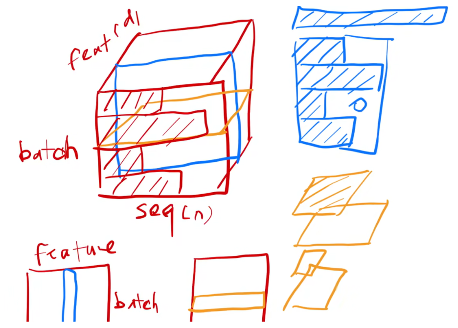
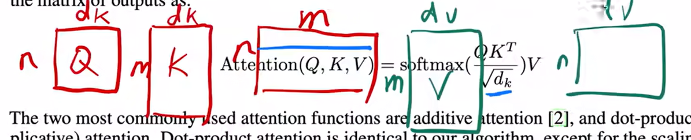
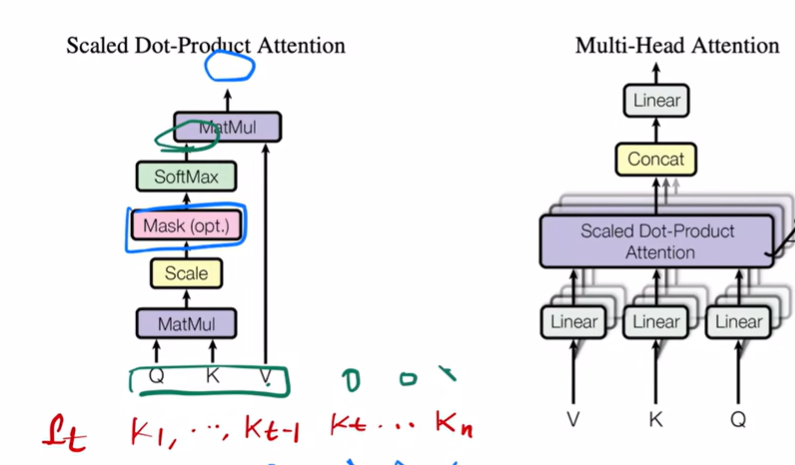
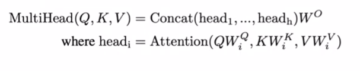
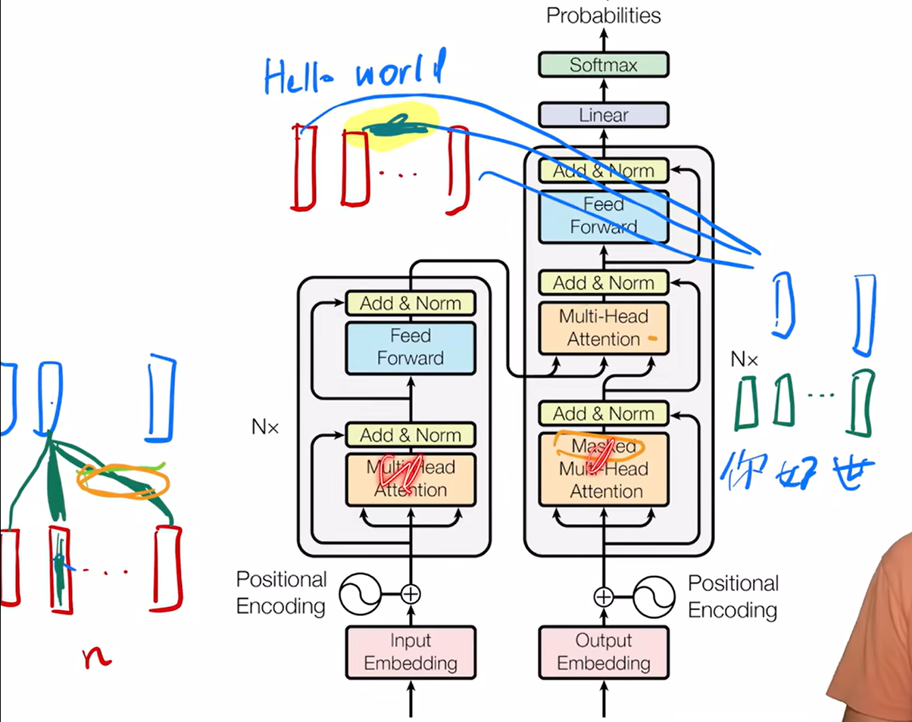

https://blog.csdn.net/qq_42068614/article/details/129417385

**layer norm**

不适合用batchnorm

batchniorm是在一个batch(若干个样本)中
对于每一列,让它在这个batch中均值为0方差为1
训练的时候在每个batch中这样做
预测时使用训练时统计的方差均值

layer norm是在一个样本内部做norm

> 假设有一个batch有b个样本,其中每个样本的长度为n(有n个单词的句子)
> 每个单词用长度为d的向量表示(d个features)
>
> 即输入为b×n×d的矩阵
>
> batchnorm为一个batch中某个特征(某特定特征共b×n个值)
> 共有d个不同的特征
>
> (下图中蓝色正方形的所有值进行norm)
>
> layernorm为在一个样本中的所有值(共n×d个值)进行norm
>
> (下图中橙色正方形的所有值进行norm)
>
> 

**为什么用layer norm**

实际输入中,一个batch内,每条样本的长度不一致

如果要对某特征进行batch norm
如果长度差异较大(如上图右上角长度不一的蓝色条)
且batch较小,会导致均值方差它的抖动相对来说是比较大

且由于样本长度不一样
训练时记录的全局均值方差在推理时不一定有效

但layernorm是在一个样本内部进行norm
不会横跨很多长度不一的样本进行norm

且layer norm 不需要记录全局的均值方差
因为是一个样本内部

**注意力机制**

注意力函数呢是一个将一个query和一些key-value对映射成一个输出的函数
这里面所有的query,key,value和output它都是一些向量

给一个query(以及若干key和value),输出是一个向量
等于所有 value 的加权平均(每个value的权重来自query和这个value对应的key的相似度)

有d个query就有d个输出

transformer使用点乘计算相似度



维度变化:

> **假设的输入:**
>
> - **batch_size** = 2(一次处理 2 句话)
> - **seq_len** = 4(每句话 4 个 token)
> - **d_model** = 8(每个 token 表示成 8 维向量)
> - **d_k** = 8(Q, K 的维度)
>
> ```python
> # (batch, seq_q, d_k)
> # (batch, seq_k, d_k)
> # (batch, seq_v, d_k)
> Q.shape = (2, 4, 8)
> K.shape = (2, 4, 8)
> V.shape = (2, 4, 8)
> 
> # 计算相似度分数
> # (batch, seq_q, d_k) @ (batch, d_k, seq_k) -> (batch, seq_q, seq_k)
> scores = torch.matmul(Q, K.transpose(-2, -1)) / math.sqrt(Q.size(-1))
> scores.shape = (2, 4, 4)
> # 固定某个seq_q维度,其seq_k维度每个值代表这个key对应的value的权重值
> # 因此对seq_k维度上进行softmax
> 
> # 对最后一个维度做归一化
> weights = softmax(scores, dim=-1)
> 
> # 对V加权求和得到输出
> # (batch, seq_q, seq_k) @ (batch, seq_k, d_v) -> (batch, seq_q, d_v)
> output = torch.matmul(attn, V)
> ```



**多头**

把每一个QKV投影(W)到比较低的维度

然后做多个注意力机制

最后再把多个注意力机制的结果concat

目的:增加可以学习的参数
投影后的度量空间里匹配不同的模式



**除以根号dk:**

当dk比较大(向量比较长的时候)

点积后值更大

这样点积结果的值之间相对差距更大

更大的值softmax后会更接近1
更小的值softmax后会更接近0
值会更向两端靠拢

算梯度时比较小 难训练

防止 d_k 大时点积值过大导致 softmax 饱和

**Transfomer中的注意力机制**

编码器:

输入 句子长度n
则输入n个长度为d的向量

同样的输入,分别乘W_Q,W_K,W_V
得到Q,K,V

如果不考虑多头则输出就是输入的一个加权和
权重来自于输入中每个向量本身和其他各个向量的相似度

如果多头,因为有投影,则会学习出h个不一样的距离空间

解码器:

- 第一个注意力层:

  有mask 

  n个长度d的向量

  得到每个向量的加权和时,来自它后面的向量乘的权重需设置成0

- 第二个注意力层:

  不再是自注意力

  而是key和value来自编码器输出
  query来自解码器第一个注意力层

即解码器根据输入,在编码器的输出里挑感兴趣的东西



**Feed-Forward Networks**

即MLP,但b

但应用于每一个word
即对于每个word对应的输出向量
作用的是同一个MLP

W1: 512 维 -> 2048 维
W2: 2048 维->512 维

**Embeddings and Softmax**

使用需要学习得到的embedding将输入的词转换为d维向量

使用线性层和softmax将decoder的输出的d维向量转化为下一个token的预测概率

- **三个embedding共享权重**

1.编码器的输入要一个embedding(输入token->查表->embedding)(需要加位置编码)

2.解码器的输入也要有个embedding(输入token->查表->embedding)(需要加位置编码)

> 如果是机器翻译,源语言和目标语言不一定相同,所以 vocab 可能不同(比如英译法)
>  但在单语任务(比如 GPT)里,这两个可以是同一个矩阵

3.softmax前面那个线性啊也需要一个embedding
即decoder的输出
用线性变换将d维的输出向量转为v维(v是词表大小)
然后才能做softmax
线性变换时W**每一列** 就是一个词的原型向量
当我们对 h_t 做内积时其实是在计算 “当前语义表示与每个词的相似度”
分数越大说明越可能是那个词

即拿 decoder 最后输出的语义向量与词表中每个词的 embedding 做内积,然后归一化成概率

- **embedding权重乘了一个根号d**

因为token embedding需要和 Positional Encoding(位置编码)相加,再送进后面的注意力模块

关键问题是embedding向量的数值大小scale和位置编码的数值大小要处在同一个量级,否则相加会失衡

- 假设 embedding 初始化时,每个维度的值均值为 0、方差为 1/d_model(Xavier 初始化等常见方式)
- 这样 L2 范数(向量长度)大约是 **1**,也就是说每个元素的幅度大概是 1/√d_model
- 例如 d_model = 512 时,每个维度的值可能在 ±0.044 左右,非常小。

位置编码的值(正弦+余弦)幅度大约是 **[-1, 1]**,如果直接相加：
Embedding:0.04 vs PosEnc:1.0

那位置编码的影响会**远远大于**词向量的本身含义,模型初期几乎只“看到”位置信息。

如果我们把 embedding 乘以 √d_model(比如 √512 ≈ 22.6)

- 每个维度的值会放大到 ~1.0
- 向量整体的数值范围和位置编码相当
- 这样相加后两者的影响力差不多,不会谁被淹没或谁主导

**Positional Encoding**

在输入里加入时序信息

用一个长为512的向量来表示一个数字
值用周期不一样的sin和cos函数的值来算出来的
所以导致说我任何一个值可以用一个长为512的一个向量来表示它

**label smoothing**

把原先的one-hot向量平滑一下正确类别不再是 1,而是 1−ε

错误类别不再是 0,而是 ε/V−1
其中 ε 通常取 0.1

ysmooth=[0.025,0.025,0.9,0.025,0.025]

避免模型过度自信,提升泛化能力


平滑后的标签等于在“告诉”模有一部分概率分布在其他词上,结果更鲁棒
